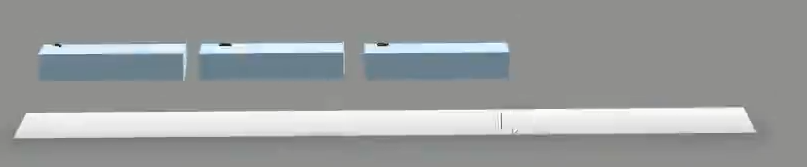
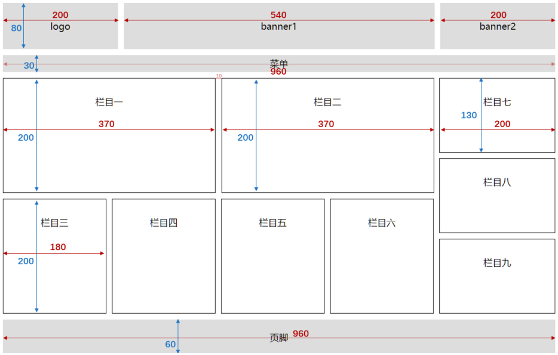

# 一、CSS基础

## 1. CSS简介


- `CSS` 的全称为：层叠样式表 ( `Cascading Style Sheets` ) 。
- `CSS` 也是一种标记语言，用于给 `HTML` 结构设置样式，例如：文字大小、颜色、元素宽高等等。

> 简单理解： `CSS` 可以美化 `HTML` , 让 `HTML` 更漂亮。  
> 核心思想： `HTML` 搭建结构， `CSS` 添加样式，实现了：结构与样式的分离。  


## 2. CSS的编写位置

### 2.1 行内样式
- 写在标签的 `style` 属性中，（又称：内联样式）。
- 语法：
  ```html
  <h1 style="color:red;font-size:60px;">欢迎来到尚硅谷学习</h1>
  ```
- 注意点：
  > 1. `style` 属性的值不能随便写，写要符合 `CSS` 语法规范，是 `名:值;` 的形式。
  > 2. 行内样式表，只能控制当前标签的样式，对其他标签无效。
- 存在的问题：
  > 书写繁琐、样式不能复用、并且没有体现出： **结构与样式分离** 的思想，不推荐大量使用，只有对当前元素添加简单样式时，才偶尔使用。

### 2.2 内部样式
- 写在 `html` 页面内部，将所有的 `CSS` 代码提取出来，单独放在 `<style>` 标签中。
- 语法：
  ```html
  <style>
  h1 {
    color: red;
    font-size: 40px;
  }
  </style>
  ```
- 注意点：
  > 1. `<style>` 标签理论上可以放在 `HTML` 文档的任何地方，但一般都放在 `<head>` 标签中。
  > 2. 此种写法：样式可以复用、代码结构清晰。
- 存在的问题：
  > 1. 并没有实现：结构与样式**完全分离**。
  > 2. 多个 `HTML` 页面无法复用样式。

### 2.3 外部样式
- 写在单独的 `.css` 文件中，随后在 `HTML` 文件中引入使用。
- 语法：
  1. 新建一个扩展名为 `.css` 的样式文件，把所有 `CSS` 代码都放入此文件中。
     ```css
     h1{
       color: red;
       font-size: 40px;
     }
     ```
  2. 在 HTML 文件中引入 `.css` 文件。
     ```html
     <link rel="stylesheet" href="./xxx.css">
     ```
- 注意点：
  > 1. `<link>` 标签要写在 `<head>` 标签中。
  > 2. `<link>` 标签属性说明：
  >    - `href` ：引入的文档来自于哪里。
  >    - `rel` ：（ `relation` ：关系）说明引入的文档与当前文档之间的关系。
  > 3. 外部样式的优势：样式可以复用、结构清晰、可触发浏览器的缓存机制，提高访问速度 ，实现了**结构与样式的完全分离**。
  > 4. 实际开发中，**几乎都使用外部样式**，这是**最推荐的使用方式**！


## 3. 样式表的优先级
- 优先级规则：**行内样式 > 内部样式 = 外部样式**
  > 1. 内部样式、外部样式，这二者的优先级相同，且：后面的 会覆盖 前面的（简记：“后来者居上”）。
  > 2. 同一个样式表中，优先级也和编写顺序有关，且：后面的 会覆盖 前面的（简记：“后来者居上”）。

| 分类     | 优点                                                                                                              | 缺点                                                                         | 使用频率 | 作用范围 |
| -------- | ----------------------------------------------------------------------------------------------------------------- | ---------------------------------------------------------------------------- | -------- | -------- |
| 行内样式 | 优先级最高                                                                                                        | <ol><li>结构与样式未分离</li><li>代码结构混乱</li><li>样式不能复用</li></ol> | 很低     | 当前标签 |
| 内部样式 | <ol><li>样式可复用</li><li>代码结构清晰</li></ol>                                                                 | <ol><li>结构与样式未彻底分离</li><li>样式不能多页面复用</li></ol>            | 一般     | 当前页面 |
| 外部样式 | <ol><li>样式可多页面复用</li><li>代码结构清晰</li><li>可触发浏览器的缓存机制</li><li>结构与样式彻底分离</li></ol> | 需要引入才能使用                                                             | **最高** | 多个页面 |


## 4. CSS语法规范
`CSS` 语法规范由两部分构成：
- **选择器**：找到要添加样式的元素。
- **声明块**：设置具体的样式（**声明块**是由一个或多个**声明**组成的），声明的格式为： `属性名: 属性值;`

> 备注1：最后一个声明后的分号理论上能省略，但最好还是写上。  
> 备注2：选择器与声明块之间，属性名与属性值之间，均有一个空格，理论上能省略，但最好还是写上。  


注释的写法：
```css
/* 给h1元素添加样式 */
h1 {
  /* 设置文字颜色为红色 */
  color: red;
  /* 设置文字大小为40px */
  font-size: 40px
}
```


## 5. CSS代码风格
- **展开风格** —— 开发时推荐，便于维护和调试。
  ```css
  h1 {
    color: red;
    font-size: 40px;
  }
  ```
- **紧凑风格** —— 项目上线时推荐，可减小文件体积。
  ```css
  h1{color:red;font-size:40px;}
  ```
- 备注：
  > 项目上线时，我们会通过工具将【展开风格】的代码，变成【紧凑风格】，这样可以减小文件体积，节约网络流量，同时也能让用户打开网页时速度更快。


# 二、CSS选择器

## 1. CSS基本选择器
1. 通配选择器
2. 元素选择器
3. 类选择器
4. `id` 选择器

### 1.1 通配选择器
- 作用：可以选中所有的 `HTML` 元素。
- 语法：
  ```css
  * {
    属性名: 属性值;
  }
  ```
- 举例：
  ```css
  * {
    color: orange;
    font-size: 40px;
  }
  ```

> 备注：目前来看通配选择器貌似有点鸡肋，但后面清除样式时，会对我们有很大帮助，后面会详细讲。

### 1.2 元素选择器
- 作用：为页面中 **某种元素** 统一设置样式。
- 语法：
  ```css
  标签名 {
    属性名: 属性值;
  }
  ```
- 举例：
  ```css
  /* 选中所有h1元素 */
  h1 {
    color: orange;
    font-size: 40px;
  }
  /* 选中所有p元素 */
  p {
    color: blue;
    font-size: 60px;
  }
  ```
- 备注：元素选择器无法实现**差异化设置**，例如上面的代码中，所有的 `p` 元素效果都一样。

### 1.3 类选择器
- 作用：根据元素的 `class` 值，来选中某些元素。
- 语法：
  ```css
  .类名 {
    属性名: 属性值;
  }
  ```
- 举例：
  ```css
  /* 选中所有class值为speak的元素 */
  .speak {
    color: red;
  }
  /* 选中所有class值为answer的元素 */
  .answer {
    color: blue;
  }
  ```
- 注意点：
  > 1. 元素的 `class` 属性值不带 `.` ，但 `CSS` 的类选择器要带 `.` 。
  > 2. `class` 值，是我们自定义的，按照标准：不要使用纯数字、不要使用中文、尽量使用英文与数字的组合，若由多个单词组成，使用 - 做连接，例如： `left-menu` ，且命名要有意义，做到 “见名知意”。
  > 3. 一个元素不能写多个 `class` 属性，下面是 **错误示例**：
  >    ```html
  >    <!-- 该写法错误，元素的属性不能重复，后写的会失效 -->
  >    <h1 class="speak" class="big">你好啊</h1>
  >    ```
  > 4. 一个元素的 `class` 属性，能写多个值，要用空格隔开，例如：
  >    ```html
  >    <!-- 该写法正确，class属性，能写多个值 -->
  >    <h1 class="speak big">你好啊</h1>
  >    ```

### 1.4 ID选择器
- 作用：根据元素的 `id` 属性值，来**精准的**选中**某个**元素。
- 语法：
  ```css
  #id值 {
    属性名: 属性值;
  }
  ```
- 举例：
  ```css
  /* 选中id值为earthy的那个元素 */
  #earthy {
    color: red;
    font-size: 60px;
  }
  ```
- 注意：
  - `id` 属性值：尽量由**字母**、**数字**、**下划线**( `_` )、**短杠**( `-` )组成，最好以字母开头、不要包含空格、区分大小写。
  - 一个元素只能拥有一个 `id` 属性，多个元素的 `id` 属性值不能相同。
  - 一个元素可以同时拥有 `id` 和 `class` 属性。

### 1.5 基本选择器总结
| 基本选择器 | 特点                                                        | 用法                  |
| ---------- | ----------------------------------------------------------- | --------------------- |
| 通配选择器 | 选中所有标签，一般用于清除样式。                            | `* {color:red}`       |
| 元素选择器 | 选中所有同种标签，但是不能差异化选择。                      | `h1 {color:red}`      |
| 类选择器   | 选中所有特定类名（ `class` 值）的元素 —— **使用频率很高**。 | `.say {color:red}`    |
| ID 选择器  | 选中特定 `id` 值的那个元素（唯一的）。                      | `#earthy {color:red}` |


## 2. CSS复合选择器
CSS选择器整体分类两大类：
- 一、基本选择器：
  - ① 通配选择器
  - ② 元素选择器
  - ③ 类选择器
  - ④ `ID` 选择器
- 二、复合选择器：
  - ① 交集选择器
  - ② 并集选择器
  - ③ 后代选择器
  - ④ 子元素选择器
  - .....

> 1. 复合选择器建立在基本选择器之上，由多个基础选择器，通过不同的方式组合而成。
> 2. 复合选择器可以在复杂结构中，快速而准确的选中元素。

### 2.1 交集选择器
- 作用：选中**同时符合**多个条件的元素。
  > 交集有并且的含义（通俗理解：**即......又......** 的意思），例如：年轻**且**长得帅。
- 语法：`选择器1选择器2选择器3...选择器n {}`
- 举例：
  ```css
  /* 选中：类名为beauty的p元素，为此种写法用的非常多！！！！ */
  p.beauty {
    color: blue;
  }
  /* 选中：类名包含rich和beauty的元素 */
  .rich.beauty {
    color: green;
  }
  ```
- 注意：
  1. 有标签名，标签名必须写在前面。
  2. `id` 选择器、通配选择器，理论上可以作为交集的条件，但实际应用中几乎不用 —— 因为没有意义。
  3. 交集选择器中**不可能**出现**两个元素选择器**，因为一个元素，不可能即是 `p` 元素又是 `span` 元素。
  4. 用的最多的交集选择器是：元素选择器配合类名选择器，例如： `p.beauty` 。

### 2.2 并集选择器
- 作用：选中多个选择器对应的元素，又称：**分组选择器**。
  > 所谓并集就是或者的含义（通俗理解：**要么......要么......** 的意思），例如：给我转10万块钱**或者**我报警。
- 语法：`选择器1, 选择器2, 选择器3, ... 选择器n {}`
  > 多个选择器通过 `,` 连接，此处 `,` 的含义就是：`或`。
- 举例：
  ```css
  /* 选中id为peiqi，或类名为rich，或类名为beauty的元素 */
  #peiqi,
  .rich,
  .beauty {
    font-size: 40px;
    background-color: skyblue;
    width: 200px;
  }
  ```
- 注意：
  1. 并集选择器，我们一般竖着写。
  2. 任何形式的选择器，都可以作为并集选择器的一部分 。
  3. 并集选择器，通常用于集体声明，可以缩小样式表体积。

### 2.3 HTML元素间的关系
分为：①父元素、②子元素、③祖先元素、④后代元素、⑤兄弟元素。

1. 父元素：**直接**包裹某个元素的元素，就是该元素的父元素。
   
2. 子元素：被父元素**直接**包含的元素（简记：儿子元素）。
   
3. 祖先元素：父亲的父亲......，一直往外找，都是祖先。
   > 备注：父元素，也算是祖先元素的一种。  
   > 例如：张三的父亲，也算是张三的祖先，但一般还是称呼：父亲。  

   
4. 后代元素：儿子的儿子......，一直往里找，都是后代。
   > 备注：子元素，也算是后代元素的一种。  
   > 例如：张三的儿子，也算是张三的后代，但一般还是称呼：儿子。  

   
5. 兄弟元素：具有相同父元素的元素，互为兄弟元素。
   

### 2.4 后代选择器
- 作用：选中指定元素中，符合要求的后代元素。
- 语法：`选择器1 选择器2 选择器3 ... 选择器n {}` （先写祖先，再写后代）
  > 选择器之间，用空格隔开，空格可以理解为：" `xxx` 中的"，其实就是后代的意思。  
  > 选择器 `1234...n` ，可以是我们之前学的任何一种选择器。  
- 举例：
  ```css
  /* 选中ul中的所有li */
  ul li {
    color: red;
  }
  /* 选中ul中所有li中的a */
  ul li a {
    color: orange;
  }
  /* 选中类名为subject元素中的所有li */
  .subject li {
    color: blue;
  }
  /* 选中类名为subject元素中的所有类名为front-end的li */
  .subject li.front-end {
    color: blue;
  }
  ```
- 注意：
  1. 后代选择器，最终选择的是后代，不选中祖先。
  2. 儿子、孙子、重孙子，都算是后代。
  3. 结构一定要符合之前讲的 `HTML` 嵌套要求，例如：不能 `p` 中写 `h1` ~ `h6` 。

### 2.5 子代选择器
- 作用：选中指定元素中，符合要求的**子元素**（儿子元素）。（先写父，再写子）
  > 子代选择器又称：子元素选择器、子选择器。
- 语法：`选择器1>选择器2>选择器3>...>选择器n {}`
  > 选择器之间，用 `>` 隔开， `>` 可以理解为：" `xxx` 的子代"，其实就是儿子的意思。  
  > 选择器 `1234...n` ，可以是我们之前学的任何一种选择器。  
- 举例：
  ```css
  /* div中的子代a元素 */
  div>a {
    color: red;
  }
  /* 类名为persons的元素中的子代a元素 */
  .persons>a{
    color: red;
  }
  ```
- 注意：
  1. 子代选择器，最终选择的是子代，不是父级。
  2. 子、孙子、重孙子、重重孙子 ...... **统称后代**！，**子**就是指**儿子**。
     

### 2.6 兄弟选择器
- 相邻兄弟选择器：
  - 作用：选中指定元素后，符合条件的**相邻兄弟**元素。
    > 所谓相邻，就是**紧挨着**他的下一个，简记：睡在我下铺的兄弟。
  - 语法： `选择器1+选择器2 {} 。`
  - 示例：
    ```css
    /* 选中div后相邻的兄弟p元素 */
    div+p {
      color: red;
    }
    ```

- 通用兄弟选择器：
  - 作用：选中指定元素后，符合条件的**所有兄弟**元素。（简记：睡在我下铺的所有兄弟）
  - 语法： `选择器1~选择器2 {}` 。
  - 实例：
    ```css
    /* 选中div后相邻的兄弟p元素 */
    div~p {
      color: red;
    }
    ```
  - 注意：两种兄弟选择器，选择的是**下面**的兄弟。

### 2.7 属性选择器
- 作用：选中属性值符合一定要求的元素。
- 语法：
  1. `[属性名]` 选中**具有**某个属性的元素。
  2. `[属性名="值"]` 选中包含某个属性，且属性值**等于**指定值的元素。
  3. `[属性名^="值"]` 选中包含某个属性，且属性值以指定的值**开头**的元素。
  4. `[属性名$="值"]` 选中包含某个属性，且属性值以指定的值**结尾**的元素。
  5. `[属性名*=“值”]` 选择包含某个属性，属性值**包含**指定值的元素。
- 举例：
  ```css
  /* 选中具有title属性的元素 */
  div[title]{color:red;}
  /* 选中title属性值为atguigu的元素 */
  div[title="atguigu"]{color:red;}
  /* 选中title属性值以a开头的元素 */
  div[title^="a"]{color:red;}
  /* 选中title属性值以u结尾的元素 */
  div[title$="u"]{color:red;}
  /* 选中title属性值包含g的元素 */
  div[title*="g"]{color:red;}
  ```

### 2.8 伪类选择器
- 作用：选中特殊状态的元素。
  > 如何理解“伪” ? — 虚假的，不是真的。  
  > 如何理解“伪类”？ — 像类( `class` )，但不是类，是元素的一种特殊状态。  
- 常用的伪类选择器：

#### 一、动态伪类：
1. `:link` 超链接`未被访问`的状态。
2. `:visited` 超链接`访问过`的状态。
3. `:hover` 鼠标`悬停`在元素上的状态。
4. `:active` 元素`激活`的状态。
   > 什么是激活？—— 按下鼠标不松开。  
   > 注意点：遵循 `LVHA` 的顺序，即： `link` 、 `visited` 、 `hover` 、 `active` 。  
5. `:focus` 获取焦点的元素。
   > 表单类元素才能使用 `:focus` 伪类。
   > 当用户：点击元素、触摸元素、或通过键盘的 “ `tab` ” 键等方式，选择元素时，就是获得焦点。

#### 二、结构伪类
常用的：
1. `:first-child` 所有兄弟元素中的**第一个**。
2. `:last-child` 所有兄弟元素中的**最后一个**。
3. `:nth-child(n)` 所有兄弟元素中的**第n个**。
4. `:first-of-type` 所有**同类型**兄弟元素中的**第一个**。
5. `:last-of-type` 所有**同类型**兄弟元素中的**最后一个**。
6. `:nth-of-type(n)` 所有**同类型**兄弟元素中的 **第n个** 。

关于 `n` 的值（an+b（将n=1,2,...依次带入））：
1. `0` 或 `不写` ：什么都选不中 —— 几乎不用。
2. `n` ：选中所有子元素 —— 几乎不用。
3. `1~正无穷的整数` ：选中对应序号的子元素。
4. `2n` 或 `even` ：选中序号为偶数的子元素。
5. `2n+1` 或 `odd` ：选中序号为奇数的子元素。
6. `-n+3` ：选中的是前 `3` 个。

了解即可：
1. `:nth-last-child(n)` 所有兄弟元素中的 **倒数第n个**。
2. `:nth-last-of-type(n)` 所有**同类型**兄弟元素中的 **倒数第n个** 。
3. `:only-child` 选择没有兄弟的元素（独生子女）。
4. `:only-of-type` 选择没有**同类型**兄弟的元素。
5. `:root` 根元素（即html）。
6. `:empty` 内容为空元素（空格也算内容）。

#### 三、否定伪类：
- `:not(选择器)` 排除满足括号中条件的元素。

#### 四、UI伪类：
1. `:checked` 被选中的复选框或单选按钮。
2. `:enable` 可用的表单元素（没有 `disabled` 属性）。
3. `:disabled` 不可用的表单元素（有 `disabled` 属性）。

#### 五、目标伪类（了解）
- `:target` 选中锚点指向的元素。

#### 六、语言伪类（了解）
- `:lang()` 根据指定的语言选择元素（本质是看 `lang` 属性的值）。

### 2.9 伪元素选择器
- 作用：选中元素中的一些特殊位置。
- 常用伪元素：
  - `::first-letter` 选中元素中的**第一个**文字。
  - `::first-line` 选中元素中的**第一行**文字。
  - `::selection` 选中**被鼠标选中的**内容。
  - `::placeholder` 选中输入框的**提示文字**。
  - `::before` 在元素**最开始**的位置，创建一个子元素（必须用 `content` 属性指定内容）。
  - `::after` 在元素**最后**的位置，创建一个子元素（必须用 `content` 属性指定内容）。


## 3. 选择器的优先级（权重）
通过**不同的选择器**，选中**相同的元素** ，并且为**相同的样式名**设置**不同的值**时，就发生了样式的冲突。

到底应用哪个样式，此时就需要看**优先级**了。

### 简单描述：
> **行内样式** `>` **ID选择器** `>` **类选择器** `>` **元素选择器** `>` **通配选择器**。

### 详细描述：
1. 计算方式：每个选择器，都可计算出一组权重，格式为： `(a,b,c)`
   - `a` : ID 选择器的个数。
   - `b` : 类、伪类、属性 选择器的个数。
   - `c` : 元素、伪元素 选择器的个数。
   
   例如：
   | 选择器                     | 权重      |
   | -------------------------- | --------- |
   | `ul>li`                    | `(0,0,2)` |
   | `div ul>li p a span`       | `(0,0,6)` |
   | `#atguigu .slogan`         | `(1,1,0)` |
   | `#atguigu .slogan a`       | `(1,1,1)` |
   | `#atguigu .slogan a:hover` | `(1,2,1)` |
2. 比较规则：按照**从左到右**的顺序，依次比较大小，当前位胜出后，后面的不再对比，例如：
   > - `(1,0,0) > (0,2,2)`
   > - `(1,1,0) > (1,0,3)`
   > - `(1,1,3) > (1,1,2)`
3. 特殊规则：
   1. **行内样式**权重大于**所有选择器**。
   2. `!important` 的权重，大于**行内样式**，大于**所有选择器**，**权重最高**！
4. 图示：
   

   


# 三、CSS三大特性

## 1. 层叠性
- 概念：如果发生了样式冲突，那就会根据一定的规则（选择器优先级），进行样式的层叠（覆盖）。
  > 什么是样式冲突？ ——— 元素的**同一个样式名**，被设置了**不同的值**，这就是冲突。


## 2. 继承性
- 概念：元素会自动拥有**其父元素**、或**其祖先元素**上所设置的**某些样式**。
- 规则：优先继承**离得近**的。
- 常见的可继承属性：
  > `text-??` ， `font-??` ， `line-??` 、 `color` ......
- 备注：参照 [MDN](https://developer.mozilla.org/zh-CN/) 网站，可查询属性是否可被继承。


## 3. 优先级
- 简单聊： `!important` `>` **行内样式** `>` **ID选择器** `>` **类选择器** `>` **元素选择器** `>` `*` `>` **继承的样式**。
- 详细聊：需要计算权重。
  > 计算权重时需要注意：**并集选择器的每一个部分是分开算的！**  
  > `.a, .b, .c {}` == `.a{} .b{} .c{}`


# 四、CSS常用属性

## 1. 像素的概念
- 概念：我们的电脑屏幕是，是由一个一个“小点”组成的，每个“小点”，就是一个像素（px）。
- 规律：像素点越小，呈现的内容就越清晰、越细腻。


> 注意点：如果电脑设置中开启了缩放，那么就会影响一些工具的测量结果，但这无所谓，因为我们工作中都是参考详细的设计稿，去给元素设置宽高。


## 2. 颜色的表示

### 2.1 表示方式一：颜色名
编写方式：直接使用颜色对应的英文单词，编写比较简单，例如：
1. <span style="color: red;">红色：red</span>
2. <span style="color: green;">绿色：green</span>
3. <span style="color: blue;">蓝色：blue</span>
4. <span style="color: purple;">紫色：purple</span>
5. <span style="color: orange;">橙色：orange</span>
6. <span style="color: gray;">灰色：gray</span>

> 1. 颜色名这种方式，表达的颜色比较单一，所以用的并不多。
> 2. 具体颜色名参考 `MDN` 官方文档：[命名颜色](https://developer.mozilla.org/en-US/docs/Web/CSS/named-color)

### 2.2 表示方式二：rgb 或 rgba
- 编写方式：使用 **红、黄、蓝** 这三种光的三原色进行组合。
  - <span style="color: rgb(255,0,0);">r 表示 红色</span>
  - <span style="color: rgb(0,255,0)">g 表示 绿色</span>
  - <span style="color: rgb(0,0,255)">b 表示 蓝色</span>
  - <span style="color: rgba(128,128,128,1)">a 表示 透明度</span>
- 举例：
  ```css
  /* 使用 0~255 之间的数字表示一种颜色 */
  color: rgb(255, 0, 0); /* 红色 */
  color: rgb(0, 255, 0); /* 绿色 */
  color: rgb(0, 0, 255); /* 蓝色 */
  color: rgb(0, 0, 0); /* 黑色 */
  color: rgb(255, 255, 255); /* 白色 */
  /* 混合出任意一种颜色 */
  color: rgb(138, 43, 226) /* 紫罗兰色 */
  color: rgba(255, 0, 0, 0.5); /* 半透明的红色 */
  /* 也可以使用百分比表示一种颜色（用的少） */
  color: rgb(100%, 0%, 0%); /* 红色 */
  color: rgba(100%, 0%, 0%,50%); /* 半透明的红色 */
  ```
- 小规律：
  1. 若三种颜色值相同，呈现的是灰色，值越大，灰色越浅。
  2. `rgb(0, 0, 0)` 是黑色， `rgb(255, 255,255)` 是白色。
  3. 对于 `rbga` 来说，前三位的 `rgb` 形式要保持一致，要么都是 `0~255` 的数字，要么都是百分比 。

### 2.3 表示方式三：HEX 或 HEXA
`HEX` 的原理同与 `rgb` 一样，依然是通过：**红、绿、蓝色** 进行组合，只不过要用 **6位（分成3组）** 来表达，
格式为：`#rrggbb`

> 每一位数字的取值范围是： `0` ~ `f` ，即：（ `0`, `1`, `2`, `3`, `4`, `5`, `6`, `7`, `8`, `9`, `a`, `b`, `c`, `d`, `e`, `f` ）  
> 所以每一种光的最小值是： `00` ，最大值是： `ff`  

```css
color: #ff0000; /* 红色 */
color: #00ff00; /* 绿色 */
color: #0000ff; /* 蓝色 */
color: #000000; /* 黑色 */
color: #ffffff; /* 白色 */
/* 如果每种颜色的两位都是相同的，就可以简写*/
color: #ff9988; /* 可简为：#f98 */
/* 但要注意前三位简写了，那么透明度就也要简写 */
color: #ff998866; /* 可简为：#f986 */
```

> 注意点： `IE` 浏览器不支持 `HEXA` ，但支持 `HEX` 。

### 2.4 表示方式四：HSL 或 HSLA
- `HSL` 是通过：色相、饱和度、亮度，来表示一个颜色的，格式为： `hsl(色相,饱和度,亮度)`
  - 色相：取值范围是 `0~360` 度（deg可省略），具体度数对应的颜色如下图：
    
  - 饱和度：取值范围是 `0%`~`100%` 。（向色相中对应颜色中添加灰色， `0%` 全灰， `100%` 没有灰）
  - 亮度：取值范围是 `0%`~`100%` 。（ `0%` 亮度没了，所以就是黑色。 `100%` 亮度太强，所以就是白色了）
- `HSLA` 其实就是在 `HSL` 的基础上，添加了透明度。


## 3. CSS字体属性

### 3.1 字体大小
- 属性名： `font-size`
- 作用：控制字体的大小。
- 语法：
  ```css
  div {
    font-size: 40px;
  }
  ```
- 注意点：
  > 1. `Chrome` 浏览器支持的最小文字为 `12px` ，默认的文字大小为 `16px` ，并且 `0px` 会自动消失。
  > 2. 不同浏览器默认的字体大小可能不一致，所以最好给一个明确的值，不要用默认大小。
  > 3. 通常以给 `body` 设置 `font-size` 属性，这样 `body` 中的其他元素就都可以继承了。
- 借助控制台看样式：
  

### 3.2 字体族
- 属性名： `font-family`
- 作用：控制字体类型。
- 语法：
  ```css
  div {
    font-family: "STCaiyun","Microsoft YaHei",sans-serif
  }
  ```
- 注意：
  > 1. 使用字体的英文名字兼容性会更好，具体的英文名可以自行查询，或在电脑的设置里去寻找。
  > 2. 如果字体名包含空格，必须使用引号包裹起来。
  > 3. 可以设置多个字体，按照从左到右的顺序逐个查找，找到就用，没有找到就使用后面的，且通常在最后写上 `serif` （衬线字体）或 `sans-serif` （非衬线字体）。
  > 4. `windows` 系统中，默认的字体就是微软雅黑。

### 3.3 字体风格
- 属性名： `font-style`
- 作用：控制字体是否为斜体。
- 常用值：
  1. `normal` ：正常（默认值）
  2. `italic` ：斜体（使用字体自带的斜体效果）
  3. `oblique` ：斜体（强制倾斜产生的斜体效果）

  > 实现斜体时，更推荐使用 `italic` 。
- 语法：
  ```css
  div {
    font-style: italic;
  }
  ```

### 3.4 字体粗细
- 属性名： `font-weight`
- 作用：控制字体的粗细。
- 常用值：
  - 关键词
    1. `lighter` ：细
    2. `normal` ： 正常
    3. `bold` ：粗
    4. `bolder` ：很粗 （多数字体不支持）
  - 数值：
    1. `100~1000` 且无单位，数值越大，字体越粗 （或一样粗，具体得看字体设计时的精确程度）。
    2. `100~300` 等同于 `lighter` ， `400~500` 等同于 `normal` ， `600` 及以上等同于 `bold` 。
- 语法：
  ```css
  div {
    font-weight: bold;
  }
  div {
    font-weight: 600;
  }
  ```

### 3.5 字体复合写法
- 属性名： `font` ，可以把上述字体样式合并成一个属性。
- 作用：将上述所有字体相关的属性复合在一起编写。
- 编写规则：
  1. 字体大小、字体族必须都写上。
  2. 字体族必须是最后一位、字体大小必须是倒数第二位。
  3. 各个属性间用空格隔开。
- 实际开发中更推荐复合写法，但这也不是绝对的，比如只想设置字体大小，那就直接用 `font-size` 属性。


## 4. CSS文本属性

### 4.1 文本颜色
- 属性名： `color`
- 作用：控制文字的颜色。
- 可选值：
  1. 颜色名
  2. `rgb` 或 `rgba`
  3. `HEX` 或 `HEXA` （十六进制）
  4. `HSL` 或 `HSLA`

  > 开发中常用的是： `rgb/rgba` 或 `HEX/HEXA` （十六进制）。
- 举例：
  ```css
  div {
    color: rgb(112,45,78);
  }
  ```

### 4.2 文本间距
- 字母间距： `letter-spacing`
- 单词间距： `word-spacing` （通过空格识别词）
- 属性值为像素（ `px` ），正值让间距增大，负值让间距缩小。

### 4.3 文本修饰
- 属性名： `text-decoration`
- 作用：控制文本的各种装饰线。
- 可选值：
  1. `none` ： 无装饰线（常用）
  2. `underline` ：下划线（常用）
  3. `overline` ： 上划线
  4. `line-through` ： 删除线
- 可搭配如下值使用：
  1. `dotted` ：虚线
  2. `wavy` ：波浪线
  3. 也可以指定颜色
- 举例：
  ```css
  a {
    text-decoration: none;
  }
  ```

### 4.4 文本缩进
- 属性名： `text-indent` 。
- 作用：控制文本首字母的缩进。
- 属性值： `css` 中的长度单位，例如： `px`
- 举例：
  ```css
  div {
    text-indent: 40px;
  }
  ```
> 后面我们会学习 `css` 中一些新的长度单位，目前我们只知道像素( `px` )。

### 4.5 文本对齐_水平
- 属性名： `text-align` 。
- 作用：控制文本的水平对齐方式。
- 常用值：
  1. `left` ：左对齐（默认值）
  2. `right` ：右对齐
  3. `center` ：居中对齐
- 举例：
  ```css
  div {
    text-align: center;
  }
  ```

### 4.6 细说 font-size
1. 由于字体设计原因，文字最终呈现的大小，并不一定与 `font-size` 的值一致，可能大，也可能小。
   > 例如： `font-size` 设为 `40px` ，最终呈现的文字，可能比 `40px` 大，也可能比 `40px` 小。
2. 通常情况下，文字相对字体设计框，并不是垂直居中的，通常都靠下 一些。

### 4.7 行高
- 属性名： `line-height`
- 作用：控制一行文字的高度。
- 可选值：
  1. `normal` ：由浏览器根据文字大小决定的一个默认值。
  2. 像素( `px` )。
  3. 数字：参考自身 `font-size` 的倍数（X倍行距）【常用，方便继承】。
  4. 百分比：参考自身 `font-size` 的百分比。
- 备注：由于字体设计原因，文字在一行中，并不是绝对垂直居中，若一行中都是文字，不会太影响观感。
- 举例：
  ```css
  div {
    line-height: 60px;
    line-height: 1.5;
    line-height: 150%;
  }
  ```
- 行高注意事项：
  1. `line-height` 过小会怎样？—— 文字产生重叠，且最小值是 `0` ，**不能为负数**。
     1. 多行文字全都叠在了一起
     2. 背景色消失了
     3. 文字顶部被“吃掉”了一点点
  2. `line-height` 是**可以继承**的，且为了能更好的呈现文字，最好写数值。
  3. `line-height` 和 `height` 是什么关系？
     - 设置了 `height` ，那么高度就是 `height` 的值。
     - 不设置 `height` 的时候，会根据 `line-height` 计算高度。
- 应用场景：
  1. 【调整多行文字的间距】对于多行文字：控制行与行之间的距离。
  2. 【单行文字的垂直居中】对于单行文字：让 `height` 等于 `line-height` ，可以实现文字垂直居中。
     > 备注：由于字体设计原因，靠上述办法实现的居中，并不是绝对的垂直居中，但如果一行中都是文字，不会太影响观感。

### 4.8 文本对齐_垂直
1. **顶部**：无需任何属性，在垂直方向上，默认就是顶部对齐。
2. **居中**：对于单行文字，让 `height = line-height` 即可。
   > 问题：多行文字**垂直居中**怎么办？—— 后面我们用定位去做。
3. **底部**：对于单行文字，目前一个临时的方式：
   让 `line-height = ( height × 2 ) - font-size - x` 。
   备注： `x` 是根据字体族，动态决定的一个值。
   > 问题：垂直方向上的底部对齐，更好的解决办法是什么？—— 后面我们用定位去做。

### 4.9 vertical-align
- 属性名： `vertical-align` 。
- 作用：用于指定**同一行元素之间**，或 **表格单元格** 内文字的 **垂直对齐方式**。
- 常用值：
  1. `baseline` （默认值）：使元素的基线与父元素的基线对齐。
  2. `top` ：使元素的**顶部**与其**所在行的顶部**对齐。
  3. `middle` ：使元素的**中部**与**父元素的基线**加上父元素**字母 x 的一半** （即父元素X中部）对齐。
  4. `bottom` ：使元素的**底部**与其**所在行的底部**对齐。

> 特别注意： `vertical-align` 不能控制块元素、非元素。


## 5. CSS列表属性
列表相关的属性，可以作用在 `ul` 、 `ol` 、 `li` 元素上。
| CSS             属性名 | 功能               | 属性值                                                                                                                                                                                                                                                                                             |
| ---------------------- | ------------------ | -------------------------------------------------------------------------------------------------------------------------------------------------------------------------------------------------------------------------------------------------------------------------------------------------- |
| list-style-type        | 设置列表符号       | 常用值如下：<ul type="none"><li>`none` ：不显示前面的标识（很常用！）</li><li>`square` ：实心方块</li><li>`disc` ：圆形</li><li>`decimal` ：数字</li><li>`lower-roman` ：小写罗马字</li><li>`upper-roman` ：大写罗马字</li><li>`lower-alpha` ：小写字母</li><li>`upper-alpha` ：大写字母</li></ul> |
| list-style-position    | 设置列表符号的位置 | `inside` ：在 `li` 的里面<br>`outside` ：在 `li` 的外边                                                                                                                                                                                                                                            |
| list-style-image       | 自定义列表符号     | `url(图片地址)`                                                                                                                                                                                                                                                                                    |
| list-style             | 复合属性           | 没有数量、顺序的要求                                                                                                                                                                                                                                                                               |

> `list-style-image` 优先级高于 `list-style-type` 。


## 6. CSS表格属性
1. 边框相关属性（其他元素也能用）：
   | CSS属性名    | 功能     | 属性值                                                                                                      |
   | ------------ | -------- | ----------------------------------------------------------------------------------------------------------- |
   | border-width | 边框宽度 | `CSS` 中可用的长度值                                                                                        |
   | border-color | 边框颜色 | `CSS` 中可用的颜色值                                                                                        |
   | border-style | 边框风格 | `none` 默认值<br>`solid` 实线<br>`dashed` 虚线<br>`dotted` 点线<br>`double` 双实线<br>`border` 边框复合属性 | 没有数量、顺序的要求 |

   > 注意：
   > 1. 以上 4 个边框相关的属性，其他元素也可以用，这是我们第一次遇见它们。
   > 2. 在后面的盒子模型中，我们会详细讲解边框相关的知识。
   
2. 表格独有属性（只有 `table` 标签才能使用）：
   | CSS属性名       | 功能                 | 属性值                                                                      |
   | --------------- | -------------------- | --------------------------------------------------------------------------- |
   | table-layout    | 设置列宽度           | `auto` ：自动，列宽根据内容计算（默认值）。<br>`fixed` ：固定列宽，平均分。 |
   | border-spacing  | 单元格间距           | `CSS` 中可用的长度值。<br>生效的前提：单元格边框不能合并。                  |
   | border-collapse | 合并单元格边框       | `collapse` ：合并<br>`separate` ：不合并                                    |
   | empty-cells     | 隐藏没有内容的单元格 | `show` ：显示，默认<br>`hide` ：隐藏<br>生效前提：单元格不能合并。          |
   | caption-side    | 设置表格标题位置     | `top` ：上面（默认值）<br>`bottom` ：在表格下面                             |

   > 以上 5 个属性，只有表格才能使用，即： `<table>` 标签。


## 7. CSS背景属性
| CSS属性名           | 功能             | 属性值                                                                                                                                                                                                                                                                                                                                                                                                         |
| ------------------- | ---------------- | -------------------------------------------------------------------------------------------------------------------------------------------------------------------------------------------------------------------------------------------------------------------------------------------------------------------------------------------------------------------------------------------------------------- |
| background-color    | 设置背景颜色     | 符合 `CSS` 中颜色规范的值。<br>默认背景颜色是 `transparent` 。                                                                                                                                                                                                                                                                                                                                                 |
| background-image    | 设置背景图片     | `url(图片的地址)`                                                                                                                                                                                                                                                                                                                                                                                              |
| background-repeat   | 设置背景重复方式 | `repeat` ：重复，铺满整个元素，默认值。<br>`repeat-x` ：只在水平方向重复。<br>`repeat-y` ：只在垂直方向重复。<br>`no-repeat` ：不重复。                                                                                                                                                                                                                                                                        |
| background-position | 设置背景图位置   | **通过关键字设置位置**：<ul><li>写两个值，用空格隔开</li><li>水平： `left` 、 `center` 、 `right`</li><li>垂直: `top` 、 `center` 、 `bottom`</li><li>如果只写一个值，另一个方向的值取 `center`</li></ul>**通过长度指定坐标位置**：<ul><li>以元素左上角，为坐标原点，设置图片左上角的位置。</li><li>两个值，分别是 `x` 坐标和 `y` 坐标。</li><li>只写一个值，会被当做 `x` 坐标， `y` 坐标取 `center`</li></ul> |
| background          | 复合属性         | 没有数量、顺序的要求                                                                                                                                                                                                                                                                                                                                                                                           |


## 8. CSS鼠标属性
| CSS属性名 | 功能               | 属性值                                                                                                                 |
| --------- | ------------------ | ---------------------------------------------------------------------------------------------------------------------- |
| cursor    | 设置鼠标光标的样式 | `pointer` ：小手<br>`move` ：移动图标<br>`text` ：文字选择器<br>`crosshair` ：十字架<br>`wait` ：等待<br>`help` ：帮助 |

> 扩展：自定义鼠标图标
> ```css
> /* 自定义鼠标图标 */
> cursor: url("../images/arrow.png"), pointer;
> ```


# 五、CSS盒子模型

## 1. CSS 长度单位
1. `px` ：像素。
2. `em` ：相对元素 `font-size` 的倍数。
3. `rem` ：相对根字体大小，html标签就是根。
4. `%` ：相对父元素计算。

> 注意： `CSS` 中设置长度，必须加单位，否则样式无效！


## 2. 元素的显示模式

### 块元素（block）
又称：块级元素

> 特点：
> 1. 在页面中**独占一行**，不会与任何元素共用一行，是从上到下排列的。
> 2. 默认宽度：撑满**父元素**。
> 3. 默认高度：由**内容**撑开。
> 4. **可以**通过 `CSS` 设置宽高。

### 行内元素（inline）
又称：内联元素

> 特点：
> 1. 在页面中**不独占一行**，一行中不能容纳下的行内元素，会在下一行继续从左到右排列。
> 2. 默认宽度：由**内容**撑开。
> 3. 默认高度：由**内容**撑开。
> 4. **无法**通过 `CSS` 设置宽高。

### 行内块元素（inline-block）
又称：内联块元素

> 特点：
> 1. 在页面中**不独占一行**，一行中不能容纳下的行内元素，会在下一行继续从左到右排列。
> 2. 默认宽度：由**内容**撑开。
> 3. 默认高度：由**内容**撑开。
> 4. **可以**通过 `CSS` 设置宽高。

**注意**：元素早期只分为：**行内元素、块级元素**，区分条件也只有一条："是否独占一行"，如果按照这种分类方式，行内块元素应该算作行内元素。


## 3. 总结各元素的显示模式

### 块元素（block）
> 1. 主体结构标签： `<html>` 、 `<body>`
> 2. 排版标签： `<h1>` ~ `<h6>` 、 `<hr>` 、 `<p>` 、 `<pre>` 、 `<div>`
> 3. 列表标签： `<ul>` 、 `<ol>` 、 `<li>` 、 `<dl>` 、 `<dt>` 、 `<dd>`
> 4. 表格相关标签： `<table>` 、 `<tbody>` 、 `<thead>` 、 `<tfoot>` 、 `<tr>` 、 `<caption>`
> 5. `<form>` 与 `<option>`

### 行内元素（inline）
> 1.  文本标签： `<br>` 、 `<em>` 、 `<strong>` 、 `<sup>` 、 `<sub>` 、 `<del>` 、 `<ins>`
> 2.  `<a>` 与 `<label>`

### 行内块元素（inline-block）
> 1. 图片： ``
> 2. 单元格： `<td>` 、 `<th>`
> 3. 表单控件： `<input>` 、 `<textarea>` 、 `<select>` 、 `<button>`
> 4. 框架标签： `<iframe>`


## 4. 修改元素的显示模式
通过 `CSS` 中的 `display` 属性可以修改元素的默认显示模式，常用值如下：
| 值           | 描述                           |
| ------------ | ------------------------------ |
| none         | 元素会被**隐藏**。             |
| block        | 元素将作为**块级元素**显示。   |
| inline       | 元素将作为**内联元素**显示。   |
| inline-block | 元素将作为**行内块元素**显示。 |


## 5. 盒子模型的组成
`CSS` 会把所有的 `HTML` 元素都看成一个**盒子**，所有的样式也都是基于这个盒子。
1. `margin`（外边距）： 盒子与外界的距离。
2. `border`（边框）： 盒子的边框。
3. `padding`（内边距）： 紧贴内容的补白区域。
4. `content`（内容）：元素中的文本或后代元素都是它的内容。

图示如下：


盒子的大小 = `content` + 左右 `padding` + 左右 `border` 。

> 注意：外边距 `margin` 不会影响盒子的大小，但会影响盒子的位置。

示例：
```css
div {
  /* 内容区的宽 */
  width: 400px;
  /* 内容区的高 */
  height: 400px;
  /* 内边距，设置的背景颜色会填充内边距区域 */
  padding: 20px;
  /* 边框，设置的背景颜色会填充边框区域 */
  border: 10px solid transparent;
  /* 外边距 */
  margin: 50px;

  font-size: 20px;
  background-color: gray;
}
```


## 6. 盒子内容区（content）
| CSS属性名  | 功能                   | 属性值 |
| ---------- | ---------------------- | ------ |
| width      | 设置内容区域宽度       | 长度   |
| max-width  | 设置内容区域的最大宽度 | 长度   |
| min-width  | 设置内容区域的最小宽度 | 长度   |
| height     | 设置内容区域的高度     | 长度   |
| max-height | 设置内容区域的最大高度 | 长度   |
| min-height | 设置内容区域的最小高度 | 长度   |

> 注意：
> - `max-width` 、 `min-width` 一般不与 `width` 一起使用。
> - `max-height` 、 `min-height` 一般不与 `height` 一起使用。


## 7. 关于默认宽度
所谓的默认宽度，就是**不设置** `width` **属性时**，元素所呈现出来的宽度。

> **总宽度** = 父的 `content` — 自身的左右 `margin` 。  
> **内容区的宽度** = 父的 `content` — 自身的左右 `margin` — 自身的左右 `border` — 自身的左右 `padding` 。  


## 8. 盒子内边距（padding）
| CSS属性名      | 功能     | 属性值                    |
| -------------- | -------- | ------------------------- |
| padding-top    | 上内边距 | 长度                      |
| padding-right  | 右内边距 | 长度                      |
| padding-bottom | 下内边距 | 长度                      |
| padding-left   | 左内边距 | 长度                      |
| padding        | 复合属性 | 长度，可以设置 1 ~ 4 个值 |

`padding` 复合属性的使用规则：
1. `padding`: `10px`; 四个方向内边距都是 `10px` 。
2. `padding`: `10px` `20px`; 上 `10px` ，左右 `20px` 。（上下、左右）
3. `padding`: `10px` `20px` `30px`; 上 `10px` ，左右 `20px` ，下 `30px` 。（上、左右、下）
4. `padding`: `10px` `20px` `30px` `40px`; 上 `10px` ，右 `20px` ，下 `30px` ，左 `40px` 。（上、右、下、左）

> 注意点：
> 1. `padding` 的值不能为负数。
> 2. **行内元素** 的 左右内边距是没问题的，上下内边距不能完美的设置。
> 3. **块级元素、行内块元素**，四个方向内边距都可以完美设置。


## 9. 盒子边框（border）
| CSS属性名                                                                                                                                                                                                                                                                                                                                    | 功能                                   | 属性值                                                                                                      |
| -------------------------------------------------------------------------------------------------------------------------------------------------------------------------------------------------------------------------------------------------------------------------------------------------------------------------------------------- | -------------------------------------- | ----------------------------------------------------------------------------------------------------------- |
| border-style                                                                                                                                                                                                                                                                                                                                 | 边框线风格<br>复合了四个方向的边框风格 | `none` ： 默认值<br>`solid` ： 实线<br>`dashed` ： 虚线<br>`dotted` ： 点线<br>`double` ： 双实线<br>...... |
| border-width                                                                                                                                                                                                                                                                                                                                 | 边框线宽度<br>复合了四个方向的边框宽度 | 长度，默认 `3px`                                                                                            |
| border-color                                                                                                                                                                                                                                                                                                                                 | 边框线颜色<br>复合了四个方向的边框颜色 | 颜色，默认黑色                                                                                              |
| border                                                                                                                                                                                                                                                                                                                                       | 复合属性                               | 值没有顺序和数量要求。                                                                                      |
| border-left<br>border-left-style<br>border-left-width<br>border-left-color<br><br>border-right<br>border-right-style<br>border-right-width<br>border-right-color<br><br>border-top<br>border-top-style<br>border-top-width<br>border-top-color<br><br>border-bottom<br>border-bottom-style<br>border-bottom-width<br>border-bottom-color<br> | 分别设置各个方向的边框                 | 同上                                                                                                        |

> 边框相关属性共 `20` 个。  
> `border-style` 、 `border-width` 、 `border-color` 其实也是复合属性。  


## 10. 盒子外边距_margin
| CSS属性名     | 功能                                                 | 属性值           |
| ------------- | ---------------------------------------------------- | ---------------- |
| margin-left   | 左外边距                                             | `CSS` 中的长度值 |
| margin-right  | 右外边距                                             | `CSS` 中的长度值 |
| margin-top    | 上外边距                                             | `CSS` 中的长度值 |
| margin-bottom | 下外边距                                             | `CSS` 中的长度值 |
| margin        | 复合属性，可以写 1~4 个值，规律同 padding （顺时针） | `CSS` 中的长度值 |

### 10.1 margin 注意事项
> 1. 子元素的 `margin` ，是参考父元素的 `content` 计算的。（因为是父亲的 `content` 中承装着子元素）
> 2. 上 `margin` 、左 `margin` ：影响自己的位置；下 `margin` 、右 `margin` ：影响后面兄弟元素的位置。
> 3. 块级元素、行内块元素，均可以完美地设置四个方向的 `margin` ；但行内元素，左右 `margin` 可以完美设置，上下 `margin` 设置无效。
> 4. `margin` 的值也可以是 `auto` ，如果给一个块级元素设置左右 `margin` 都为 `auto` ，该块级元素会在父元素中水平居中。
> 5. `margin` 的值可以是负值。

### 10.2 margin 塌陷问题
什么是 `margin` 塌陷？
- 第一个子元素的**上** `margin` 会作用在父元素上，最后一个子元素的**下** `margin` 会作用在父元素上。

如何解决 `margin` 塌陷？
- 方案一：给父元素设置不为 0 的 `padding` 。
- 方案二：给父元素设置宽度不为 0 的 `border` 。
- 方案三：给父元素设置 `css` 样式 `overflow:hidden` 。

### 10.3 margin 合并问题
什么是 `margin` 合并？
- 上面兄弟元素的**下外边距**和下面兄弟元素的**上外边距**会合并，取一个最大的值，而不是相加。

如何解决 `margin` 塌陷？
- 无需解决，布局的时候上下的兄弟元素，只给一个设置上下外边距就可以了。


## 11. 处理内容溢出
| CSS属性名  | 功能                         | 属性值                                                                                                                                  |
| ---------- | ---------------------------- | --------------------------------------------------------------------------------------------------------------------------------------- |
| overflow   | 溢出内容的处理方式           | `visible` ：显示，默认值<br>`hidden` ：隐藏<br>`scroll` ：显示滚动条，不论内容是否溢出<br>`auto` ：自动显示滚动条，内容不溢出不显示<br> |
| overflow-x | 水平方向溢出内容的处理方式   | 同 `overflow`                                                                                                                           |
| overflow-y | 垂直方向溢出内容给的处理方式 | 同 `overflow`                                                                                                                           |

> 注意：
> 1. `overflow-x` 、 `overflow-y` 不能一个是 `hidden` ，一个是 `visible` ，是实验性属性，不建议使用。
> 2. `overflow` 常用的值是 `hidden` 和 `auto` ，除了能处理溢出的显示方式，还可以解决很多疑难杂症。


## 12. 隐藏元素的方式

### 方式一：visibility 属性
`visibility` 属性默认值是 `show` ，如果设置为 `hidden` ，元素会隐藏。

元素看不见了，还占有原来的位置（元素的大小依然保持）。

### 方式二：display 属性
设置 `display:none` ，就可以让元素隐藏。

彻底地隐藏，不但看不见，也不占用任何位置，没有大小宽高。


## 13. 样式的继承
有些样式会继承，元素如果本身设置了某个样式，就使用本身设置的样式；但如果本身没有设置某个样式，会从父元素开始一级一级继承（优先继承离得近的祖先元素）。

### 会继承的 css 属性
```css
字体属性、文本属性（除了vertical-align）、文字颜色 等。
```

### 不会继承的 css 属性
```css
边框、背景、内边距、外边距、宽高、溢出方式 等。
```

> 一个规律：能继承的属性，都是不影响布局的，简单说：都是和盒子模型没关系的。


## 14. 默认样式
元素一般都些默认的样式，例如：
1. `<a>` 元素：下划线、字体颜色、鼠标小手。
2. `<h1>` ~ `<h6>` 元素： 文字加粗、文字大小、上下外边距。
3. `<p>` 元素：上下外边距
4. `<ul>` 、 `<ol>` 元素：左内边距
5. body 元素： 8px 外边距（4个方向）
6. ......

优先级：**元素的默认样式 > 继承的样式**，所以如果要重置元素的默认样式，选择器一定要直接选择器到该元素。


## 15. 布局小技巧

### 1. 行内元素、行内块元素，可以被父元素当做文本处理。
> 即：可以像处理文本对齐一样，去处理：行内、行内块在父元素中的对齐。  
> 例如： `text-align` 、 `line-height` 、 `text-indent` 等。  

```html
<div class="outer">
  <div class="inner">inner</div>
</div>
```

```css
.outer {
  width: 400px;
  height: 400px;
  background-color: gray;
  overflow: hidden;
}

.inner {
  width: 200px;
  height: 100px;
  background-color: orange;
  margin: 0 auto;
  margin-top: 150px;
  text-align: center;
  line-height: 100px;
}
```

### 2. 如何让子元素，在父亲中 **水平居中**：
- 若子元素为**块元素**，给子元素加上： `margin: 0 auto;` 。
- 若子元素为**行内元素**、**行内块元素**，给父元素加上： `text-align:center` 。

```html
<div class="outer">
  <span class="inner">出来玩啊？</span>
</div>
```

```css
.outer {
  width: 400px;
  height: 400px;
  background-color: gray;
  text-align: center;
  line-height: 400px;
}

.inner {
  background-color: orange;
  font-size: 20px;
}
```

### 3. 如何让子元素，在父亲中 **垂直居中**：
- 若子元素为**块元素**，给子元素加上： `margin-top` ，值为：(父元素 `content` - 子元素盒子总高) / 2。
- 若子元素为**行内元素**、**行内块元素**：
  - 让父元素的 `height = line-height` ，每个子元素都加上： `vertical-align:middle;` 。
    - 补充：若想绝对垂直居中，父元素 `font-size` 设置为 `0` 。

```html
<div class="outer">
  <span>出来玩啊？</span>
  
</div>
```

```css
.outer {
  width: 400px;
  height: 400px;
  background-color: gray;
  text-align: center;
  line-height: 400px;
  font-size: 0px;
  text-indent: 20px;
}

img {
  vertical-align: middle;
}

span {
  font-size: 40px;
  vertical-align: middle;
  background-color: orange;
}
```


## 16. 元素之间的空白问题
**产生的原因**：
- 行内元素、行内块元素，彼此之间的换行会被浏览器解析为一个空白字符。

**解决方案**：
1. 方案一： 去掉换行和空格（不推荐）。
2. 方案二： 给父元素设置 `font-size: 0` ，再给需要显示文字的元素，单独设置字体大小（推荐）。


## 17. 行内块的幽灵空白问题
**产生原因**：
- 行内块元素与文本的基线对齐，而文本的基线与文本最底端之间是有一定距离的。

**解决方案**：
1. 方案一： 给行行内块设置 `vertical` ，值不为 `baseline` 即可，设置为 `middel` 、 `bottom` 、 `top` 均可。
2. 方案二： 若父元素中只有一张图片，设置图片为 `display:block` 。
3. 方案三： 给父元素设置 `font-size: 0` 。如果该行内块内部还有文本，则需单独设置 `font-size` 。


# 六、浮动

## 1. 浮动的简介
在最初，浮动是用来实现文字环绕图片效果的，现在浮动是主流的页面布局方式之一。


## 2. 元素浮动后的特点
1. 🤢脱离文档流。
2. 😊不管浮动前是什么元素，浮动后：默认宽与高都是被内容撑开（尽可能小），而且可以设置宽高。
3. 😊不会独占一行，可以与其他元素共用一行。
4. 😊不会 `margin` 合并，也不会 `margin` 塌陷，能够完美的设置四个方向的 `margin` 和 `padding` 。
5. 😊不会像行内块一样被当做文本处理（没有行内块的空白问题）。


## 3. 浮动小练习
```html
<div class="outer">
  <div class="box box1">1</div>
  <div class="box box2">2</div>
  <div class="box box3">3</div>
</div>
```
```css
.outer {
  width: 500px;
  background-color: gray;
  border: 1px solid black;
}
.box {
  background-color: skyblue;
  border: 1px solid black;
  margin: 10px;
}
```

### 练习1：盒子1右浮动
效果如下：

```css
.box {
  width: 100px;
  height: 100px;
}
.box1 {
  float: right;
}
```

### 练习2：盒子1左浮动
效果如下：

```css
.box {
  width: 100px;
  height: 100px;
}
.box1 {
  float: left;
}
```

### 练习3：所有盒子都浮动
效果如下：

```css
.box {
  width: 100px;
  height: 100px;
  float: left;
}
```

### 练习4：所有盒子浮动后，盒子3落下来
效果如下：

```css
.box {
  width: 200px;
  height: 200px;
  float: left;
}
```

### 练习5：所有盒子浮动后，盒子3卡住了
效果如下：

```css
.box {
  width: 200px;
  height: 200px;
  float: left;
}
.box1 {
  height: 230px;
}
```


## 4. 解决浮动产生的影响

### 4.1 元素浮动后会有哪些影响
- **对兄弟元素的影响**： x后面的兄弟元素，会占据浮动元素之前的位置，在浮动元素的z下面；对x前面的兄弟无影响。
- **对父元素的影响**： 不能撑起父元素的高度，导致父元素高度塌陷；但父元素的宽度依然束缚浮动的元素。

示例：
```html
<div class="outer">
  <div class="floatbox">1</div>
  <div class="floatbox">2</div>
  <div class="floatbox">3</div>
</div>
<div style="background-color:orange">Lorem*50</div>
```
```css
.outer {
  width: 500px;
  background-color: gray;
  border: 1px solid black;
}
.box {
  width: 100px;
  height: 100px;
  background-color: skyblue;
  border: 1px solid black;
  margin: 10px;
}
.box1, .box2, .box3 {
  float: left;
}
```


- x后面的兄弟元素，会占据浮动元素之前的位置，在浮动元素的z下面；
  ```html
  <div class="outer">
    <div class="box box1">1</div>
    <div class="box box2">2</div>
    <div class="box box3">3</div>
    <div class="box box4">4</div>
  </div>
  ```
  
  > 父元素的高度是box4撑起的，因为浮动，box4在box1的z下面，而box4中的文字被挤到了box1的y下面。

- 对x前面的兄弟无影响。
  ```html
  <div class="outer">
    <div class="box box0">0</div>
    <div class="box box1">1</div>
    <div class="box box2">2</div>
    <div class="box box3">3</div>
  </div>
  ```
  
  > 父元素的高度是box0撑起的，box0未浮动，div是块级元素占据一行，box1、box2、box3在box0的y下面。

### 4.2 解决浮动产生的影响（清除浮动）
解决方案：
1. 方案一： 给父元素指定高度。【父亲的高度】
2. 方案二： 给父元素也设置浮动，带来其他影响。【狂飙】
3. 方案三： 给父元素设置 `overflow:hidden` 。【解决提出问题的人】
4. 方案四： 在所有浮动元素的最后面，添加一个**块级元素**，并给该块级元素设置 `clear:both` 。【老小撑起整个家】
5. **方案五**： 给浮动元素的父元素，设置伪元素，通过伪元素清除浮动，原理与方案四相同。【一视同仁的使者】
   ```css
   .parent::after {
     content: "";
     display: block;
     clear: both;
   }
   ```

补充：
- > 前三种方案都解决了父元素高度塌陷的问题，但没有解决不浮动元素所受到的影响。
- 方案四补充：
  > `clear:both` 消除所有浮动元素的影响（还可以仅消除一个方向的`left`或`right`）。
  > 注意：该块级元素不要设置浮动（必须是个好人），否则将产生另一个门派（跟兄弟不一个坏法）。结果如下图（明明父元素的宽度足以容纳4，但是4还是另起一行）： 
  > 另外，这里的4不一定是我们想要添加的。解决：在最后一个元素后添加一个空div `<div style="clear:both"></div>` 。
- 方案五补充：
  > 如果最后一个元素不是浮动的，那么这个方案就不会生效，因为伪元素是在最后一个元素后面添加的。（而这种情况应该将 `clear:both` 添加到最后一个浮动元素后面，而不是父元素的最后后面）。  

> 布局中的一个原则：设置浮动的时候，兄弟元素要么全都浮动，要么全都不浮动。  

<small>！这玩意初衷就不是拿来布局的，但是我们发现这玩意布局很方便就拿来用了，他本身的设计缺陷就越来越明显，最好的解决方法就是能不用浮动就不用。</small>


## 5. 浮动布局小练习


```html
<!DOCTYPE html>
<html lang="zh-CN">

<head>
    <meta charset="UTF-8">
    <title>06_浮动布局小练习</title>
    <style>
        * {
            margin: 0;
            padding: 0;
        }

        .leftfix {
            float: left;
        }

        .rightfix {
            float: right;
        }

        .clearfix::after {
            content: '';
            display: block;
            clear: both;
        }

        .container {
            width: 960px;
            margin: 0 auto;
            text-align: center;
        }

        .logo {
            width: 200px;
        }

        .banner1 {
            width: 540px;
            margin: 0 10px;
        }

        .banner2 {
            width: 200px;
        }

        .logo,
        .banner1,
        .banner2 {
            height: 80px;
            line-height: 80px;
            background-color: #ccc;
        }

        .menu {
            height: 30px;
            background-color: #ccc;
            margin-top: 10px;
            line-height: 30px;
        }

        .item1,
        .item2 {
            width: 368px;
            height: 198px;
            line-height: 198px;
            border: 1px solid black;
            margin-right: 10px;
        }

        .content {
            margin-top: 10px;
        }

        .item3,
        .item4,
        .item5,
        .item6 {
            width: 178px;
            height: 198px;
            line-height: 198px;
            border: 1px solid black;
            margin-right: 10px;
        }

        .bottom {
            margin-top: 10px;
        }

        .item7,
        .item8,
        .item9 {
            width: 198px;
            height: 128px;
            line-height: 128px;
            border: 1px solid black;
        }

        .item8 {
            margin: 10px 0;
        }

        .footer {
            height: 60px;
            background-color: #ccc;
            margin-top: 10px;
            line-height: 60px;
        }
    </style>
</head>

<body>
    <div class="container">
        <!-- 头部 -->
        <div class="page-header clearfix">
            <div class="logo leftfix">logo</div>
            <div class="banner1 leftfix">banner1</div>
            <div class="banner2 leftfix">banner2</div>
        </div>
        <!-- 菜单 -->
        <div class="menu">菜单</div>
        <!-- 内容区 -->
        <div class="content clearfix">
            <!-- 左侧 -->
            <div class="left leftfix">
                <!-- 上 -->
                <div class="top clearfix">
                    <div class="item1 leftfix">栏目一</div>
                    <div class="item2 leftfix">栏目二</div>
                </div>
                <!-- 下 -->
                <div class="bottom clearfix">
                    <div class="item3 leftfix">栏目三</div>
                    <div class="item4 leftfix">栏目四</div>
                    <div class="item5 leftfix">栏目五</div>
                    <div class="item6 leftfix">栏目六</div>
                </div>
            </div>
            <!-- 右侧 -->
            <div class="right rightfix">
                <div class="item7">栏目七</div>
                <div class="item8">栏目八</div>
                <div class="item9">栏目九</div>
            </div>
        </div>
        <!-- 页脚 -->
        <div class="footer">页脚</div>
    </div>
</body>

</html>
```


## 6. 浮动相关属性
| CSS属性 | 功能     | 属性值                                                                                             |
| ------- | -------- | -------------------------------------------------------------------------------------------------- |
| float   | 设置浮动 | `left` : 设置左浮动<br>`right` : 设置右浮动<br>`none` ：不浮动，默认值                             |
| clear   | 清除浮动 | `left` ：清除前面左浮动的影响<br>`right` ：清除前面右浮动的影响<br>`both` ：清除前面左右浮动的影响 |


# 七、定位

## 1. 相对定位

### 1.1 如何设置相对定位？
- 给元素设置 `position: relative` 即可实现相对定位。
- 可以使用 `left` 、 `right` 、 `top` 、 `bottom` 四个属性调整位置。

### 1.2 相对定位的参考点在哪里？
- 相对自己**原来的位置**

### 1.3 相对定位的特点：
1. 不会脱离文档流，元素位置的变化，只是视觉效果上的变化，不会对其他元素产生任何影响。
2. 定位元素的显示**层级**比普通元素高，无论什么定位，显示层级都是一样的。
   - 默认规则是：
     - 定位的元素会盖在普通元素之上。
     - 都发生定位的两个元素，后写的元素会盖在先写的元素之上。
3. `left` 不能和 `right` 一起设置， `top` 和 `bottom` 不能一起设置。
4. 相对定位的元素，也能继续浮动，但不推荐这样做。
5. 相对定位的元素，也能通过 `margin` 调整位置，但不推荐这样做。

> 注意：绝大多数情况下，相对定位，会与绝对定位配合使用。


## 2. 绝对定位

### 2.1 如何设置绝对定位？
- 给元素设置 `position: absolute` 即可实现绝对定位。
- 可以使用 `left` 、 `right` 、 `top` 、 `bottom` 四个属性调整位置。

### 2.2 绝对定位的参考点在哪里？
- 参考它的**包含块**。

> 什么是包含块？
> 1. 对于没有脱离文档流的元素：包含块就是父元素；
> 2. 对于脱离文档流的元素：包含块是第一个拥有定位属性的祖先元素（如果所有祖先都没定位，那包含块就是整个页面）。

### 2.3 绝对定位元素的特点：
1. 脱离文档流，会对后面的兄弟元素、父元素有影响。
2. `left` 不能和 `right` 一起设置， `top` 和 `bottom` 不能一起设置。
3. 绝对定位、浮动不能同时设置，如果同时设置，浮动失效，以定位为主。
4. 绝对定位的元素，也能通过 `margin` 调整位置，但不推荐这样做。
5. 无论是什么元素（行内、行内块、块级）设置为**绝对定位**之后，都变成了定位元素。

> 何为定位元素？ —— 默认宽、高都被内容所撑开，且能自由设置宽高。


## 3. 固定定位

### 3.1 如何设置为固定定位？
给元素设置 `position: fixed` 即可实现固定定位。
可以使用 `left` 、 `right` 、 `top` 、 `bottom` 四个属性调整位置。

### 3.2 固定定位的参考点在哪里？
- 参考它的**视口**
  > 什么是视口？—— 对于 `PC` 浏览器来说，视口就是我们看网页的那扇“窗户”。

### 3.3 固定定位元素的特点
1. 脱离文档流，会对后面的兄弟元素、父元素有影响。
2. `left` 不能和 `right` 一起设置， `top` 和 `bottom` 不能一起设置。
3. 固定定位和浮动不能同时设置，如果同时设置，浮动失效，以固定定位为主。
4. 固定定位的元素，也能通过 `margin` 调整位置，但不推荐这样做。
5. 无论是什么元素（行内、行内块、块级）设置为**固定定位**之后，都变成了定位元素。


## 4. 粘性定位

### 4.1 如何设置为粘性定位？
- 给元素设置 `position: sticky` 即可实现粘性定位。
- 可以使用 `left` 、 `right` 、 `top` 、 `bottom` 四个属性调整位置，不过最常用的是 `top` 值。

### 4.2 粘性定位的参考点在哪里？
- 离它**最近的一个拥有“滚动机制”的祖先元素**，即便这个祖先不是最近的真实可滚动祖先。

### 4.3 粘性定位元素的特点
- 不会脱离文档流，它是一种专门用于窗口滚动时的新的定位方式。
- 最常用的值是 `top` 值。
- 粘性定位和浮动可以同时设置，但不推荐这样做。
- 粘性定位的元素，也能通过 `margin` 调整位置，但不推荐这样做。

> 粘性定位和相对定位的特点基本一致，不同的是：粘性定位可以在元素到达某个位置时将其固定。

```html
<!DOCTYPE html>
<html lang="zh-CN">

<head>
    <meta charset="UTF-8">
    <title>04_粘性定位</title>
    <style>
        * {
            margin: 0;
            padding: 0;
        }

        body {
            height: 2000px;
        }

        .page-header {
            height: 100px;
            text-align: center;
            line-height: 100px;
            background-color: orange;
            font-size: 20px;
        }

        .item {
            background-color: gray;
        }

        .first {
            background-color: skyblue;
            font-size: 40px;
            position: sticky;
            top: 0px;
        }
    </style>
</head>

<body>
    <!-- 头部 -->
    <div class="page-header">头部</div>
    <!-- 内容区 -->
    <div class="content">
        <!-- 每一项 -->
        <div class="item">
            <div class="first">A</div>
            <h2>A1</h2><h2>A2</h2><h2>A3</h2><h2>A4</h2><h2>A5</h2><h2>A6</h2><h2>A7</h2><h2>A8</h2>
        </div>
        <div class="item">
            <div class="first">B</div>
            <h2>B1</h2><h2>B2</h2><h2>B3</h2><h2>B4</h2><h2>B5</h2><h2>B6</h2><h2>B7</h2><h2>B8</h2>
        </div>
        <div class="item">
          <div class="first">C</div>
            <h2>C1</h2><h2>C2</h2><h2>C3</h2><h2>C4</h2><h2>C5</h2><h2>C6</h2><h2>C7</h2><h2>C8</h2>
        </div>
    </div>
</body>

</html>
```


## 5. 定位层级
1. 定位元素的显示层级比普通元素高，无论什么定位，显示层级都是一样的。
2. 如果位置发生重叠，默认情况是：后面的元素，会显示在前面元素之上。
3. 可以通过 `css` 属性 `z-index` 调整元素的显示层级。
4. `z-index` 的属性值是数字，没有单位，值越大显示层级越高。
5. 只有定位的元素设置 `z-index` 才有效。
6. 如果 `z-index` 值大的元素，依然没有覆盖掉 `z-index` 值小的元素，那么请检查其包含块的层级。

```html
<!DOCTYPE html>
<html lang="zh-CN">

<head>
    <meta charset="UTF-8">
    <title>05_定位的层级</title>
    <style>
        .outer {
            width: 500px;
            background-color: skyblue;
            border: 1px solid black;
            padding: 20px;
            position: relative;
            z-index: 11;
        }

        .box {
            width: 200px;
            height: 200px;
            font-size: 20px;
        }

        .box1 {
            background-color: #888;
        }

        .box2 {
            background-color: orange;
            position: relative;
            top: -150px;
            left: 50px;
        }

        .box3 {
            background-color: green;
            position: absolute;
            top: 130px;
            left: 130px;
        }

        .box4 {
            background-color: red;
            position: fixed;
            top: 200px;
            left: 200px;
            z-index: 50;
        }

        .box5 {
            background-color: purple;
            position: fixed;
            top: 300px;
            left: 300px;
            z-index: 10;
        }
    </style>
</head>

<body>
    <div class="outer">
        <div class="box box1">1</div>
        <div class="box box2">2</div>
        <div class="box box3">3</div>
        <div class="box box4">4</div>
    </div>
    <div class="box box5">5</div>
</body>

</html>
```


## 6. 定位的特殊应用
> 注意：
> 1. 发生固定定位、绝对定位后，元素都变成了定位元素，默认宽高被内容撑开，且依然可以设置宽高。
> 2. 发生相对定位后，元素依然是之前的显示模式。
> 3. 以下所说的特殊应用，只针对 **绝对定位** 和 **固定定位** 的元素，不包括相对定位的元素。

### 让定位元素的宽充满包含块
1. 块宽想与包含块一致，可以给定位元素同时设置 `left` 和 `right` 为 `0` 。
2. 高度想与包含块一致， `top` 和 `bottom` 设置为 `0` 。

### 让定位元素在包含块中居中
- 方案一★：
  ```css
  left:0;
  right:0;
  top:0;
  bottom:0;
  margin:auto;
  ```
- 方案二：
  ```css
  left: 50%;
  top: 50%;
  margin-left: 负的宽度一半;
  margin-top: 负的高度一半;
  ```

> 注意：该定位的元素必须设置宽高！！！


# 八、布局

## 1. 版心
- 在 `PC` 端网页中，一般都会有一个固定宽度且水平居中的盒子，来显示网页的主要内容，这是网页的**版心**。
- 版心的宽度一般是 `960` ~ `1200` 像素之间。
- 版心可以是一个，也可以是多个。


## 2. 常用布局名词
| 位置               | 命名                             |
| ------------------ | -------------------------------- |
| 顶部导航条         | `topbar`                         |
| 页头               | `header` 、 `page-header`        |
| 导航               | `nav` 、 `navigator` 、 `navbar` |
| 搜索框             | `search` 、 `search-box`         |
| 横幅、广告、宣传图 | `banner`                         |
| 主要内容           | `content` 、 `main`              |
| 侧边栏             | `aside` 、 `sidebar`             |
| 页脚               | `footer` 、 `page-footer`        |


## 3. 重置默认样式
很多元素都有默认样式，比如：
1. `p` 元素有默认的上下 `margin` 。
2. `h1`~`h6` 标题也有上下 `margin` ，且字体加粗。
3. `body` 元素有默认的 `8px` 外边距。
4. 超链接有默认的文字颜色和下划线。
5. `ul` 元素有默认的左 `pading` 。
6. .......

> 在早期，元素默认样式，能够让我们快速的绘制网页，但如今网页的设计越来越复杂，内容越来越多，而且很精细，这些默认样式会给我们绘制页面带来麻烦；而且这些默认样式，在不同的浏览器上呈现出来的效果也不一样，所以我们需要重置这些默认样式。

### 方案一：使用全局选择器
```css
* {
  margin: 0;
  padding: 0;
  ......
}
```

> 此种方法，在简单案例中可以用一下，但**实际开发中不会使用**，因为 `*` 选择的是所有元素，而并不是所有的元素都有默认样式；而且我们重置时，有时候是需要做特定处理的，比如：想让 `a` 元素的文字是灰色，其他元素文字是蓝色。

### 方案二：reset.css
选择到具有默认样式的元素，清空其默认的样式。

> 经过 reset 后的网页，好似“一张白纸”，开发人员可根据设计稿，精细的去添加具体的样式。

```css
/* 基础设置 */
body,h1,h2,h3,h4,h5,h6,hr,p,blockquote,dl,dt,dd,ul,ol,li,pre,form,fieldset,legend,button,input,textarea,th,td {
    margin: 0;
    padding: 0;
}

ul,ol {
    list-style: none;
}

img {
    /* 底部留白 */
    display: block;
	  border:0;
}

b,strong {
    font-weight: 400;
}

h1,h2,h3,h4,h5,h6 {
    /* 父元素字号的百分比 */
    font-size: 100%;
    font-weight: normal;
}

i,em {
    /* 不倾斜 */
    font-style: normal;
}

u,ins,s,del {
    /* 去掉中划线和下划线 */
    text-decoration: none;
}

table {
    border: 1px solid #999;
    /* 相当于是cellspacing */
    border-spacing: 0;
    /* 1px边框 */
    border-collapse: collapse;
}

td,th {
    border: 1px solid #999;
}

input,button {
    /* 去掉轮廓线 */
    outline: none;
    border:none;
}

/* 风格设置 */
body {
    font: 12px/1.5 "Microsoft YaHei", Tahoma, Helvetica, Arial, "\5b8b\4f53", sans-serif;
    color: #333;
}

a {
    text-decoration: none;
    color: #666;
}

a:hover {
    color:#DD302D;
    text-decoration: none;
}

.leftfix {
    float: left;
}

.rightfix {
    float: right;
}

.clearfix::after {
    content: "";
    display: block;
    clear: both;
}
```

### 方案三：Normalize.css
`Normalize.css` 是一种最新方案，它在清除默认样式的基础上，保留了一些有价值的默认样式。
- 官网地址：http://necolas.github.io/normalize.css/

相对于 `reset.css` ， `Normalize.css` 有如下优点：
1. 保护了有价值的默认样式，而不是完全去掉它们。
2. 为大部分HTML元素提供一般化的样式。
3. 新增对 `HTML5` 元素的设置。
4. 对并集选择器的使用比较谨慎，有效避免调试工具杂乱。

> 备注： `Normalize.css` 的重置，和 `reset.css` 相比，更加的温和，开发时可根据实际情况进行选择

