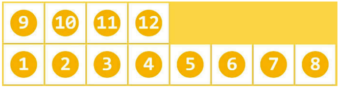

# 一、CSS3 简介

## 1. CSS3 概述
- `CSS3` 是 `CSS2` 的升级版本，它在 `CSS2` 的基础上，新增了很多强大的新功能，从而解决一些实际面临的问题。
- `CSS3` 在未来会按照**模块化**的方式去发展： https://www.w3.org/Style/CSS/current-work.html

`CSS3` 的新特性如下：
- 新增了**更加实用的选择器**，例如：动态伪类选择器、目标伪类选择器、伪元素选择器等等。
- 新增了**更好的视觉效果**，例如：圆角、阴影、渐变等。
- 新增了**丰富的背景效果**，例如：支持多个背景图片，同时新增了若干个背景相关的属性。
- 新增了**全新的布局方案** —— 弹性盒子。
- 新增了 `Web` **字体**，可以显示用户电脑上没有安装的字体。
- 增强了**颜色**，例如： `HSL` 、 `HSLA` 、 `RGBA` 几种新的颜色模式，新增 `opacity` 属性来控制透明度。
- 增加了 `2D` **和** `3D` **变换**，例如：旋转、扭曲、缩放、位移等。
- 增加**动画与过渡效果**，让效果的变换更具流线性、平滑性。
- ......


## 2. CSS3私有前缀

### 2.1 什么是私有前缀
如下代码中的 `-webkit-` 就是私有前缀
```css
div {
  width: 400px;
  height: 400px;
  -webkit-border-radius: 20px;
}
```

### 2.2 为什么要有私有前缀
- `W3C` 标准所提出的某个 `CSS` 特性，在被浏览器正式支持之前，浏览器厂商会根据浏览器的内核，使用私有前缀来测试该 `CSS` 特性，在浏览器正式支持该 `CSS` 特性后，就不需要私有前缀了。
- 举个例子：
  ```css
  -webkit-border-radius: 20px;
  -moz-border-radius: 20px;
  -ms-border-radius: 20px;
  -o-border-radius: 20px;
  border-radius: 20px;
  ```
- 查询 `CSS3` 兼容性的网站： https://caniuse.com/

### 2.3 常见浏览器私有前缀
- Chrome 浏览器： `-webkit-`
- Safari 浏览器： `-webkit-`
- Firefox 浏览器： `-moz-`
- Edge 浏览器： `-webkit-`
- ~~旧 Opera 浏览器： `-o-`~~
- ~~旧 IE 浏览器： `-ms-`~~

注意：
> 我们在编码时，不用过于关注浏览器私有前缀，不用绞尽脑汁的去记忆，也不用每个都去查询，因为常用的 `CSS3` 新特性，主流浏览器都是支持的，即便是为了老浏览器而加前缀，我们也可以借助现代的构建工具，去帮我们添加私有前缀。


# 二、CSS3 基本语法

## 1. CSS3 新增长度单位
1. `rem` 根元素字体大小的倍数，只与根元素字体大小有关。
2. `vw` 视口宽度（view width）的百分之多少 `10vw` 就是视口宽度的 `10%` 。
3. `vh` 视口高度（view height）的百分之多少 `10vh` 就是视口高度的 `10%` 。
4. `vmax` 视口宽高中大的那个的百分之多少。（了解即可）
5. `vmin` 视口宽高中小的那个的百分之多少。（了解即可）


## 2. CSS3 新增颜色设置方式
`CSS3` 新增了三种颜色设置方式，分别是： `rgba` 、 `hsl` 、 `hsla` ，由于之前已经详细讲解，此处略过。


## 3. CSS3 新增选择器
`CSS3` 新增的选择器有：动态伪类、目标伪类、语言伪类、 `UI` 伪类、结构伪类、否定伪类、伪元素；这些在 `CSS2` 中已经详细讲解，此处略过。


## 4. CSS3 新增盒模型相关属性

### 4.1. box-sizing 怪异盒模型
使用 `box-sizing` 属性可以设置盒模型的两种类型
| 可选值      | 含义                                                     |
| ----------- | -------------------------------------------------------- |
| content-box | `width` 和 `height` 设置的是盒子内容区的大小。（默认值） |
| border-box  | `width` 和 `height` 设置的是盒子总大小。（怪异盒模型）   |

### 4.2. resize 调整盒子大小
使用 `resize` 属性可以控制是否允许用户调节元素尺寸。
| 值         | 含义                           |
| ---------- | ------------------------------ |
| none       | 不允许用户调整元素大小。(默认) |
| both       | 用户可以调节元素的宽度和高度。 |
| horizontal | 用户可以调节元素的宽度。       |
| vertical   | 用户可以调节元素的高度。       |

> 注意： 只有设置了 `overflow` 属性，才能使用 `resize` 属性。
> 实际开发中，很少使用。

### 4.3. box-shadow 盒子阴影
使用 `box-shadow` 属性为盒子添加阴影。
- 语法：
  ```css
  box-shadow: h-shadow v-shadow blur spread color inset;
  ```
- 各个值的含义：
  | 值       | 含义                                 |
  | -------- | ------------------------------------ |
  | h-shadow | 水平阴影的位置，必须填写，可以为负值 |
  | v-shadow | 垂直阴影的位置，必须填写，可以为负值 |
  | blur     | 可选，模糊距离                       |
  | spread   | 可选，阴影的外延值                   |
  | color    | 可选，阴影的颜色                     |
  | inset    | 可选，将外部阴影改为内部阴影         |
- 默认值： `box-shadow:none` 表示没有阴影
- 示例：
  ```css
  /* 写两个值，含义：水平位置、垂直位置 */
  box-shadow: 10px 10px;
  /* 写三个值，含义：水平位置、垂直位置、颜色 */
  box-shadow: 10px 10px red;
  /* 写三个值，含义：水平位置、垂直位置、模糊值 */
  box-shadow: 10px 10px 10px;
  /* 写四个值，含义：水平位置、垂直位置、模糊值、颜色 */
  box-shadow: 10px 10px 10px red;
  /* 写五个值，含义：水平位置、垂直位置、模糊值、外延值、颜色 */
  box-shadow: 10px 10px 10px 10px blue;
  /* 写六个值，含义：水平位置、垂直位置、模糊值、外延值、颜色、内阴影 */
  box-shadow: 10px 10px 20px 3px blue inset;
  ```

### 4.4. opacity 不透明度
`opacity` 属性能为整个元素添加透明效果， 值是 `0` 到 `1` 之间的小数， `0` 是完全透明， `1` 表示完全不透明。

> `opacity` 与 `rgba` 的区别？  
> `opacity` 是一个属性，设置的是整个元素（包括元素里的内容）的不透明度。  
> `rgba` 是颜色的设置方式，用于设置颜色，它的透明度，仅仅是调整颜色的透明度。  


## 5. CSS3 新增背景属性

### 5.1. background-origin
- 作用：设置背景图的原点。
- 语法：
  1. `padding-box` ：从 `padding` 区域开始显示背景图像。—— 默认值
  2. `border-box` ： 从 `border` 区域开始显示背景图像。
  3. `content-box` ： 从 `content` 区域开始显示背景图像。

> `background-origin` 只是设置了背景图像的开始的位置， 如果开启了 `background-repeat` ，那么背景图像还是会铺满整个元素盒子的。

### 5.2. background-clip
- 作用：设置背景图的向外裁剪的区域。
- 语法：
  1. `border-box` ： 从 `border` 区域开始向外裁剪背景。 —— 默认值
  2. `padding-box` ： 从 `padding` 区域开始向外裁剪背景。
  3. `content-box` ： 从 `content` 区域开始向外裁剪背景。
  4. `text` ：背景图只呈现在文字上。（背景被裁剪成文字的前景色。）

> `background-color` 与 `background-image` 都受到 `background-clip` 的影响。

> 注意：若值为 `text` ，那么 `backgroun-clip` 要加上 `-webkit-` 前缀。  

### 5.3. background-size
- 作用：设置背景图的尺寸。
- 语法：
  1. 用长度值指定背景图片大小，不允许负值。
     ```css
     background-size: 300px 200px;
     ```
  2. 用百分比指定背景图片大小，不允许负值。
     ```css
     background-size: 100% 100%;
     ```
  3. `auto` ： 背景图片的真实大小。 —— 默认值
  4. `contain` ： 将背景图片等比缩放，使背景图片的宽或高，与容器的宽或高相等，再将完整背景图片包含在容器内，但要注意：可能会造成容器里部分区域没有背景图片。
     ```css
     background-size: contain;
     ```
  5. `cover` ：将背景图片等比缩放，直到完全覆盖容器，图片会尽可能全的显示在元素上，但要注意：背景图片有可能显示不完整。—— 相对比较好的选择
     ```css
     background-size: cover;
     ```

### 5.4. backgorund 复合属性
- 语法：
  ```css
  /* background: 背景颜色 背景url 是否重复 位置 / 大小 原点 裁剪方式; */
  background: color url repeat position / size origin clip
  ```
- 示例：
  ```css
  background: red url(../images/bg.png) no-repeat 10px 20px / 300px 200px content-box padding-box;
  ```

> 注意：
> 1. `origin` 和 `clip` 的值如果一样，如果只写一个值，则 `origin` 和 `clip` 都设置；如果设置了两个值，前面的是 `origin` ，后面的 `clip` 。
> 2. `size` 的值必须写在 `position` 值的后面，并且用 / 分开。
> 3. 建议：`background` 复合属性的值，最好按照上面的顺序来写。

### 5.5. 多背景图
`CSS3` 允许元素设置多个背景图片
```css
/* 添加多个背景图 */
background: url(../images/bg-lt.png) no-repeat left top, /* left top 是默认值，可以省略 */
            url(../images/bg-rt.png) no-repeat right top,
            url(../images/bg-lb.png) no-repeat left bottom,
            url(../images/bg-rb.png) no-repeat right bottom;
```

> 注意： `background-image` 属性只能设置一张背景图，如果要设置多张背景图，需要使用 `background` 复合属性。


## 6. CSS3新增边框属性

### 6.1 边框圆角
- 在 `CSS3` 中，使用 `border-radius` 属性可以将盒子变为圆角。
- 同时设置四个角的圆角：
  ```css
  border-radius: 10px;
  ```
- 分开设置每个角的圆角（几乎不用）：
  | 属性名                     | 作用                                                                                                |
  | -------------------------- | --------------------------------------------------------------------------------------------------- |
  | border-top-left-radius     | 设置左上角圆角半径<ol><li>一个值是正圆半径，</li><li>两个值分别是椭圆的 x 半径、 y 半径。</li></ol> |
  | border-top-right-radius    | 设置右上角圆角半径<ol><li>一个值是正圆半径，</li><li>两个值分别是椭圆的 x 半径、 y 半径。</li></ol> |
  | border-bottom-right-radius | 设置右下角圆角半径<ol><li>一个值是正圆半径，</li><li>两个值分别是椭圆的 x 半径、 y 半径。</li></ol> |
  | border-bottom-left-radius  | 设置左下角圆角半径<ol><li>一个值是正圆半径，</li><li>两个值分别是椭圆的 x 半径、 y 半径。</li></ol> |
- 分开设置每个角的圆角，综合写法（几乎不用）：
  ```css
  border-raidus: 左上角x 右上角x 右下角x 左下角x / 左上y 右上y 右下y 左下y;
  ```

### 6.2 边框外轮廓（了解）
- `outline-width` ：外轮廓的宽度。
- `outline-color` ：外轮廓的颜色。
- `outline-style` ：外轮廓的风格。
  - `none` ： 无轮廓
  - `dotted` ： 点状轮廓
  - `dashed` ： 虚线轮廓
  - `solid` ： 实线轮廓
  - `double` ： 双线轮廓
- `outline-offset` 设置外轮廓与边框的距离，正负值都可以设置。
  > 注意： `outline-offset` 不是 `outline` 的子属性，是一个独立的属性。
- `outline` 复合属性
  ```css
  outline: 50px solid blue;
  ```


## 7. CSS3新增文本属性

### 7.1 文本阴影
- 在 `CSS3` 中，我们可以使用 `text-shadow` 属性给文本添加阴影。
- 语法：
  ```css
  text-shadow: h-shadow v-shadow blur color;
  ```
  | 值       | 描述                               |
  | -------- | ---------------------------------- |
  | h-shadow | 必需写，水平阴影的位置。允许负值。 |
  | v-shadow | 必需写，垂直阴影的位置。允许负值。 |
  | blur     | 可选，模糊的距离。                 |
  | color    | 可选，阴影的颜色                   |

> 默认值： `text-shadow: none` 表示没有阴影。

### 7.2 文本换行
- 在 `CSS3` 中，我们可以使用 `white-space` 属性设置文本换行方式。
- 常用值如下：
  | 值       | 含义                                                                            |
  | -------- | ------------------------------------------------------------------------------- |
  | normal   | 文本超出边界自动换行，文本中的换行被浏览器识别为一个空格。（默认值）            |
  | pre      | 原样输出，与 `pre` 标签的效果相同。                                             |
  | pre-wrap | 在 `pre` 效果的基础上，超出元素边界自动换行。                                   |
  | pre-line | 在 `pre` 效果的基础上，超出元素边界自动换行，且只识别文本中的换行，空格会忽略。 |
  | nowrap   | 强制不换行                                                                      |

### 7.3 文本溢出
- 在 `CSS3` 中，我们可以使用 `text-overflow` 属性设置文本内容溢出时的呈现模式。
- 常用值如下：
  | 值       | 含义                                            |
  | -------- | ----------------------------------------------- |
  | clip     | 当内联内容溢出时，将溢出部分裁切掉。 （默认值） |
  | ellipsis | 当内联内容溢出块容器时，将溢出部分替换为 ... 。 |

> 注意：要使得 `text-overflow` 属性生效，块容器必须显式定义 `overflow` 为非 `visible` 值， `white-space` 为 `nowrap` 值。

### 7.4 文本修饰
- `CSS3` 升级了 `text-decoration` 属性，让其变成了复合属性。
  ```css
  text-decoration: text-decoration-line || text-decoration-style || text-decoration-color
  ```
- 子属性及其含义：
  - `text-decoration-line` ： 设置文本装饰线的位置
    - `none` ： 指定文字无装饰 （默认值）
    - `underline` ： 指定文字的装饰是下划线
    - `overline` ： 指定文字的装饰是上划线
    - `line-through` ： 指定文字的装饰是贯穿线
  - `text-decoration-style` ： 文本装饰线条的形状
    - `solid` ： 实线 （默认）
    - `double` ： 双线
    - `dotted` ： 点状线条
    - `dashed` ： 虚线
    - `wavy` ： 波浪线
  - `text-decoration-color` ： 文本装饰线条的颜色

### 7.5 文本描边
注意：文字描边功能仅 `webkit` 内核浏览器支持。
- `-webkit-text-stroke-width` ：设置文字描边的宽度，写长度值。
- `-webkit-text-stroke-color` ：设置文字描边的颜色，写颜色值。
- `-webkit-text-stroke` ：复合属性，设置文字描边宽度和颜色。


## 8. CSS3 新增渐变

### 8.1 线性渐变
- 多个颜色之间的渐变， 默认**从上到下**渐变。
  > 
  > ```css
  > background-image: linear-gradient(red,yellow,green);
  > ```
- 使用关键词设置线性**渐变的方向**。
  > 
  > ```css
  > background-image: linear-gradient(to top,red,yellow,green);
  > background-image: linear-gradient(to right top,red,yellow,green);
  > ```
- 使用角度设置线性**渐变的方向**。 （注意：角度是顺时针方向，默认为180deg）
  > 
  > ```css
  > background-image: linear-gradient(30deg,red,yellow,green);
  > ```
- 调整开始**渐变的位置**。（指定的位置为指定的颜色）
  > 
  > ```css
  > background-image: linear-gradient(red 50px,yellow 100px,green 150px);
  > ```

### 8.2 径向渐变
- 多个颜色之间的渐变， 默认从圆心四散。（注意：不一定是正圆，要看容器本身宽高比）
  > 
  > ```css
  > background-image: radial-gradient(red,yellow,green);
  > ```
- 使用关键词调整渐变圆的圆心位置。
  > 
  > ```css
  > background-image: radial-gradient(at right top,red,yellow,green);
  > ```
- 使用像素值调整渐变圆的圆心位置。
  > 
  > ```css
  > background-image: radial-gradient(at 100px 50px,red,yellow,green);
  > ```
- 调整渐变形状为正圆 。
  > 
  > ```css
  > background-image: radial-gradient(circle,red,yellow,green);
  > ```
- 调整形状的半径 。
  > 
  > ```css
  > background-image: radial-gradient(100px,red,yellow,green);
  > background-image: radial-gradient(50px 100px,red,yellow,green);
  > ```
- 调整开始渐变的位置。
  > 
  > ```css
  > background-image: radial-gradient(red 50px,yellow 100px,green 150px);
  > ```

综合示例：
```css
background-image: radial-gradient(100px 50px at 150px 150px,red 50px,yellow 100px,green 150px);
```

### 8.3 重复渐变
无论线性渐变，还是径向渐变，**在没有发生渐变的位置，继续进行渐变**，就为重复渐变。
- 使用 `repeating-linear-gradient` 进行重复线性渐变，具体参数同 `linear-gradient` 。
- 使用 `repeating-radial-gradient` 进行重复径向渐变，具体参数同 `radial-gradient` 。

> 我们可以利用渐变，做出很多有意思的效果：例如：横格纸、立体球等等。

```css
.box1 {
    width: 600px;
    height: 800px;
    padding: 20px;
    border: 1px solid black;
    margin: 0 auto;
    background-image: repeating-linear-gradient(transparent 0px,transparent 29px,gray 30px);
    background-clip: content-box;
}
.box2 {
    width: 200px;
    height: 200px;
    border-radius: 50%;
    background-image: radial-gradient(at 80px 80px,white,#333);
}
```


## 9. web 字体

### 9.1 基本用法
可以通过 `@font-face` 指定字体的具体地址，浏览器会自动下载该字体，这样就不依赖用户电脑上的字体了。
- 语法（简写方式）
  ```css
  @font-face {
    font-family: "情书字体";
    src: url('./方正手迹.ttf');
  }
  ```
- 语法（高兼容性写法）★
  ```css
  @font-face {
    font-family: "atguigu";
    font-display: swap;
    src: url('webfont.eot'); /* IE9 */
    src: url('webfont.eot?#iefix') format('embedded-opentype'), /* IE6-IE8 */
         url('webfont.woff2') format('woff2'),
         url('webfont.woff') format('woff'), /* chrome、firefox */
         url('webfont.ttf') format('truetype'), /* chrome、firefox、opera、Safari, Android */
         url('webfont.svg#webfont') format('svg'); /* iOS 4.1- */
  }
  ```

### 9.2 定制字体
- 中文的字体文件很大，使用完整的字体文件不现实，通常针对某几个文字进行单独定制。
- 可使用阿里 `Web` 字体定制工具： https://www.iconfont.cn/webfon

### 9.3 字体图标
- 相比图片更加清晰。
- 灵活性高，更方便改变大小、颜色、风格等。
- 兼容性好， `IE` 也能支持。

> 字体图标的具体使用方式，每个平台不尽相同，最好参考平台使用指南，视频中我们是以使用最多的阿里图标库作为演示。
> 
> 阿里图标官网地址： https://www.iconfont.cn/


## 10. 2D变换
> 前提：二维坐标系如下图所示


### 10.1. 2D位移
`2D` 位移可以改变元素的位置，具体使用方式如下：
1. 先给元素添加 **转换属性** `transform`
2. 编写 `transform` 的具体值，相关可选值如下：
   | 值         | 含义                                                                       |
   | ---------- | -------------------------------------------------------------------------- |
   | translateX | 设置水平方向位移，需指定长度值；若指定的是百分比，是参考自身宽度的百分比。 |
   | translateY | 设置垂直方向位移，需指定长度值；若指定的是百分比，是参考自身高度的百分比。 |
   | translate  | 一个值代表水平方向，两个值代表：水平和垂直方向。                           |
3. 注意点：
   > 1. 位移与相对定位很相似，都不脱离文档流，不会影响到其它元素。
   > 2. 与相对定位的区别：相对定位的百分比值，参考的是其父元素；定位的百分比值，参考的是其自身。
   > 3. 浏览器针对位移有优化，与定位相比，浏览器处理位移的效率更高。
   > 4. `transform` 可以链式编写，例如：
   >    ```css
   >    transform: translateX(30px) translateY(40px);
   >    ```
   > 5. 位移对行内元素无效。
   > 6. 位移配合定位，可实现元素**水平垂直居中**
   >    ```css
   >    .box {
   >      position: absolute;
   >      left: 50%;
   >      top: 50%;
   >      transform: translate(-50%, -50%);
   >    }
   >    ```

### 10.2. 2D缩放
`2D` 缩放是指：让元素放大或缩小，具体使用方式如下：
1. 先给元素添加 **转换属性** `transform`
2. 编写 `transform` 的具体值，相关可选值如下：
   | 值     | 含义                                                                                                         |
   | ------ | ------------------------------------------------------------------------------------------------------------ |
   | scaleX | 设置水平方向的缩放比例，值为一个数字， 1 表示不缩放，大于 1 放大，小于 1 缩小。                              |
   | scaleY | 设置垂直方向的缩放比例，值为一个数字， 1 表示不缩放，大于 1 放大，小于 1 缩小。                              |
   | scale  | 同时设置水平方向、垂直方向的缩放比例，一个值代表同时设置水平和垂直缩放；两个值分别代表：水平缩放、垂直缩放。 |
3. 注意点：
   > 1. `scale` 的值，是支持写负数的，但几乎不用，因为容易让人产生误解。
   > 2. 借助缩放，可实现小于 `12px` 的文字。
   > 3. 缩放同样对行内元素无效。

### 10.3. 2D旋转
`2D` 旋转是指：让元素在二维平面内，顺时针旋转或逆时针旋转，具体使用方式如下：
1. 先给元素添加 **转换属性** `transform`
2. 编写 `transform` 的具体值，相关可选值如下：
   | 值     | 含义                                                              |
   | ------ | ----------------------------------------------------------------- |
   | rotate | 设置旋转角度，需指定一个角度值( `deg` )，正值顺时针，负值逆时针。 |

> 注意： `rotateZ(20deg)` 相当于 `rotate(20deg)` ，当然到了 `3D` 变换的时候，还能写： `rotate(x,x,x)`  
> 旋转的中心是元素中心（旋转之后进行其他变换不会改变旋转中心），旋转的本质是坐标系的变换。

### 10.4. 2D扭曲（了解）
`2D` 扭曲是指：让元素在二维平面内被“拉扯”，进而“走形”，实际开发几乎不用，了解即可，具体使用方式如下：
1. 先给元素添加 **转换属性** `transform`
2. 编写 `transform` 的具体值，相关可选值如下：
   | 值    | 含义                                                                    |
   | ----- | ----------------------------------------------------------------------- |
   | skewX | 设置元素在水平方向扭曲，值为角度值，会将元素的+(左上角、右下角) 拉扯 。 |
   | skewY | 设置元素在垂直方向扭曲，值为角度值，会将元素的+(左上角、右下角) 拉扯 。 |
   | skew  | 一个值代表 `skewX` ，两个值分别代表： `skewX` 、 `skewY`                |

### 10.5. 多重变换
多个变换，可以同时使用一个 `transform` 来编写。
```css
transform: translate(-50%, -50%) rotate(45deg);
```

> 注意点：多重变换时，变换的先后顺序会影响到最终的效果。 **建议最后旋转。**

### 10.6. 变换原点
- 元素变换时，默认的原点是元素的中心，使用 `transform-origin` 可以设置变换的原点。
- 修改变换原点对位移没有影响， 对旋转和缩放会产生影响。
- 如果提供两个值，第一个用于横坐标，第二个用于纵坐标。
- 如果只提供一个，若是像素值，表示横坐标，纵坐标取 `50%` ；若是关键词，则另一个坐标取 `50%`
  > 1. `transform-origin: 50% 50%` ， 变换原点在元素的中心位置，百分比是相对于自身。—— 默认值
  > 2. `transform-origin: left top` ，变换原点在元素的左上角 。
  > 3. `transform-origin: 50px 50px` ， 变换原点距离元素左上角 `50px` `50px` 的位置。
  > 4. `transform-origin: 0` ，只写一个值的时候，第二个值默认为 `50%` 。


## 11. 3D变换

### 11.1. 开启3D空间
重要原则：元素进行 `3D` 变换的首要操作：**父元素**必须开启 `3D` 空间！

> 使用 `transform-style` 开启 3D 空间，可选值如下：
> - `flat` ： 让子元素位于此元素的二维平面内（ `2D` 空间）—— 默认值
> - `preserve-3d` ： 让子元素位于此元素的三维空间内（ `3D` 空间）

### 11.2. 设置景深
何为景深？—— 指定观察者与 `z=0` 平面的距离，能让发生 `3D` 变换的元素，产生**透视**效果，看来更加立体。
> 使用 `perspective` 设置景深，可选值如下：
> - `none` ： 不指定透视 ——（默认值）
> - `长度值` ： 指定观察者距离 `z=0` 平面的距离，不允许负值。（通常设置为变换元素半径的150%+）
> 
> 注意： `perspective` 设置给发生 `3D` 变换元素的**父元素**！

### 11.3. 透视点位置
所谓透视点位置，就是观察者位置；默认的透视点在 变换元素的父元素 中心。
> 使用 `perspective-origin` 设置观察者位置（透视点的位置），例如：
> ```css
> /* 相对坐标轴往右偏移400px， 往下偏移300px（相当于人蹲下300像素，然后向右移动400像素看元素） */
> perspective-origin: 400px 300px;
> ```
> 注意：通常情况下，我们不需要调整透视点位置。

### 11.4. 3D 位移
`3D` 位移是在 `2D` 位移的基础上，可以让元素沿 `z` 轴位移，具体使用方式如下：
1. 先给元素添加 **转换属性** `transform`
2. 编写 `transform` 的具体值， `3D` 相关可选值如下：
   | 值          | 含义                                                                             |
   | ----------- | -------------------------------------------------------------------------------- |
   | translateZ  | 设置 `z` 轴位移，需指定长度值，正值向屏幕外，负值向屏幕里，且不能写百分比。      |
   | translate3d | 第1个参数对应 `x` 轴，第2个参数对应 `y` 轴，第3个参数对应 `z` 轴，且均不能省略。 |

> 当使用 `translateZ` 的值不小于景深值时，元素在 `z` 轴上的位移会超出透视点，此时元素不可见。

### 11.5. 3D 旋转
`3D` 旋转是在 `2D` 旋转的基础上，可以让元素沿 `x` 轴和 `y` 轴旋转，具体使用方式如下：
1. 先给元素添加 **转换属性** `transform`
2. 编写 `transform` 的具体值， `3D` 相关可选值如下：
   | 值       | 含义                                                                                                                                                                             |
   | -------- | -------------------------------------------------------------------------------------------------------------------------------------------------------------------------------- |
   | rotateX  | 设置 `x` 轴旋转角度，需指定一个角度值( `deg` )，面对 `x` 轴正方向：正值顺时针，负值逆时针。                                                                                      |
   | rotateY  | 设置 `y` 轴旋转角度，需指定一个角度值( `deg` )，面对 `y` 轴正方向：正值顺时针，负值逆时针。                                                                                      |
   | rotate3d | 前3个参数分别表示坐标轴： `x` 、 `y` 、 `z` ，第4个参数表示旋转的角度，参数不允许省略。<br>例如： `transform: rotate3d(1,1,1,30deg)` ，意思是： `x` 、 `y` 、 `z` 分别旋转30度。 |

### 11.6. 3D 缩放
`3D` 缩放是在 `2D` 缩放的基础上，可以让元素沿 `z` 轴缩放，具体使用方式如下：
1. 先给元素添加 **转换属性** `transform`
2. 编写 `transform` 的具体值， `3D` 相关可选值如下：
   | 值      | 含义                                                                               |
   | ------- | ---------------------------------------------------------------------------------- |
   | scaleZ  | 设置 `z` 轴方向的缩放比例，值为一个数字， 1 表示不缩放，大于 1 放大，小于 1 缩小。 |
   | scale3d | 第1个参数对应 `x` 轴，第2个参数对应 `y` 轴，第3个参数对应 `z` 轴，参数不允许省略。 |

> `scaleZ` 相当于在修改 `perspective` 的值。 `perspective /= scaleZ` 。

### 11.7. 多重变换
多个变换，可以同时使用一个 `transform` 来编写。
```css
transform: translateZ(100px) scaleZ(3) rotateY(40deg);
```

> 注意点：多重变换时，建议最后旋转。

### 11.8. 背部可见性
使用 `backface-visibility` 指定元素背面，在面向用户时是否可见，常用值如下：
- `visible` ： 指定元素背面可见，允许显示正面的镜像。—— 默认值
- `hidden` ： 指定元素背面不可见

> 注意： `backface-visibility` 需要加在发生 `3D` 变换元素的自身上。


## 12. 过渡
过渡可以在不使用 `Flash` 动画，不使用 `JavaScript` 的情况下，让元素从一种样式，平滑过渡为另一种样式。

### 12.1. transition-property
- 作用：定义哪个属性需要过渡，只有在该属性中定义的属性（比如宽、高、颜色等）才会以有过渡效果。
- 常用值：
  1. `none` ：不过渡任何属性。
  2. `all` ：过渡所有能过渡的属性。
  3. 具体某个属性名 ，例如： `width` 、 `heigth` ，若有多个以逗号分隔。

> 不是所有的属性都能过渡，值为数字，或者值能转为数字的属性，都支持过渡，否则不支持过渡。  
> 常见的支持过渡的属性有：颜色、长度值、百分比、 `z-index` 、 `opacity` 、 `2D` 变换属性、 `3D` 变换属性、阴影。  

### 12.2. transition-duration
- 作用：设置过渡的持续时间，即：一个状态过渡到另外一个状态耗时多久。
- 常用值：
  1. `0` ：没有任何过渡时间 —— 默认值。
  2. `s` 或 `ms` ：秒或毫秒。
  3. 列表 ：
     - 如果想让所有属性都持续一个时间，那就写一个值。
     - 如果想让每个属性持续不同的时间那就写一个时间的列表（`,` 分隔，与 `transition-property` 一一对应）。

### 12.3. transition-delay
- 作用：指定开始过渡的延迟时间，单位： `s` 或 `ms`

### 12.4. transition-timing-function
- 作用：设置过渡的类型
- 常用值：
  1. `ease` ： 平滑过渡 —— 默认值
  2. `linear` ： 线性过渡
  3. `ease-in` ： 慢 → 快
  4. `ease-out` ： 快 → 慢
  5. `ease-in-out` ： 慢 → 快 → 慢
  6. `step-start` ： 等同于 `steps(1, start)`
  7. `step-end` ： 等同于 `steps(1, end)`
  8. `steps(integer,?)` ： 接受两个参数的步进函数。
     1. 第一个参数必须为正整数，指定函数的步数。第二个参数取值可以是 `start` 或 `end` ，指定每一步的值发生变化的时间点。
     2. 第二个参数默认值为 `end` 。
  9. `cubic-bezie(number, number, number, number)`： 特定的贝塞尔曲线类型。
     > 在线制作贝赛尔曲线： https://cubic-bezier.com

示例：
```html
<div class="outer">
    <div class="box box1">ease（慢，快，慢）</div>
    <div class="box box2">linear（匀速）</div>
    <div class="box box3">ease-in（慢，快）</div>
    <div class="box box4">ease-out（快，慢）</div>
    <div class="box box5">ease-in-out（慢，快，慢）</div>
    <div class="box box6">step-start不考虑过渡的时间，直接就是终点</div>
    <div class="box box7">step-end考虑过渡时间，但无过渡效果，过渡时间到了以后，瞬间到达终点</div>
    <div class="box box8">steps分步过渡</div>
    <div class="box box9">无敌的贝赛尔曲线</div>
</div>
```

```css
.outer {
    width: 1300px;
    height: 900px;
    border: 1px solid black;
}

.outer:hover .box {
    width: 1300px;
}

.box {
    width: 200px;
    height: 100px;
    /* 让所有能过渡的属性，都过渡 */
    transition-property: all;
    /* 设置一个时间，所有人都用 */
    transition-duration: 5s;
    /* 过渡延迟 */
    /* transition-delay: 2s; */
}

.box1 {
    background-color: skyblue;
    transition-timing-function: ease; /* 默认值：平滑过渡 */
}

.box2 {
    background-color: orange;
    transition-timing-function: linear; /* 线性过渡 */
}

.box3 {
    background-color: gray;
    transition-timing-function: ease-in; /* 慢 → 快 */
}

.box4 {
    background-color: tomato;
    transition-timing-function: ease-out; /* 快 → 慢 */
}

.box5 {
    background-color: green;
    transition-timing-function: ease-in-out; /* 慢 → 快 → 慢 */
}

.box6 {
    background-color: purple;
    transition-timing-function: step-start; /* 不考虑过渡的时间，直接就是终点：等同于 steps(1, start) */
}

.box7 {
    background-color: deepskyblue;
    transition-timing-function: step-end; /* 考虑过渡时间，但无过渡效果，过渡时间到了以后，瞬间到达终点：等同于 steps(1, end) */
}

.box8 {
    background-color: chocolate;
    transition-timing-function: steps(20, end);
}

.box9 {
    background-color: rgb(18, 78, 34);
    transition-timing-function: cubic-bezier(1, .35, .78, 1.24);
}
```

### 12.5. transition 复合属性
- 如果设置了一个时间，表示 `duration` ；如果设置了两个时间，第一是 `duration` ，第二个是 `delay` ；其他值没有顺序要求。
  ```css
  transition: 1s 1s linear all;
  ```


## 13. 动画

### 13.1. 什么是帧
- 一段动画，就是一段时间内连续播放 n 个画面。每一张画面，我们管它叫做“帧”。一定时间内连续快速播放若干个帧，就成了人眼中所看到的动画。同样时间内，播放的帧数越多，画面看起来越流畅。

### 13.2. 什么是关键帧
- 关键帧指的是，在构成一段动画的若干帧中，起到决定性作用的 `2-3` 帧。


### 13.3. 动画的基本使用
第一步：定义关键帧（定义动画）
1. 简单方式定义：
   ```css
   @keyframes 动画名 {
     from {
       /* property1: value1 */
     }
     to {
       /* property1: value1 */
     }
   }
   ```
2. 完整方式定义：
   ```css
   @keyframes 动画名 {
     0% {
       /* property1: value1 */
     }
     20% {
       /*property1: value1*/
     }
     40% {
       /*property1: value1*/
     }
     60% {
       /*property1: value1*/
     }
     80% {
       /*property1: value1*/
     }
     100% {
       /*property1: value1*/
     }
   }
   ```

第二步：给元素应用动画，用到的属性如下：
1. `animation-name` ：给元素指定具体的动画（具体的关键帧）
2. `animation-duration` ：设置动画所需时间
3. `animation-delay` ：设置动画延迟

  ```css
  .box {
    /* 指定动画 */
    animation-name: 动画名;
    /* 设置动画所需时间 */
    animation-duration: 5s;
    /* 设置动画延迟 */
    animation-delay: 0.5s;
  }
  ```

### 13.4. 动画的其他属性
- `animation-timing-function` ，设置动画的类型，常用值如下：
  > 1. `ease` ： 平滑动画 —— 默认值
  > 2. `linear` ： 线性过渡
  > 3. `ease-in` ： 慢 → 快
  > 4. `ease-out` ： 快 → 慢
  > 5. `ease-in-out` ： 慢 → 快 → 慢
  > 6. `step-start` ： 等同于 `steps(1, start)`
  > 7. `step-end` ： 等同于 `steps(1, end)`
  > 8. `steps(integer,?)` ： 接受两个参数的步进函数。第一个参数必须为正整数，指定函数的步数。第二个参数取值可以是 `start` 或 `end` ，指定每一步的值发生变化的时间点。第二个参数默认值为 `end` 。
  > 9. `cubic-bezie(number, number, number, number)`： 特定的贝塞尔曲线类型。
- `animation-iteration-count` ，指定动画的播放次数，常用值如下：
  > 1. `number` ：动画循环次数
  > 2. `infinite` ： 无限循环
- `animation-direction` ，指定动画方向，常用值如下：
  > 1. `normal` ： 正常方向 (默认)
  > 2. `reverse` ： 反方向运行
  > 3. `alternate` ： 动画先正常运行再反方向运行，并持续交替运行
  > 4. `alternate-reverse` ： 动画先反运行再正方向运行，并持续交替运行
- `animation-fill-mode` ，设置动画之外的状态
  > 1. `forwards` ： 设置对象状态为动画结束时的状态
  > 2. `backwards` ： 设置对象状态为动画开始时的状态
- `animation-play-state` ，设置动画的播放状态，常用值如下：
  > 1. `running` ： 运动 (默认)
  > 2. `paused` ： 暂停

### 13.5. 动画复合属性
只设置一个时间表示 `duration` ，设置两个时间分别是： `duration` 和 `delay` ，其他属性没有数量和顺序要求。
```css
.inner {
  animation: atguigu 3s 0.5s linear 2 alternate-reverse forwards;
}
```

> 备注： `animation-play-state` 一般单独使用。

### 动画与过渡的区别
`transition` 需要触发一个事件才会随着时间改变其 `CSS` 属性；`animation` 在不需要触发任何事件的情况下，也可以显式的随时间变化来改变元素 `CSS` 属性，达到一种动画的效果。
1. 动画不需要事件触发，过渡需要。
2. 过渡只有一组（两个：开始-结束） 关键帧，动画可以设置多个。

### 动画案例
```html
<style>
#animation-case-bike {
    width: 130px;
    height: 130px;
    background-image: url('./image/CSS3/bike.png');
    margin: 0 auto;
    margin-top: 100px;
    animation: bike 1s steps(31) infinite;
}
@keyframes bike {
    from{}
    to {
        background-position: 0px -4030px;
    }
}
</style>
<div id="animation-case-bike"></div>
```


## 14. 多列布局
作用：专门用于实现类似于报纸的布局。


### 常用属性如下：
- `column-count` ：指定列数，值是数字。
- `column-width` ：指定列宽，值是长度。（自动计算列数）
- `columns` ：同时指定列宽和列数，复合属性；值没有数量和顺序要求。（最终取节约空间的那个，不推荐使用）
- `column-gap` ：设置列边距，值是长度。
- `column-rule-style` ：设置列与列之间边框的风格，值与 `border-style` 一致。
- `column-rule-width` ：设置列与列之间边框的宽度，值是长度（必须是正数）。
- `column-rule-color` ：设置列与列之间边框的颜色。
- `coumn-rule` ：设置列边框，复合属性。
- `column-span` ：指定是否跨列；值: `none` 、 `all` 。（给需要跨列的内部元素指定）

示例：
```html
<div class="outer">
    
    
    
    
    
    
    
    
    
    
    
    
    
    
    ...
</div>
```

```css
.outer {
    column-count: 5;
}
img {
    width: 100%;
    transition: 0.2s linear;
}
img:hover {
    box-shadow: 0px 0px 20px black;
    transform: scale(1.02);
}
```


## 15.伸缩盒模型

### 1. 伸缩盒模型简介
- `2009` 年， `W3C` 提出了一种新的盒子模型 —— `Flexible Box` （伸缩盒模型，又称：弹性盒子）。
- 它可以轻松的控制：元素分布方式、元素对齐方式、元素视觉顺序 .......
- 截止目前，除了在部分 `IE` 浏览器不支持，其他浏览器均已全部支持。
- 伸缩盒模型的出现，逐渐演变出了一套新的布局方案 —— `flex` 布局。

> 小贴士：
> 1. 传统布局是指：基于传统盒状模型，主要靠： `display` 属性 + `position` 属性 + `float` 属性。
> 2. `flex` 布局目前在移动端应用比较广泛，因为传统布局不能很好的呈现在移动设备上。

### 2. 伸缩容器、伸缩项目
**伸缩容器**： 开启了 `flex` 的元素，就是：伸缩容器。
> 1. 给元素设置： `display:flex` 或 `display:inline-flex` ，该元素就变为了伸缩容器。
> 2. `display:inline-flex` 很少使用，因为可以给多个伸缩容器的父容器，也设置为伸缩容器。
> 3. 一个元素可以同时是：伸缩容器、伸缩项目。

**伸缩项目**：伸缩容器所有**子元素**自动成为了：伸缩项目。
> 1. 仅伸缩容器的**子元素**成为了伸缩项目，孙子元素、重孙子元素等后代，不是伸缩项目。
> 2. 无论原来是哪种元素（块、行内块、行内），一旦成为了伸缩项目，全都会“**块状化**”。
>    

### 3. 主轴与侧轴
- **主轴**： 伸缩项目沿着主轴排列，主轴默认是水平的，默认方向是：从左到右（左边是起点，右边是终点）。
- **侧轴**： 与主轴垂直的就是侧轴，侧轴默认是垂直的，默认方向是：从上到下（上边是起点，下边是终点）。

### 4. 主轴方向
- 属性名： `flex-direction`
- 常用值如下：
  1. `row` ：主轴方向水平从左到右 —— 默认值
  2. `row-reverse` ：主轴方向水平从右到左。
  3. `column` ：主轴方向垂直从上到下。
  4. `column-reverse` ：主轴方向垂直从下到上。


> 注意：改变了主轴的方向，侧轴方向也随之改变。

### 5. 主轴换行方式
- 属性名： `flex-wrap`
- 常用值如下：
  1. `nowrap` ：默认值，不换行。
     
  2. `wrap` ：自动换行，伸缩容器不够自动换行。
     
  3. `wrap-reverse` ：反向换行。
     

> 主轴尽量紧凑（父容器宽度不足时压缩容器内元素宽度）；侧轴尽量分散（父容器高度不足时溢出父容器）。

### 6. flex-flow
- `flex-flow` 是一个复合属性，复合了 `flex-direction` 和 `flex-wrap` 两个属性。 值没有顺序要求。

```css
flex-flow: row wrap;
``` 

### 7. 主轴对齐方式
- 属性名： `justify-content`
- 常用值如下：
  1. `flex-start` ：主轴起点对齐。—— 默认值
  2. `flex-end` ：主轴终点对齐。
  3. `center` ：居中对齐
  4. `space-between` ：均匀分布，两端对齐（最常用）。
  5. `space-around` ：均匀分布，两端距离是中间距离的一半。
  6. `space-evenly` ：均匀分布，两端距离与中间距离一致。


### 8. 侧轴对齐方式

#### 8.1 一行的情况
- 所需属性： `align-items`
- 常用值如下：
  1. `flex-start` ：侧轴的起点对齐。
     
  2. `flex-end` ：侧轴的终点对齐。
     
  3. `center` ：侧轴的中点对齐。
     
  4. `baseline` ：伸缩项目的第一行文字的基线对齐。
     
  5. `stretch` ：如果伸缩项目未设置高度，将占满整个容器的高度。—— （默认值）
     

#### 8.2 多行的情况
- 所需属性： `align-content`
- 常用值如下：
  1. `flex-start` ：与侧轴的起点对齐。
     
  2. `flex-end` ：与侧轴的终点对齐。
     
  3. `center` ：与侧轴的中点对齐。
     
  4. `space-between` ：与侧轴两端对齐，中间平均分布。
     
  5. `space-around` ：伸缩项目间的距离相等，比距边缘大一倍。
     
  6. `space-evenly` ：在侧轴上完全平分。
     
  7. `stretch` ：占满整个侧轴。—— 默认值
     

### 9.flex 实现水平垂直居中
方法一：父容器开启 `flex` 布局，随后使用 `justify-content` 和 `align-items` 实现水平垂直居中
```css
.outer {
  width: 400px;
  height: 400px;
  background-color: #888;
  display: flex;
  justify-content: center;
  align-items: center;
}
.inner {
  width: 100px;
  height: 100px;
  background-color: orange;
}
```

方法二：父容器开启 `flex` 布局，随后子元素 `margin: auto`
```css
.outer {
  width: 400px;
  height: 400px;
  background-color: #888;
  display: flex;
}
.inner {
  width: 100px;
  height: 100px;
  background-color: orange;
  margin: auto;
}
```

### 10. 伸缩性

#### 1. flex-basis
- 概念： `flex-basis` 设置的是主轴方向的**基准长度**，会让宽度或高度失效。
  > 备注：主轴横向：宽度失效；主轴纵向：高度失效
- 作用：浏览器根据这个属性设置的值，计算主轴上是否有多余空间，默认值 `auto` ，即：伸缩项目的宽或高。

#### 2. flex-grow（伸）
- 概念： `flex-grow` 定义伸缩项目的放大比例，默认为 0 ，即：纵使主轴存在剩余空间，也不拉伸（放大）。
- 规则：
  1. 若所有伸缩项目的 `flex-grow` 值都为 1 ，则：它们将等分剩余空间（如果有空间的话）。
  2. 若三个伸缩项目的 `flex-grow` 值分别为： 1 、 2 、 3 ，则：分别瓜分到： 1/6 、 2/6 、 3/6 的空间。

#### 3. flex-shrink（缩）
- 概念： `flex-shrink` 定义了项目的压缩比例，默认为 1 ，即：如果空间不足，该项目将会缩小。
- 收缩项目的计算，略微复杂一点，我们拿一个场景举例：

> 例如：  
> 三个收缩项目，宽度分别为： `200px` 、 `300px` 、 `200px` ，它们的 `flex-shrink` 值分别为： 1 、 2 、 3  
> 若想刚好容纳下三个项目，需要总宽度为 `700px` ，但目前容器只有 `400px` ，还差 `300px`  
> 所以每个人都要收缩一下才可以放下，具体收缩的值，这样计算：
> 1. 计算分母： `(200×1) + (300×2) + (200×3) = 1400`
> 2. 计算比例：
>    - 项目一： `(200×1) / 1400 = 比例值1`
>    - 项目二： `(300×2) / 1400 = 比例值2`
>    - 项目三： `(200×3) / 1400 = 比例值3`
> 3. 计算最终收缩大小：
>    - 项目一需要收缩： `比例值1 × 300`
>    - 项目二需要收缩： `比例值2 × 300`
>    - 项目三需要收缩： `比例值3 × 300`

> 注意：如果开启了主轴换行，那么当父容器宽度不足是优先换行。  
> 收缩的极限是保证内容的呈现，如果达到内容宽度，就不会再收缩了。多余的部分会溢出父容器。

### 11. flex 复合属性
`flex` 是复合属性，复合了： `flex-grow` 、 `flex-shrink` 、 `flex-basis` 三个属性，默认值为 0 1 auto 。
- 如果写 `flex:1 1 auto` ，**可以拉伸，可以压缩，不设置基准长度**，则可简写为： `flex:auto`
- 如果写 `flex:1 1 0` ，**可以拉伸，可以压缩，设置基准长度为0**，则可简写为： `flex:1`
- 如果写 `flex:0 0 auto` ，**不可以拉伸，不可以压缩，不设置基准长度**，则可简写为： `flex:none`
- 如果写 `flex:0 1 auto` ，**不可以拉伸，可以压缩，不设置基准长度**，则可简写为： `flex:0 auto` —— 即 `flex` 初始值。

### 12. 项目排序
- `order` 属性定义项目的排列顺序。数值越小，排列越靠前，默认为 0 。

### 13. 单独对齐
- 通过 `align-self` 属性，可以单独调整某个伸缩项目的对齐方式
- 默认值为 `auto` ，表示继承父元素的 `align-items` 属性。

示例：
```html
<!-- 头部 -->
<header class="page-header">
    <a href="#">
        
    </a>
    <ul class="header-nav">
        <li><a href="#">国内校区</a></li>
        <li><a href="#">缅甸校区</a></li>
        <li><a href="#">非洲校区</a></li>
        <li><a href="#">美国校区</a></li>
    </ul>
</header>
<!-- 内容区 -->
<div class="page-content">
    <div class="content-nav">
        <div class="item">
            <span>我的邮箱</span>
        </div>
        <div class="item">
            <span>云服务</span>
        </div>
        <div class="item">
            <span>手机课堂</span>
        </div>
        <div class="item">
            <span>微信服务</span>
        </div>
        <div class="item">
            <span>在线客服</span>
        </div>
    </div>
</div>
```

```css
* {
    font-family: Arial;
    font-size: 14px;
    margin: 0;
    padding: 0;
    border: none;
}
a {
    text-decoration: none;
}
ul {
    list-style: none;
}
html, body {
    width: 100%;
    height: 100%;
}
body {
    background-image: url('./image/CSS3/bg.jpg');
    background-repeat: no-repeat;
    background-size: cover;
}
.page-header {
    height: 70px;
    background-color: rgba(0, 0, 0, 0.7);
    display: flex;
    justify-content: space-between;
    align-items: center;
    padding: 0 20px;
}
.header-nav {
    display: flex;
}
.header-nav li a {
    color: white;
    font-size: 20px;
    border: 1px solid white;
    border-radius: 8px;
    padding: 10px;
    margin-right: 20px;
}
.header-nav li:last-child a {
    margin-right: 0;
}
.page-content {
    display: flex;
    height: calc(100vh - 70px);
}
.content-nav {
    width: 1000px;
    height: 300px;
    margin: auto;
    display: flex;
    justify-content: space-evenly;
    align-items: center;
}
.content-nav .item {
    width: 180px;
    height: 200px;
    background-color: orange;
    display: flex;
    flex-direction: column;
    align-items: center;
    justify-content: space-evenly;
    transition: 0.2s linear;
    cursor: pointer;
}
.content-nav .item:hover {
    box-shadow: 0px 0px 20px black;
}
.content-nav .item span {
    font-size: 20px;
    color: white;
}
.content-nav .item:nth-child(1) {
    background-color: #595CA8;
}
.content-nav .item:nth-child(2) {
    background-color: #FF9D2E;
}
.content-nav .item:nth-child(3) {
    background-color: #01A6DE;
}
.content-nav .item:nth-child(4) {
    background-color: #015E91;
}
.content-nav .item:nth-child(5) {
    background-color: #1DC128;
}
```


## 16. 响应式布局

### [媒体查询](https://developer.mozilla.org/zh-CN/docs/Web/CSS/@media)

#### 1. 媒体类型
| 值         | 含义                                                                       |
| ---------- | -------------------------------------------------------------------------- |
| all        | 检测所有设备。                                                             |
| screen     | 检测电子屏幕，包括：电脑屏幕、平板屏幕、手机屏幕等。                       |
| print      | 检测打印机。                                                               |
| aural      | ~~已废弃，用于语音和声音合成器。~~                                         |
| braille    | ~~已废弃，应用于盲文触摸式反馈设备。~~                                     |
| embossed   | ~~已废弃，用于打印的盲人印刷设备。~~                                       |
| handheld   | ~~已废弃，用于掌上设备或更小的装置，如PDA和小型电话。~~                    |
| projection | ~~已废弃，用于投影设备。~~                                                 |
| tty        | ~~已废弃，用于固定的字符网格，如电报、终端设备和对字符有限制的便携设备。~~ |
| tv         | ~~已废弃，用于电视和网络电视。~~                                           |

> 注意：媒体查询并不具有更高的优先级，所以如果在媒体查询后面的样式，会覆盖媒体查询的样式。

#### 2. 媒体特性
| 值               | 含义                                                                                                                                                       |
| ---------------- | ---------------------------------------------------------------------------------------------------------------------------------------------------------- |
| width            | 检测视口**宽度**。                                                                                                                                         |
| max-width        | 检测视口**最大宽度**。                                                                                                                                     |
| min-width        | 检测视口**最小宽度**。                                                                                                                                     |
| height           | 检测视口**高度**。                                                                                                                                         |
| max-height       | 检测视口**最大高度**。                                                                                                                                     |
| min-height       | 检测视口**最小高度**。                                                                                                                                     |
| device-width     | 检测设备**屏幕的宽度**。                                                                                                                                   |
| max-device-width | 检测设备**屏幕的最大宽度**。                                                                                                                               |
| min-device-width | 检测设备**屏幕的最小宽度**。                                                                                                                               |
| orientation      | 检测**视口的旋转方向**（是否横屏）。<ol><li>`portrait` ：视口处于纵向，即高度大于等于宽度。</li><li>`landscape` ：视口处于横向，即宽度大于高度。</li></ol> |

#### 3. 运算符
| 值      | 含义 |
| ------- | ---- |
| and     | 并且 |
| , 或 or | 或   |
| not     | 否定 |
| only    | 肯定 |

#### 4. 常用阈值
在实际开发中，会将屏幕划分成几个区间，例如：


#### 5. 结合外部样式的用法
用法一：
```css
/* CSS-Code; */
```
```html
<link rel="stylesheet" media="具体的媒体查询" href="mystylesheet.css">
```

用法二：
```css
@media 具体的媒体查询 {
  /* CSS-Code; */
}
```
```html
<link rel="stylesheet" href="mystylesheet.css">
```


## 17. BFC

### 1. 什么是BFC 
- `W3C` 上对 `BFC` 的定义：
  > 原文：Floats, absolutely positioned elements, block containers (such as inline-blocks, table-cells, and table-captions) that are not block boxes, and block boxes with 'overflow' other than 'visible' (except when that value has been propagated to the viewport) establish new block formatting contexts for their contents.  
  > 译文：浮动、绝对定位元素、不是块盒子的块容器（如 `inline-blocks` 、 `table-cells` 和 `table-captions` ），以及 `overflow` 属性的值除 `visible` 以外的块盒，将为其内容建立新的块格式化上下文。
- `MDN` 上对 `BFC` 的描述：
  > **块格式化上下文**（Block Formatting Context，BFC） 是 `Web` 页面的可视 `CSS` 渲染的一部分，是块盒子的布局过程发生的区域，也是浮动元素与其他元素交互的区域。
- 更加通俗的描述：
  > 1. `BFC` 是 `Block Formatting Context` （**块级格式上下文**），可以理解成元素的一个“**特异功能**”。
  > 2. 该 “**特异功能**”，在默认的情况下处于关闭状态；当元素满足了某些条件后，该“**特异功能**”被激活。
  > 3. 所谓激活“**特异功能**”，专业点说就是：该元素创建了 `BFC` （又称：开启了 `BFC` ）。

### 2. 开启了BFC能解决什么问题
1. 元素开启 `BFC` 后，其子元素不会再产生 `margin` 塌陷问题。

2. 元素开启 `BFC` 后，自己不会被其他浮动元素所覆盖。

3. 元素开启 `BFC` 后，就算其子元素浮动，元素自身高度也不会塌陷。


### 3. 如何开启BFC
- 根元素
- 浮动元素（以浮攻浮）
- 绝对定位、固定定位的元素（倒反天罡）
- 行内块元素
- 表格单元格： `table` 、 `thead` 、 `tbody` 、 `tfoot` 、 `th` 、 `td` 、 `tr` 、 `caption` （或 `display` 的值为 `table`、）
- `overflow` 的值不为 `visible` 的块元素
- 伸缩项目（注意不是伸缩容器）： `display` 的值为 `flex` 的元素的子元素
- 多列容器
- `column-span` 为 `all` 的元素（即使该元素没有包裹在多列容器中）
- **`display` 的值，设置为 `flow-root`**


---


1. 代码是敲出来，不要眼高手低。
2. 要不断的学习，持续提升自己。
3. 要有工匠精神，代码也有生命。

> 愿所有的汗水都有收获，愿所有的努力不被辜负。
