# 一、前序知识

## 1. 认识两位先驱
艾伦·麦席森·图灵
- 二战时期，破译了德军的战争编码——英格玛。
- 让二战提前2年结束，拯救了上千万人的生命。
- 设立图灵奖，被后人誉为： **人工智能之父**

约翰·冯·诺依曼
- 制订了现代计算机标准——冯诺依曼体系结构。
- 提出：计算机要采用二进制、明确计算机组成部分。
- 被后人誉为： **现代计算机之父**


## 2. 计算机基础知识
1. **计算机** 俗称电脑，是现代一种用于高速计算的电子计算机器，可以进行数值计算、逻辑计算，还具有存储记忆功能。
2. 计算机由 **硬件 + 软件** 成：
   - 硬件：看得见摸得着的物理部件。
   - 软件：可以指挥硬件工作的指令。
3. 软件的分类：
   1. 系统软件：Windows、Linux、Android、Harmony 等。
   2. 应用软件：微信、QQ、王者荣耀、PhotoShop 等。
4. 整体图示：
   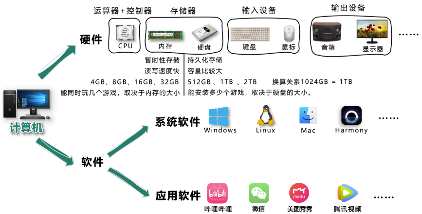


## 3. C/S架构与B/S架构 
1. 上面提到的应用软件，又分为两大类：
   - **C/S架构** ，特点：需要安装、偶尔更新、不跨平台、开发更具针对性。
   - **B/S架构** ，特点：无需安装、无需更新、可跨平台、开发更具通用性。

   > 名词解释：C => client（客户端）、B => browser（浏览器）、S => server（服务器）。  
   > 服务器 ：为软件提供数据的设备（在背后默默的付出）。

2. **前端工程师，主要负责编写 B/S架构中的网页（呈现界面、实现交互）。**
   > 备注：大前端时代，我们可以用前端的技术栈，做出一个C/S架构的应用、甚至搭建一个服务器😎。


## 4. 浏览器相关知识
浏览器是网页运行的平台，常见的浏览器有： `谷歌(Chrome)` 、 `Safari` 、 `IE` 、 `火狐(Firefox)` 、 `欧朋(Opera)` 等，以上这些是常用的五大浏览器。

1. 各大浏览器市场份额：
   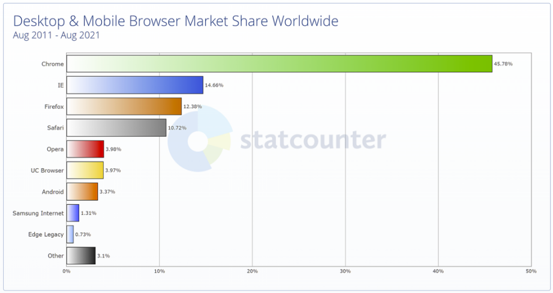
2. 常见浏览器的内核：
   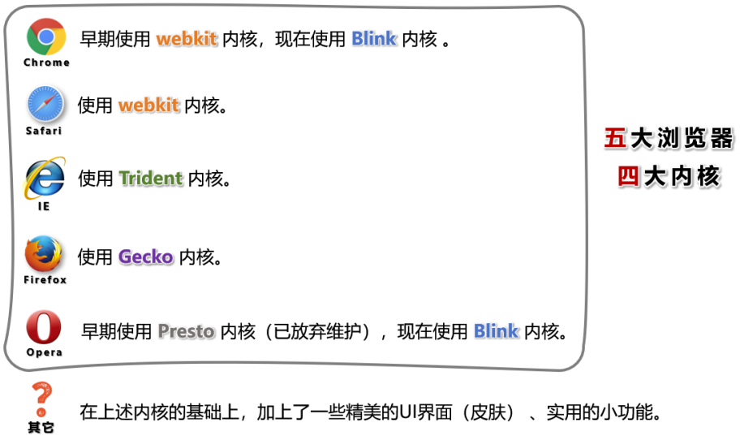


## 5. 网页相关概念
1. 网址：我们在浏览器中输入的地址。
2. 网页：浏览器所呈现的每一个页面。
3. 网站：多个网页构成了一个网站。
4. 网页标准：
   


# 二、HTML 简介

## 1. 什么是 HTML？
全称：HyperText Markup Language（超文本标记语言）。
> 超文本：暂且简单理解为 “超级的文本”，和普通文本比，内容更丰富。  
> 标记：文本要变成超文本，就需要用到各种标记符号。  
> 语言：每一个标记的写法、读音、使用规则，组成了一个标记语言。


## 2. 相关国际组织（了解）
1. IETF
   > 全称：Internet Engineering Task Force（国际互联网工程任务组），成立于1985年底，是一个权威的互联网技术标准化组织，主要负责互联网相关技术规范的研发和制定，当前绝大多数国际互联网技术标准均出自IETF。官网： https://www.ietf.org
2. W3C
   > 全称：World Wide Web Consortium（万维网联盟），创建于1994年，是目前Web技术领域，最具影响力的技术标准机构。共计发布了200多项技术标准和实施指南，对互联网技术的发展和应用起到了基础性和根本性的支撑作用，官网： https://www.w3.org
3. WHATWF
   > 全称：Web Hypertext Application Technology Working Group（网页超文本应用技术工作小组）成立于2004年，是一个以推动网络HTML 5 标准为目的而成立的组织。由Opera、Mozilla基金会、苹果，等这些浏览器厂商组成。官网： https://whatwg.org/


## 3. HTML 发展历史（了解）
从 HTML 1.0 开始发展，期间经历了很多版本，目前HTML的最新标准是：HMTL 5，具体发展史如图（了解即可）。
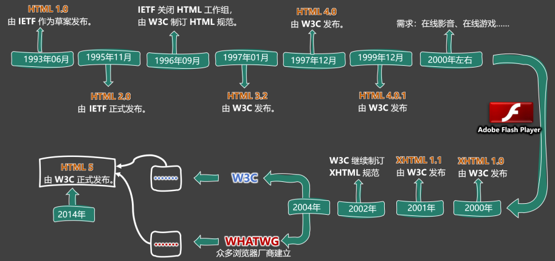


# 三、准备工作

## 1. 常用电脑设置
1. 查看文件夹内容的几种布局。
2. 展示文件扩展名（文件后缀）。
3. 使用指定程序打开文件。
4. 配置文件的默认打开方式。


## 2. 安装Chrome浏览器
1. 下载地址： https://www.google.cn/chrome 。
2. 若上述地址打不开，或无法安装，请使用资料中的离线安装包。
3. 详细步骤请参考视频。


# 四、HTML 入门

## 1. HTML 初体验
1. 第一步：鼠标右键 => 新建 => 文本文档 => 输入以下内容，并保存。
   ```html
   <marquee>尚硅谷，让天下没有难学的技术！</marquee>
   ```
2. 第二步：修改后缀为 `.html` ，然后双击打开即可。
   > 这里的后缀名，使用 `.htm` 也可以，但推荐使用更标准的 `.html` 。
3. 程序员写的叫 **源代码** ，要交给浏览器进行渲染。
4. 借助浏览器看网页的 **源代码** ，具体操作：
   > 在网页空白处：鼠标右键 => 查看网页源代码


## 2. HTML 标签
1. **标签** 又称 **元素**，是HTML的基本组成单位。
2. 标签分为： **双标签** 与 **单标签** （绝大多数都是双标签）。
3. 标签名不区分大小写，但推荐小写，因为小写更规范。
4. 双标签：
   >   
   > 示例代码： ```<marquee>尚硅谷，让天下没有难学的技术！</marquee>```

5. 单标签：
   > 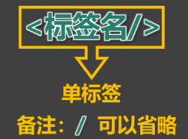  
   > 示例代码： ```<input>```

6. 标签之间的关系：并列关系、嵌套关系，可以使用 `tab` 键进行缩进：
   ```html
   <marquee>
       尚硅谷，让天下没有难学的技术！
       <input>
   </marquee>
   <input>
   ```


## 3. HTML 标签属性
1. 用于给标签提供 **附加信息**。
2. 可以写在：**起始标签** 或 **单标签**中，形式如下：
   > 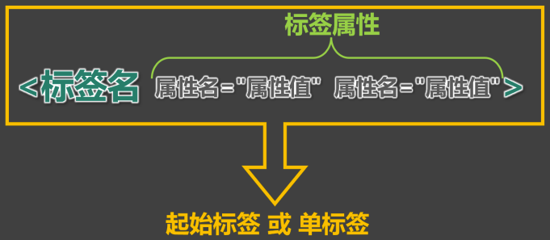  
   > 例如：  
   > ```html
   > <marquee loop="1" bgcolor="orange">尚硅谷，让天下没有难学的技术！</marquee>
   > <input type="password">
   > ```
3. 有些特殊的属性，没有属性名，只有属性值，例如：
   ```html
   <input disabled>
   ```
4. 注意点：
   > 1. 不同的标签，有不同的属性；也有一些通用属性（在任何标签内都能写，后面会详细总结）。  
   > 2. 属性名、属性值不能乱写，都是W3C规定好的。  
   > 3. 属性名、属性值，都不区分大小写，但推荐小写。  
   > 4. 双引号，也可以写成单引号，甚至不写都行，但还是推荐写双引号。  
   > 5. 标签中不要出现同名属性，否则后写的会失效，例如：  
   >    ```html
   >    <input type="text" type="password">
   >    ```


## 4. HTML 基本结构
1. 在网页中，如何查看某段结构的具体代码？—— 点击鼠标右键，选择“检查”。
2. 【检查】 和 【查看网页源代码】的区别：
   > 【查看网页源代码】看到的是：程序员编写的源代码。  
   > 【检查】看到的是：经过浏览器 “处理” 后的源代码。  
   > 备注：日常开发中，【检查】用的最多。  
3. 网页的 **基本结构** 如下：
   > 1. 想要呈现在网页中的内容写在 `body` 标签中。  
   > 2. `head` 标签中的内容不会出现在网页中。  
   > 3. `head` 标签中的 `title` 标签可以指定网页的标题。  
   > 4. 代码：  
   >    ```html
   >    <html>
   >        <head>
   >            <title>网页标题</title>
   >        </head>
   >        <body>
   >        ...
   >        </body>
   >    </html>
   >    ```


## 5. 安装 VSCode
1. 安装中文语言包。`Chinese (Simplified) (简体中文) Language Pack`
2. 使用 VSCode 打开文件夹的两种方式。
3. 调整字体大小。`editor.fontSize`
4. 设置主题。
5. 安装图标主题： `vscode-icons` 。

> 备注：详细安装步骤请参考视频。


## 6. 安装 Live Server 插件
1. 可以更加方便的打开网页。
2. 打开网页的方式更贴近项目上线。
3. 代码出现改动后，可以自动刷新。
4. 根据自己的情况，去配置一下 VSCode 的自动保存。

> 注意1：务必使用VSCode打开的是文件夹，否则 Live Server 插件无法正常工作！  
> 注意2：打开的网页必须是标准的HTML结构，否则无法自动刷新！  


## 7. HTML 注释
1. 特点：注释的内容会被浏览器所忽略，不会呈现到页面中，但源代码中依然可见。
2. 作用：对代码进行解释和说明。
3. 写法：
   ```html
   <!-- 下面的文字只能滚动一次 -->
   <marquee loop="1">尚硅谷</marquee>
   <!-- 下面的文字可以无限滚动 -->
   <marquee>尚硅谷123</marquee>
   ```
4. HTML注释不可以嵌套。


## 8. HTML 文档声明
1. 作用：告诉浏览器当前网页的版本。
2. 写法：
   - 旧写法：要依网页所用的HTML版本而定，写法有很多。
     > 具体有哪些写法请参考 ：[W3C官网-文档声明](https://www.w3.org/QA/2002/04/valid-dtd-list.html)（了解即可，千万别背！）
   - **新写法**：一切都变得简单了！W3C 推荐使用 HTML 5 的写法。
     ```html
     <!DOCTYPE html>
     ```
3. 注意：文档声明，必须在网页的第一行，且在 `html` 标签的外侧。


## 9. HTML 字符编码
1. 计算机对数据的操作：
   - 存储时，对数据进行：**编码**。
   - 读取时，对数据进行：**解码**。
2. 编码、解码，会遵循一定的规范 —— **字符集**。
3. 字符集有很多中，常见的有（了解）：
   > 1. **ASCII** ：大写字母、小写字母、数字、一些符号，共计128个。  
   > 2. **ISO 8859-1** ：在 ASCII 基础上，扩充了一些希腊字符等，共计是256个。  
   > 3. **GB2312** ：继续扩充，收录了 6763 个常用汉字、682个字符。  
   > 4. **GBK** ：收录了的汉字和符号达到 20000+ ，支持繁体中文。  
   > 5. **UTF-8** ：包含世界上所有语言的：所有文字与符号。—— 很常用。  
4. 使用原则是怎样的？
   > 原则1：存储时，务必采用合适的字符编码 。  
   > 否则：无法存储，数据会丢失！  

   > 原则2：存储时采用哪种方式编码 ，读取时就采用哪种方式解码。  
   > 否则：数据错乱（乱码）！  

   > 例如下面文字中（略），包含有：中文、英文、泰文、缅甸文  
   > 若使用 `ISO8859-1` 编码存储，在存入的那一刻，就出问题了，因为 `ISO8859-1` 仅支持英文！  
   > 为保证所有的输入，都能正常存储和读取，现在几乎全都采用： `UFT-8` 编码。  
   > 所以我们编写 `html` 文件时，也都统一用 `UFT-8` 编码。  

5. 总结：
   - 平时编写代码时，统一采用 `UTF-8` 编码（最稳妥）。
   - 为了让浏览器在渲染 `html` 文件时，不犯错误，可以通过 `meta` 标签配合 `charset` 属性指定字符编码。
     ```html
     <head>
         <meta charset="UTF-8"/>
     </head>
     ```


## 10. HTML 设置语言
1. 主要作用：
   - 让浏览器显示对应的翻译提示。
   - 有利于搜索引擎优化。
2. 具体写法：
   ```html
   <html lang="zh-CN">
   ```
3. 扩展知识： `lang` 属性的编写规则（作为一个课外扩展知识，了解即可）。
   > 1. 第一种写法（ 语言-国家/地区 ），例如：
   >    - **zh-CN** ：中文-中国大陆（简体中文）
   >    - **zh-TW** ：中文-中国台湾（繁体中文）
   >    - **zh** ：中文
   >    - **en-US** ：英语-美国
   >    - **en-GB** ：英语-英国
   > 2. 第二种写法（ 语言—具体种类）已不推荐使用，例如：
   >    - **zh-Hans** ：中文—简体
   >    - **zh-Hant** ：中文—繁体
   > 3. W3School 上的说明：[《语言代码参考手册》](https://www.w3school.com.cn/tags/html_ref_language_codes.asp)、[《国家/地区代码参考手册》](https://www.w3school.com.cn/tags/html_ref_country_codes.asp)
   > 4. W3C官网上的说明：[《Language tags in HTML》](https://www.w3.org/International/articles/language-tags/)


## 11. HTML标准结构
- HTML标准结构如下：
  ```html
  <!DOCTYPE html>
  <html lang="zh-CN">
  <head>
      <meta charset="UTF-8">
      <title>我是一个标题</title>
  </head>
  <body>
  </body>
  </html>
  ```
- 输入 `!` ，随后回车即可快速生成标准结构。
  > 生成的结构中，有两个 `meta` 标签，我们暂时用不到，可以先删掉。
- 配置 `VScode` 的内置插件 `emmet` ，可以对生成结构的属性进行定制。
- 在存放代码的文件夹中，存放一个 `favicon.ico` 图片，可配置网站图标。


# 五、HTML 基础

## 1. 开发者文档
- W3C官网： www.w3c.org
- W3School： www.w3school.com.cn
- MDN【★推荐】： developer.mozilla.org


## 2. 排版标签
| 标签名  | 标签含义                                       | 单/双标签 |
| ------- | ---------------------------------------------- | --------- |
| h1 ~ h6 | 标题                                           | 双        |
| p       | 段落                                           | 双        |
| div     | 没有任何含义，用于整体布局（生活中的包装袋）。 | 双        |

1. `h1` 最好写一个， `h2`~`h6` 能适当多写。
2. `h1`~`h6` 不能互相嵌套，例如： `h1` 标签中最好不要写 `h2` 标签了。
3. `p` 标签很特殊！它里面不能有： `h1`~`h6` 、 `p` 、 `div` 标签（暂时先这样记，后面会说规律）。


## 3. 语义化标签
- 概念：用特定的标签，去表达特定的含义。
- 原则：标签的默认效果不重要（后期可以通过 `CSS` 随便控制效果），语义最重要！
- 举例：对于 `h1` 标签，效果是文字很大（不重要），语义是网页主要内容（很重要）。
- 优势：
  - 代码结构清晰可读性强。
  - 有利于 **SEO** （搜索引擎优化）。
  - 方便设备解析（如屏幕阅读器、盲人阅读器等）。


## 4. 块级元素 与 行内元素
1. **块级元素**：独占一行（排版标签都是块级元素）。
2. **行内元素**：不独占一行（目前只学了： `input` ，稍后会学习更多）。
3. **使用原则**：
   1. 块级元素 中**能**写 行内元素 和 块级元素（简单记：块级元素中几乎什么都能写）。
   2. 行内元素 中**能**写 行内元素，但**不能**写 块级元素。
   3. 一些特殊的规则：
      1. `h1`~`h6` 不能互相嵌套。
      2. `p` 中不要写块级元素。

> 备注： `marquee` 元素设计的初衷是：让文字有动画效果，但如今我们可以通过 `CSS` 来实现了，而且还可以实现的更加炫酷，所以 `marquee` 标签已经：过时了（废弃了），不推荐使用。我们只是在开篇的时候，用他做了一个引子而已，在后续的学习过程中，这些已经废弃的标签，我们直接跳过。


## 5. 文本标签_常用的
1. 用于包裹：词汇、短语等。
2. 通常写在排版标签里面。
3. 排版标签更宏观（大段的文字），文本标签更微观（词汇、短语）。
4. 文本标签通常都是行内元素。

| 标签名 | 标签语义                         | 单/双标签 |
| ------ | -------------------------------- | --------- |
| em     | 要着重阅读的内容                 | 双        |
| strong | 十分重要的内容（语气比em要强）   | 双        |
| span   | 没有语义，用于包裹短语的通用容器 | 双        |

> 生活中的例子： `div` 是大包装袋， `span` 是小包装袋。


## 6. 文本标签_不常用的
| 标签名     | 标签语义                                                             | 单/双标签 |
| ---------- | -------------------------------------------------------------------- | --------- |
| cite       | 作品标题（书籍、歌曲、电影、电视节目、绘画、雕塑）                   | 双        |
| dfn        | 特殊术语 ，或专属名词                                                | 双        |
| del 与 ins | 删除的文本 【与】 插入的文本                                         | 双        |
| sub 与 sup | 下标文字 【与】 上标文字                                             | 双        |
| code       | 一段代码                                                             | 双        |
| samp       | 从正常的上下文中，将某些内容提取出来，例如：标识设备输出             | 双        |
| kbd        | 键盘文本，表示文本是通过键盘输入的，经常用在与计算机相关的手册中     | 双        |
| abbr       | 缩写，最好配合上 `title` 属性                                        | 双        |
| bdo        | 更改文本方向，要配合 `dir` 属性，可选值: `ltr` （默认值）、`rtl`     | 双        |
| var        | 标记变量，可以与 `code` 标签一起使用                                 | 双        |
| small      | 附属细则，例如：包括版权、法律文本。—— 很少使用                      | 双        |
| b          | 摘要中的关键字、评论中的产品名称。—— 很少使用                        | 双        |
| i          | 本意是：人物的思想活动、所说的话等等。现在多用于：呈现**字体图标**。 | 双        |
| u          | 与正常内容有反差文本，例如：错的单词、不合适的描述等。——很少使用     | 双        |
| q          | 短引用 —— 很少使用                                                   | 双        |
| blockquote | 长引用 —— 很少使用                                                   | 双        |
| address    | 地址信息                                                             | 双        |

> 备注：
> 1. 这些不常用的文本标签，编码时不用过于纠结（酌情而定，不用也没毛病）。
> 2. `blockquote` 与 `address` 是块级元素，其他的文本标签，都是行内元素。
> 3. 有些语义感不强的标签，我们很少使用，例如：`small` 、 `b` 、 `u` 、 `q` 、 `blockquote`
> 4. HTML标签太多了！记住那些：重要的、语义感强的标签即可；截止目前，有这些：`h1`~`h6` 、 `p` 、 `div` 、 `em` 、 `strong` 、 `span`

常用的文本标签示例：
```html
<p>预防电信诈骗，请安装：<em>国家反诈中心app</em>。</p>
<p>当我们出门的时候，一定要<strong>关好门窗</strong>！</p>
<p>前端三个框架为：<span>Angular、React、Vue</span>。</p>
```

不常用的文本标签示例：
```html
<p>这首<cite>《光辉岁月》</cite>，非常的好听！</p>
<p><dfn>耗子尾汁</dfn>，是一个网络流行语，意思同<dfn>好自为之</dfn>。</p>
<p>商品原价：<del>199</del>，限时秒杀：<ins>99</ins></p>
<p>水的化学方程式是：H<sub>2</sub>O，8的三次方是这么写的：8<sup>3</sup></p>
<p>等过一段我们学习了JS，你就会发现这段代码很有意思：<code>alert(1)</code></p>
<p>手机突然提示，<samp>支付宝到账100万元！</samp></p>
<p>保存的快捷键是：<kbd>ctrl + s</kbd></p>
<p><abbr title="英雄联盟">LOL</abbr>这个游戏非常好玩</p>
<p>你是年少的欢喜，这句话反过来念就是：<bdo dir="rtl">你是年少的欢喜</bdo></p>
<p>等过一段我们学习了JS，我们就知道要这样定义变量了：<code>let <var>a</var> = 1</code></p>
<p><small>本网站所有资料、图表仅供参考，涉及投资项目所造成的盈亏与本网站无关。</small></p>
<p>我也买过<b>罗技GPW二代</b>这个鼠标，确实很好用！</p>
<p>猪头声嘶力竭的喊着：<i>“燕子，没有你我怎么活啊！”</i></p>
<p>张三把“你好”的英文写成了：<u>heelo</u>，这是不对的！</p>
<p>屈原曾经说过：<q>路漫漫其修远兮，吾将上下而求索</q></p>
<p>有一首歌，歌词是这样的：<blockquote>后来，我总算学会了如何去爱；可惜你早已远去消失在人海；后来终于在眼泪中明白，有些人一旦错过就不在；</blockquote></p>
<p>我们的学校地址是：<address>北京宏福科技园</address></p>
```


## 7. 图片标签

### 1. 基本使用
| 标签名 | 标签语义 | 常用属性                                                                                                                                                                                | 单/双标签 |
| ------ | -------- | --------------------------------------------------------------------------------------------------------------------------------------------------------------------------------------- | --------- |
| img    | 图片     | `src` ：图片路径（又称：图片地址）—— 图片的具体位置<br>`alt` ：图片描述<br>`width` ：图片宽度，单位是像素，例如： 200px 或 200<br>`height` ：图片高度， 单位是像素，例如： 200px 或 200 | 单        |

总结：
> 1. 像素（ `px` ）是一种单位，学到 `CSS` 时，我们会详细讲解。
> 2. 尽量不要同时修改图片的宽和高，可能会造成比例失调。
> 3. 暂且认为 `img` 是行内元素（学到 `CSS` 时，会认识一个新的元素分类，目前咱们只知道：块、行内）。
> 4. `alt` 属性的作用：
>    - 搜索引擎通过 `alt` 属性，得知图片的内容。—— 最主要的作用。
>    - 当图片无法展示时候，有些浏览器会呈现 `alt` 属性的值。
>    - 盲人阅读器会朗读 `alt` 属性的值。

### 2. 路径的分类 
1. 相对路径：以**当前位置**作为参考点，去建立路径。
   ```
   path_test/
      测试.html
      怪兽.jpg
   a/
      喜羊羊.jpg
   奥特曼.jpg
   ```
   
   | 符号 | 含义   | 举例（在 测试.html 中）                           |
   | ---- | ------ | ------------------------------------------------- |
   | ./   | 同级   | 引入【怪兽.jpg】： ``       |
   | /    | 下一级 | 引入【喜羊羊.jpg】： `` |
   | ../  | 上一级 | 引入【奥特曼.jpg】： ``  |
   
   > 注意点：
   > - 相对路径中的 `./` 可以省略不写。
   > - 相对路径依赖的是当前位置，后期若调整了文件位置，那么文件中的路径也要修改。

2. 绝对路径：以**根位置**作为参考点，去建立路径。
   1. 本地绝对路径： `E:/a/b/c/奥特曼.jpg` 。（很少使用）
   2. 网络绝对路径： `http://www.atguigu.com/images/index_new/logo.png` 。

   > 注意点：
   > - 使用本地绝对路径，一旦更换设备，路径处理起来比较麻烦，所以很少使用。
   > - 使用网络绝对路径，确实方便，但要注意：若服务器开启了防盗链，会造成图片引入失败。

### 3. 常见图片格式
1. jpg 格式：
   > 概述：扩展名为 `.jpg` 或 `.jpeg` ，是一种有损的压缩格式（把肉眼不容易观察出来的细节丢弃了）。  
   > 主要特点：**支持的颜色丰富、占用空间较小**、不支持透明背景、不支持动态图。  
   > 使用场景：对图片细节**没有极高要求**的场景，例如：网站的产品宣传图等 。—— 该格式网页中很常见。  

2. png 格式：
   > 概述：扩展名为 `.png` ，是一种无损的压缩格式，能够更高质量的保存图片。  
   > 主要特点：**支持的颜色丰富**、占用空间略大、**支持透明背景**、不支持动态图。  
   > 使用场景：①想让图片有透明背景；②想更高质量的呈现图片；例如 ：公司logo图、重要配图等。  

3. bmp 格式：
   > 概述：扩展名为 `.bmp` ，不进行压缩的一种格式，在最大程度上保留图片更多的细节。  
   > 主要特点：**支持的颜色丰富、保留的细节更多**、占用空间极大、不支持透明背景、不支持动态图。  
   > 使用场景：对图片细节**要求极高**的场景，例如：一些大型游戏中的图片 。（网页中很少使用）  

4. gif 格式：
   > 概述：扩展名为 `.gif` ，仅支持256种颜色，色彩呈现不是很完整。  
   > 主要特点：支持的颜色较少、**支持简单透明背景、支持动态图**。  
   > 使用场景：网页中的动态图片。  

5. webp 格式：
   > 概述：扩展名为 `.webp` ，谷歌推出的一种格式，专门用来在网页中呈现图片。  
   > 主要特点：具备上述几种格式的优点，但兼容性不太好，一旦使用务必要解决兼容性问题。  
   > 使用场景：网页中的各种图片。  

6. base64 格式：
   > 1. 本质：一串特殊的文本，要通过浏览器打开，传统看图应用通常无法打开。
   > 2. 原理：把图片进行 `base64` 编码，形成一串文本。
   > 3. 如何生成：靠一些工具或网站。
   > 4. 如何使用：直接作为 `img` 标签的 `src` 属性的值即可，并且不受文件位置的影响。
   > 5. 使用场景：一些较小的图片，或者需要和网页一起加载的图片。

图片的格式非常多，上面这些，只是一些常见的、我们前端人员常接触到的。


## 8. 超链接
主要作用：从当前页面进行跳转。

可以实现：①跳转到指定页面、②跳转到指定文件（也可触发下载）、③跳转到锚点位置、④唤起指定应用。

| 标签名 | 标签语义 | 常用属性                                                                                                                                                                                                                                                           | 单/双标签 |
| ------ | -------- | ------------------------------------------------------------------------------------------------------------------------------------------------------------------------------------------------------------------------------------------------------------------ | --------- |
| a      | 超链接   | `href` ： 指定要跳转到的具体目标。<br>`target` ： 控制跳转时如何打开页面，常用值如下:<br>&emsp;`_self` ：在本窗口打开。<br>&emsp;`_blank` ：在新窗口打开。<br>`id` ： 元素的唯一 标识，可用于设置锚点。<br>`name` ： 元素的名字，写在 a 标签中，也能设置锚点。<br> | 双        |

### 1. 跳转到页面
```html
<!-- 跳转其他网页 -->
<a href="https://www.jd.com/" target="_blank">去京东</a>
<!-- 跳转本地网页 -->
<a href="./10_HTML排版标签.html" target="_self">去看排版标签</a>
```

> 注意点：
> 1. 代码中的**多个空格、多个回车**，都会被浏览器解析成一个空格！
> 2. 虽然 `a` 是行内元素，但 `a` 元素可以包裹除它自身外的任何元素！
> 
> 想展示多个回车或空格，怎么办呢？ —— 后面会讲。

### 2. 跳转到文件
```html
<!-- 浏览器能直接打开的文件 -->
<a href="./resource/自拍.jpg">看自拍</a>
<a href="./resource/小电影.mp4">看小电影</a>
<a href="./resource/小姐姐.gif">看小姐姐</a>
<a href="./resource/如何一夜暴富.pdf">点我一夜暴富</a>
<!-- 浏览器不能打开的文件，会自动触发下载 -->
<a href="./resource/内部资源.zip">内部资源</a>
<!-- 强制触发下载 -->
<a href="./resource/小电影.mp4" download="电影片段.mp4">下载电影</a>
```

> 注意1：若浏览器无法打开文件，则会引导用户下载。  
> 注意2：若想强制触发下载，请使用 `download` 属性，属性值即为下载文件的名称。  

### 3. 跳转到锚点
什么是锚点？—— 网页中的一个标记点。

具体使用方式：
- **第一步：设置锚点**

   ```html
   <!-- 第一种方式：a标签配合name属性 -->
   <a name="test1"></a>
   <!-- 第二种方式：其他标签配合id属性 -->
   <h2 id="test2">我是一个位置</h2>
   ```

   > 注意点：
   > 1. 具有 `href` 属性的 `a` 标签是超链接，具有 `name` 属性的 `a` 标签是锚点。
   > 2. `name` 和 `id` 都是区分大小写的，且 `id` 最好别是数字开头。

- **第二步：跳转锚点**

   ```html
   <!-- 跳转到test1锚点-->
   <a href="#test1">去test1锚点</a>
   <!-- 跳到本页面顶部 -->
   <a href="#">回到顶部</a>
   <!-- 跳转到其他页面锚点 -->
   <a href="demo.html#test1">去demo.html页面的test1锚点</a>
   <!-- 刷新本页面 -->
   <a href="">刷新本页面</a>
   <!-- 执行一段js,如果还不知道执行什么，可以留空，javascript:; -->
   <a href="javascript:alert(1);">点我弹窗</a>
   ```

示例：
```html
<a href="#htl">看灰太狼</a>
<a href="#atm">看奥特曼</a>

<p>我是一只羊，一只很肥美的羊</p>


<a name="htl"></a>
<p>我是一只狼，一只很邪恶的狼</p>


<p id="atm">我是一只奥特曼，一只很能打的奥特曼</p>


<p>我是一只怪兽，一只很丑的怪兽</p>


<p>整体的介绍完毕了</p>
<a href="#">回到顶部</a>
<a href="">刷新页面</a>
<a href="javascript:;">点我弹窗</a>
```

### 4. 唤起指定应用
通过 `a` 标签，可以唤起设备应用程序。
```html
<!-- 唤起设备拨号 -->
<a href="tel:10010">电话联系</a>
<!-- 唤起设备发送邮件 -->
<a href="mailto:10010@qq.com">邮件联系</a>
<!-- 唤起设备发送短信 -->
<a href="sms:10086">短信联系</a>
```

> “超文本”（hypertext）是指连接单个网站内或多个网站间的网页的链接。链接是网络的一个基本方面。只要将内容上传到互联网，并将其与他人创建的页面相链接，你就成为了万维网的积极参与者。  

> 超文本：是一种组织信息的方式，通过超链接将不同空间的文字、图片、等各种信息组织在一起，能从当前阅读的内容，跳转到超链接所指向的内容（页面、文件、锚点、应用）。


## 9. 列表

### 1. 有序列表（Ordered list）
概念：有顺序或侧重顺序的列表。
```html
<h2>要把大象放冰箱总共分几步</h2>
<ol>
   <!-- 列表项（List item） -->
  <li>把冰箱门打开</li>
  <li>把大象放进去</li>
  <li>把冰箱门关上</li>
</ol>
```

### 2. 无序列表（Unordered list）
概念：无顺序或不侧重顺序的列表。
```html
<h2>我想去的几个城市</h2>
<ul>
  <li>成都</li>
  <li>上海</li>
  <li>西安</li>
  <li>武汉</li>
</ul>
```

### 3. 列表嵌套
概念：列表中的某项内容，又包含一个列表（注意：嵌套时，请务必把解构写完整）。
```html
<h2>我想去的几个城市</h2>
<ul>
  <li>成都</li>
  <li>
    <span>上海</span>
    <ul>
      <li>外滩</li>
      <li>杜莎夫人蜡像馆</li>
      <li>
        <a href="https://www.opg.cn/">东方明珠</a>
      </li>
      <li>迪士尼乐园</li>
    </ul>
  </li>
  <li>西安</li>
  <li>武汉</li>
</ul>
```

> 注意： `li` 标签最好写在 `ul` 或 `ol` 中，不要单独使用。

### 4. 自定义列表（Definition list）
1. 概念：所谓自定义列表，就是一个包含 **术语名称（Definition title）** 以及 **术语描述（Definition description）** 的列表。
2. 一个 `dl` 就是一个自定义列表，一个 `dt` 就是一个术语名称，一个 `dd` 就是术语描述（可以有多个）。

```html
<h2>如何高效的学习？</h2>
<dl>
  <dt>做好笔记</dt>
    <dd>笔记是我们以后复习的一个抓手</dd>
    <dd>笔记可以是电子版，也可以是纸质版</dd>
  <dt>多加练习</dt>
    <dd>只有敲出来的代码，才是自己的</dd>
  <dt>别怕出错</dt>
    <dd>错很正常，改正后并记住，就是经验</dd>
</dl>
```


## 10. 表格

### 1. 基本结构
1. 一个完整的表格由：**表格标题、表格头部、表格主体、表格脚注**，四部分组成。
   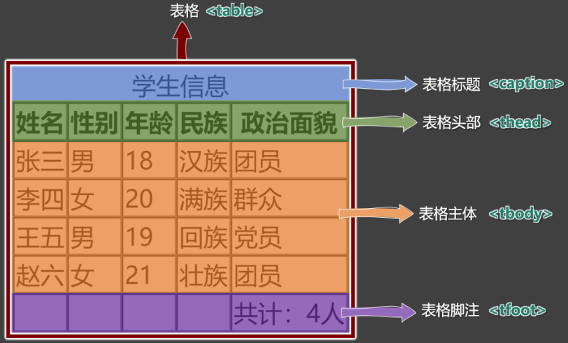

2. 表格涉及到的标签：
   - `table` ：表格
   - `caption` ：表格标题
   - `thead` ：表格头部
   - `tbody` ：表格主体
   - `tfoot` ：表格注脚
   - `tr` ：每一行(row)
   - `th` 、 `td` ：每一个单元格（备注：表格头部中用 th(head) ，表格主体、表格脚注中用： td(data) ）

   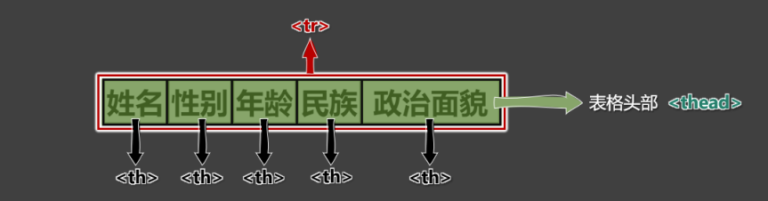

   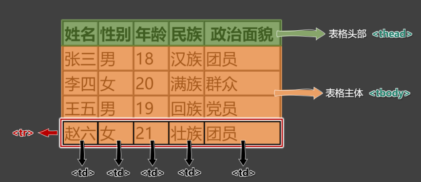

   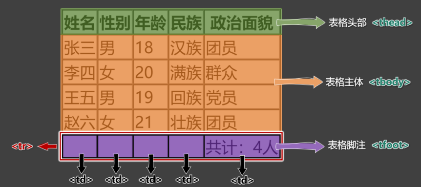

3. 具体编码：
   ```html
   <table border="1">
     <!-- 表格标题 -->
     <caption>学生信息</caption>
     <!-- 表格头部 -->
     <thead>
       <tr><th>姓名</th><th>性别</th><th>年龄</th><th>民族</th><th>政治面貌</th></tr>
     </thead>
     <!-- 表格主体 -->
     <tbody>
       <tr><td>张三</td><td>男</td><td>18</td><td>汉族</td><td>团员</td></tr>
       <tr><td>李四</td><td>女</td><td>20</td><td>满族</td><td>群众</td></tr>
       <tr><td>王五</td><td>男</td><td>19</td><td>回族</td><td>党员</td></tr>
       <tr><td>赵六</td><td>女</td><td>21</td><td>壮族</td><td>团员</td></tr>
     </tbody>
     <!-- 表格脚注 -->
     <tfoot>
       <tr><td></td><td></td><td></td><td></td><td>共计：4人</td></tr>
     </tfoot>
   </table>
   ```

### 2. 常用属性
| 标签名 | 标签语义   | 常用属性                                                                                                                                                                                                                                                                                                                                                        | 单/双标签 |
| ------ | ---------- | --------------------------------------------------------------------------------------------------------------------------------------------------------------------------------------------------------------------------------------------------------------------------------------------------------------------------------------------------------------- | --------- |
| table  | 表格       | <ul type="none"><li>`width` ：设置表格宽度。</li><li>`height` ：设置表格最小高度，表格最终高度可能比设置的值大。</li><li>`border` ：设置表格边框宽度。</li><li>`cellspacing` ： 设置单元格之间的间距。</li></ul>                                                                                                                                                | 双        |
| thead  | 表格头部   | <ul type="none"><li>`height` ：设置表格头部高度。</li><li>`align` ： 设置单元格的水平对齐方式，可选值如下：</li><ol><li>`left` ：左对齐</li><li>`center` ：中间对齐</li><li>`right` ：右对齐</li></ol><li>`valign` ：设置单元格的垂直对齐方式，可选值如下：</li><ol><li>`top` ：顶部对齐</li><li>`middle` ：中间对齐</li><li>`bottom` ：底部对齐</li></ol></ul> | 双        |
| tbody  | 表格主体   | 常用属性与 `thead` 相同。                                                                                                                                                                                                                                                                                                                                       | 双        |
| tr     | 行         | 常用属性与 `thead` 相同。                                                                                                                                                                                                                                                                                                                                       | 双        |
| tfoot  | 表格脚注   | 常用属性与 `thead` 相同。                                                                                                                                                                                                                                                                                                                                       | 双        |
| td     | 普通单元格 | <ul type="none"><li>`width` ：设置单元格的宽度，同列所有单元格全都受影响。</li><li>`height` ：设置单元格的高度，同行所有单元格全都受影响。</li><li>`align` ：设置单元格的水平对齐方式。</li><li>`valign` ：设置单元格的垂直对齐方式。</li><li>`rowspan` ：指定要跨的行数。</li><li>`colspan` ：指定要跨的列数。</li></ul>                                       | 双        |
| th     | 表头单元格 | 常用属性与 `td` 相同。                                                                                                                                                                                                                                                                                                                                          | 双        |

注意点：
> 1. `<table>` 元素的 `border` 属性可以控制表格边框，但 `border` 值的大小，并不控制单元格边框的宽度，只能控制表格最外侧边框的宽度，这个问题如何解决？—— 后期靠 `CSS` 控制。
> 2. 默认情况下，每列的宽度，得看这一列单元格最长的那个文字。
> 3. 给某个 `th` 或 `td` 设置了宽度之后，他们所在的那一列的宽度就确定了。
> 4. 给某个 `th` 或 `td` 设置了高度之后，他们所在的那一行的高度就确定了。

### 3. 跨行跨列
1. `rowspan` ：指定要跨的行数。
2. `colspan` ：指定要跨的列数。

课程表效果：
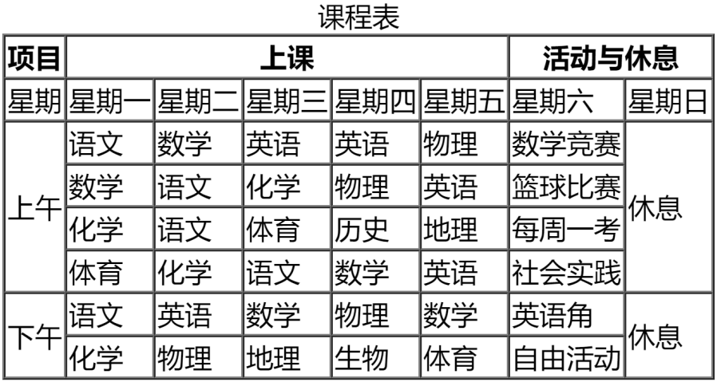

编写思路：
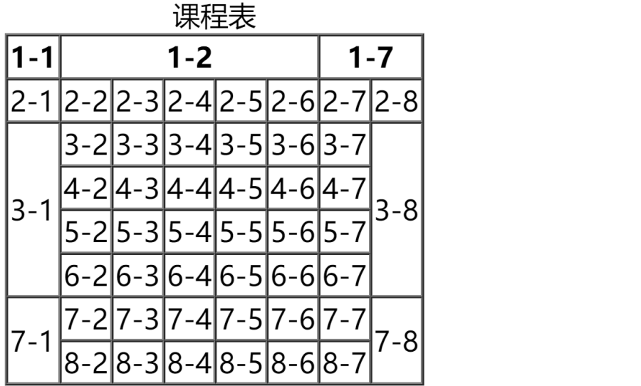

```html
<table border="1" cellspacing="0">
  <caption>课程表</caption>
  <thead>
    <tr><th>项目</th><th colspan="5">上课</th><th colspan="2">活动与休息</th></tr>
  </thead>
  <tbody>
    <tr><td>星期</td><td>星期一</td><td>星期二</td><td>星期三</td><td>星期四</td><td>星期五</td><td>星期六</td><td>星期日</td></tr>
    <tr><td rowspan="4">上午</td><td>3-2</td><td>3-3</td><td>3-4</td><td>3-5</td><td>3-6</td><td>3-7</td><td rowspan="4">休息</td></tr>
    <tr><td>4-2</td><td>4-3</td><td>4-4</td><td>4-5</td><td>4-6</td><td>4-7</td></tr>
    <tr><td>5-2</td><td>5-3</td><td>5-4</td><td>5-5</td><td>5-6</td><td>5-7</td></tr>
    <tr><td>6-2</td><td>6-3</td><td>6-4</td><td>6-5</td><td>6-6</td><td>6-7</td></tr>
    <tr><td rowspan="2">下午</td><td>7-2</td><td>7-3</td><td>7-4</td><td>7-5</td><td>7-6</td><td>7-7</td><td rowspan="2">休息</td></tr>
    <tr><td>8-2</td><td>8-3</td><td>8-4</td><td>8-5</td><td>8-6</td><td>8-7</td></tr>
  </tbody>
</table>
```


## 11.常用标签补充
| 标签名 | 标签含义                                   | 单/双标签 |
| ------ | ------------------------------------------ | --------- |
| br     | 换行                                       | 单        |
| hr     | 分隔                                       | 单        |
| pre    | 按原文显示（一般用于在页面中嵌入大段代码） | 双        |

> 注意点：
> 1. 不要用 `<br>` 来增加文本之间的行间隔，应使用 `<p>` 元素，或后面即将学到的 `CSS margin` 属性。
> 2. `<hr>` 的语义是分隔，如果不想要语义，只是想画一条水平线，那么应当使用 `CSS` 完成。

```html
<!-- 换行标签 -->
<a href="https://www.baidu.com">去百度</a>
<br>
<a href="https://www.jd.com">去京东</a>
<!-- 分割线 -->
<div>第一章</div>
<p>xxxxxx，就这样最后王子和公主就在一起了！</p>
<hr>
<div>第二章</div>
<p>一个月黑风高的晚上，xxxxxxxxxxxxxx</p>
<!-- 按原文显示 -->
<pre>
    I      Love      You
        I   Love   You
            Love
</pre>
```


## 12. 表单
概念：一个包含交互的区域，用于收集用户提供的数据。

### 1. 基本结构
简单梳理：
| 标签名 | 标签语义 | 常用属性                                                                                                                                                                                                                                                                                                                                                    | 单/双标签 |
| ------ | -------- | ----------------------------------------------------------------------------------------------------------------------------------------------------------------------------------------------------------------------------------------------------------------------------------------------------------------------------------------------------------- | --------- |
| form   | 表单     | <ul type="none"><li>`action` ：用于指定表单的提交地址（需要与后端人员沟通后确定）。</li><li>`target` ：用于控制表单提交后，如何打开页面，常用值如下：</li><ul type="none"><li>`_self` ：在本窗口打开。</li><li>`_blank` ：在新窗口打开。</li></ul><li>`method` ：用于控制表单的提交方式，暂时只需了解，在后面</li><li>Ajax 的课程中，会详细讲解。</li></ul> | 双        |
| input  | 输入框   | <ul type="none"><li>`type` ：设置输入框的类型，目前用到的值是 text ，表示普通文本。</li><li>`name` ：用于指定提交数据的名字，（需要与后端人员沟通后确定）。</li></ul>                                                                                                                                                                                       | 单        |
| button | 按钮     | 本小节暂不涉及                                                                                                                                                                                                                                                                                                                                              | 双        |


> 在本小节，我们先记住表单的整体形式，稍后会对表单控件进行详细讲解。

示例代码：
```html
<form action="https://www.baidu.com/s" target="_blank" method="get">
  <input type="text" name="wd">
  <button>去百度搜索</button>
</form>
```

### 2. 常用表单控件

#### ① 文本输入框
```html
<input type="text">
```
> 常用属性如下：
> - `name` 属性：数据的名称。
> - `value` 属性：输入框的默认输入值。
> - `maxlength` 属性：输入框最大可输入长度。


#### ② 密码输入框
```html
<input type="password">
```
> 常用属性如下：
> - `name` 属性：数据的名称。
> - `value` 属性：输入框的默认输入值（一般不用，无意义）。
> - `maxlength` 属性：输入框最大可输入长度。

#### ③ 单选框
```html
<input type="radio" name="sex" value="female">女
<input type="radio" name="sex" value="male">男
```
> 常用属性如下：
> - `name` 属性：数据的名称，注意：想要单选效果，多个 radio 的 name 属性值要保持一致。
> - `value` 属性：提交的数据值。
> - `checked` 属性：让**该单选按钮默认选中**。

#### ④ 复选框
```html
<input type="checkbox" name="hobby" value="smoke">抽烟
<input type="checkbox" name="hobby" value="drink">喝酒
<input type="checkbox" name="hobby" value="perm">烫头
```
> 常用属性如下：：
> - `name` 属性：数据的名称。
> - `value` 属性：提交的数据值。
> - `checked` 属性：让**该复选框默认选中**。

#### ⑤ 隐藏域
```html
<input type="hidden" name="tag" value="100">
```
> 用户不可见的一个输入区域，作用是： 提交表单的时候，携带一些固定的数据。
> - `name` 属性：指定数据的名称。
> - `value` 属性：指定的是真正提交的数据。

#### ⑥ 提交按钮
```html
<input type="submit" value="点我提交表单">
<button>点我提交表单</button>
```
> 注意：
> 1. `button` 标签 `type` 属性的默认值是 `submit` 。
> 2. `button` 不要指定 `name` 属性
> 3. `input` 标签编写的按钮，使用 `value` 属性指定按钮文字。

#### ⑦ 重置按钮
```html
<input type="reset" value="点我重置">
<button type="reset">点我重置</button>
```
> 注意点：
> 1. `button` 不要指定 `name` 属性
> 2. `input` 标签编写的按钮，使用 `value` 属性指定按钮文字。

#### ⑧ 普通按钮
```html
<input type="button" value="普通按钮">
<button type="button">普通按钮</button>
```
> 注意点：普通按钮的 `type` 值为 `button` ，若不写 `type` 值是 `submit` 会引起表单的提交。

#### ⑨ 文本域
```html
<textarea name="msg" rows="22" cols="3">我是文本域</textarea>
```
> 常用属性如下：
> 1. `rows` 属性：指定默认显示的行数，会影响文本域的高度。
> 2. `cols` 属性：指定默认显示的列数，会影响文本域的宽度。
> 3. 不能编写 `type` 属性，其他属性，与普通文本输入框一致。

#### ⑩ 下拉框
```html
<select name="from">
  <option value="黑">黑龙江</option>
  <option value="辽">辽宁</option>
  <option value="吉">吉林</option>
  <option value="粤" selected>广东</option>
</select>
```
> 常用属性及注意事项：
> 1. `name` 属性：指定数据的名称。
> 2. `option` 标签设置 `value` 属性， 如果没有 `value` 属性，提交的数据是 `option` 中间的文字；如果设置了 `value` 属性，提交的数据就是 `value` 的值（建议设置 `value` 属性）
> 3. `option` 标签设置了 `selected` 属性，表示**默认选中**。

常用表单控件示例：
```html
<form action="#">
  <!-- 文本输入框 -->
  账户：<input type="text" name="account" value="zhangsan" maxlength="10"><br>
  <!-- 密码输入框 -->
  密码：<input type="password" name="pwd" value="123" maxlength="6"><br>
  <!-- 单选框 -->
  性别：
  <input type="radio" name="gender" value="male">男
  <input type="radio" name="gender" value="female" checked>女<br>
  <!-- 多选框 -->
  爱好：
  <input type="checkbox" name="hobby" value="smoke" checked>抽烟
  <input type="checkbox" name="hobby" value="drink">喝酒
  <input type="checkbox" name="hobby" value="perm" checked>烫头<br>
  其他：
  <textarea name="other" cols="23" rows="3"></textarea><br>
  籍贯：
  <select name="place">
    <option value="冀">河北</option>
    <option value="鲁">山东</option>
    <option value="晋" selected>山西</option>
    <option value="粤">广东</option>
  </select>
  <!-- 隐藏域 -->
  <input type="hidden" name="from" value="toutiao">
  <br>
  <!-- 确认按钮_第一种写法（form中的button的type默认就是submit） -->
  <button type="submit">确认</button>
  <!-- 确认按钮_第二种写法 -->
  <!-- <input type="submit" value="确认"> -->
  <!-- 重置按钮_第一种写法 -->
  <!-- <button type="reset">重置</button> -->
  <!-- 重置按钮_第二种写法 -->
  <input type="reset" value="点我重置">
  <!-- 普通按钮_第一种写法 -->
  <input type="button" value="检测账户是否被注册">
  <!-- 普通按钮_第二种写法 -->
  <!-- <button type="button">检测账户是否被注册</button> -->
</form>
```

### 3. 禁用表单控件
给表单控件的标签设置 `disabled` 既可禁用表单控件。
> `input` 、 `textarea` 、 `button` 、 `select` 、 `option` 都可以设置 `disabled` 属性

```html
账户：<input disabled type="text" name="account" value="zhangsan" maxlength="10"><br>
<input disabled type="button" value="检测账户是否被注册">
```

### 4. label 标签
`label` 标签可与表单控件相关联，关联之后点击文字，与之对应的表单控件就会获取焦点。
两种与 `label` 关联方式如下：
1. 让 `label` 标签的 `for` 属性的值等于表单控件的 `id` 。
2. 把表单控件套在 `label` 标签的里面。

```html
<label for="zhanghu">账户：</label><input id="zhanghu" type="text" name="account" maxlength="10"><br>
<label>密码：<input id="mima" type="password" name="pwd" maxlength="6"></label><br>
性别：
<input type="radio" name="gender" value="male" id="nan"><label for="nan">男</label>
<label><input type="radio" name="gender" value="female" id="nv">女</label><br>
爱好：
<label><input type="checkbox" name="hobby" value="smoke">抽烟</label>
<label><input type="checkbox" name="hobby" value="drink">喝酒</label>
<label><input type="checkbox" name="hobby" value="perm">烫头</label><br>
<label for="qita">其他：</label>
<textarea id="qita" name="other" cols="23" rows="3"></textarea>
```

### 5. fieldset 与 legend 的使用（了解）
`fieldset` 可以为表单控件分组、 `legend` 标签是分组的标题。

示例：
```html
<fieldset>
  <legend>主要信息</legend>
  <label for="zhanghu">账户：</label><input id="zhanghu" type="text" name="account" maxlength="10"><br>
  <label>密码：<input id="mima" type="password" name="pwd" maxlength="6"></label><br>
  性别：<input type="radio" name="gender" value="male" id="nan">
  <label for="nan">男</label>
  <label><input type="radio" name="gender" value="female" id="nv">女</label>
</fieldset>
```

### 6. 表单总结
| 标签名   | 标签语义           | 常用属性                                                                                                                                                                                                                                                                                                                                                                                                                                                                                                                                             | 单/双标签 |
| -------- | ------------------ | ---------------------------------------------------------------------------------------------------------------------------------------------------------------------------------------------------------------------------------------------------------------------------------------------------------------------------------------------------------------------------------------------------------------------------------------------------------------------------------------------------------------------------------------------------- | --------- |
| form     | 表单               | <ul type="none"><li>`action` 属性： 表单要提交的地址。</li><li>`target` 属性： 要跳转的新地址打开位置; 值: `_self` 、 `_blank`</li><li>`method` 属性： 请求方式，值： `get` 、 `post`</li></ul>                                                                                                                                                                                                                                                                                                                                                      | 双        |
| input    | 多种形式的表单控件 | <ul type="none"><li>`type` 属性： 指定表单控件的类型。</li><li>值： `text` 、 `password` 、 `radio` 、 `checkbox` 、 `hidden` 、 `submit` 、 `reset` 、 `button` 等。</li><li>`name` 属性： 指定数据名称</li><li>`value` 属性：</li><ul type="none"><li>对于输入框：指定默认输入的值；</li><li>对于单选和复选框：实际提交的数据；</li><li>对于按钮：显示按钮文字。</li></ul><li>`disabled` 属性： 设置表单控件不可用。</li><li>`maxlength` 属性： 用于输入框，设置最大可输入长度。</li><li>`checked` 属性： 用于单选按钮和复选框，默认选中</li></ul> | 单        |
| textarea | 文本域             | <ul type="none"><li>`name` 属性： 指定数据名称</li><li>`rows` 属性： 指定默认显示的行数，影响文本域的高度。</li><li>`cols` 属性： 指定默认显示的列数，影响文本域的宽度。</li><li>`disabled` 属性： 设置表单控件不可用。</li></ul>                                                                                                                                                                                                                                                                                                                    | 双        |
| select   | 下拉框             | <ul type="none"><li>`name` 属性： 指定数据名称</li><li>`disabled` 属性： 设置整个下拉框不可用。</li></ul>                                                                                                                                                                                                                                                                                                                                                                                                                                            | 双        |
| option   | 下拉框的选项       | <ul type="none"><li>`disabled` 属性： 设置拉下选项不可用。</li><li>`value` 属性： 该选项事件提交的数据（不指定`value`，会把标签中的内容作为提交数据）</li><li>`selected` 属性： 默认选中。</li></ul>                                                                                                                                                                                                                                                                                                                                                 | 双        |
| button   | 按钮               | <ul type="none"><li>`disabled` 属性： 设置按钮不可用。</li><li>`type` 属性： 设置按钮的类型，值： `submit` （默认）、 `reset` 、 `button`</li></ul>                                                                                                                                                                                                                                                                                                                                                                                                  | 双        |
| label    | 与表单控件做关联   | for 属性： 值与要关联的表单控件的ID值相同。                                                                                                                                                                                                                                                                                                                                                                                                                                                                                                          | 双        |
| fieldset | 表单边框           |                                                                                                                                                                                                                                                                                                                                                                                                                                                                                                                                                      | 双        |


## 13. 框架标签
| 标签名 | 功能和语义                   | 属性                                                                                                                                                                                          | 单/双标签 |
| ------ | ---------------------------- | --------------------------------------------------------------------------------------------------------------------------------------------------------------------------------------------- | --------- |
| iframe | 框架（在网页中嵌入其他文件） | <ul type="none"><li>`name` ：框架名字，可以与 `target` 属性配合。</li><li>`width` ： 框架的宽。</li><li>`height` ： 框架的高度。</li><li>`frameborder` ：是否显示边框，值：0或者1。</li></ul> | 双        |

> `iframe` 标签的实际应用：
> 1. 在网页中嵌入广告。
> 2. 与超链接或表单的 `target` 配合，展示不同的内容。

```html
<!-- 利用iframe嵌入一个网页 -->
<iframe src="https://www.toutiao.com" width="900" height="300" frameborder="0"></iframe>

<!-- 利用iframe嵌入其他内容 -->
<iframe src="./resource/如何一夜暴富.pdf" frameborder="0"></iframe>

<!-- 与超链接的target属性配合使用 -->
<a href="https://www.toutiao.com" target="container">点我看新闻</a>
<a href="https://www.taobao.com" target="container">点我看淘宝</a><br>

<!-- 与表单的target属性配合使用 -->
<form action="https://so.toutiao.com/search" target="container">
   <input type="text" name="keyword">
   <input type="submit" value="搜索">
</form>

<iframe name="container" frameborder="0" width="900" height="300"></iframe>
```


## 14. HTML实体
在 `HTML` 中我们可以用一种特殊的形式的内容，来表示某个**符号**，这种特殊形式的内容，就是 `HTML` 实体。比如小于号 `<` 用于定义 `HTML` 标签的开始。如果我们希望浏览器正确地显示这些字符，我们必须在 `HTML` 源码中插入字符实体。

> 字符实体由三部分组成：一个 `&` 和 一个实体名称（或者一个 `#` 和 一个实体编号），最后加上一个分号 `;` 。

常见字符实体总结：
| 字符     | 描述              | 实体名称   | 实体编号  |
| -------- | ----------------- | ---------- | --------- |
| &nbsp;   | 空格              | `&nbsp;`   | `&#160;`  |
| &lt;     | 小于号            | `&lt;`     | `&#60;`   |
| &gt;     | 大于号            | `&gt;`     | `&#62;`   |
| &amp;    | 和号              | `&amp;`    | `&#38;`   |
| &quot;   | 引号              | `&quot;`   | `&#34;`   |
| &acute;  | 反引号            | `&acute;`  | `&#180;`  |
| &cent;   | 分（cent）        | `&cent;`   | `&#162;`  |
| &pound;  | 镑（pound）       | `&pound;`  | `&#163;`  |
| &yen;    | 元（yen）         | `&yen;`    | `&#165;`  |
| &euro;   | 欧元（euro）      | `&euro;`   | `&#8364;` |
| &copy;   | 版权（copyright） | `&copy;`   | `&#169;`  |
| &reg;    | 注册商标          | `&reg;`    | `&#174;`  |
| &trade;  | 商标              | `&trade;`  | `&#8482;` |
| &times;  | 乘号              | `&times;`  | `&#215;`  |
| &divide; | 除号              | `&divide;` | `&#247;`  |

完整实体列表，请参考：[HTML Standard (whatwg.org)](https://html.spec.whatwg.org/multipage/named-characters.html#named-character-references)


## 15. HTML全局属性
常用的全局属性：
| 属性名 | 含义                                                                                                                                   |
| ------ | -------------------------------------------------------------------------------------------------------------------------------------- |
| id     | 给标签指定唯一标识，注意： `id` 是不能重复的。<br>作用：可以让 `label` 标签与表单控件相关联；也可以与 `CSS` 、 `JavaScript` 配合使用。 |
| class  | 给标签指定类名，随后通过 `CSS` 就可以给标签设置样式。                                                                                  |
| style  | 给标签设置 `CSS` 样式。                                                                                                                |
| dir    | 内容的方向，值: `ltr` 、 `rtl`                                                                                                         |
| title  | 给标签设置一个文字提示，一般超链接和图片用得比较多。                                                                                   |
| lang   | 给标签指定语言，具体规范和可选值请参考【## 10. HTML 设置语言】。                                                                          |

完整的全局属性，请参考：[全局属性 - HTML（超文本标记语言） | MDN (mozilla.org)](https://developer.mozilla.org/zh-CN/docs/Web/HTML/Global_attributes)


## 16. meta 元信息
1. 配置字符编码
   ```html
   <meta charset="utf-8">
   ```
2. 针对 IE 浏览器的兼容性配置。
   ```html
   <meta http-equiv="X-UA-Compatible" content="IE=edge">
   ```
3. 针对移动端的配置（移动端课程中会详细讲解）
   ```html
   <meta name="viewport" content="width=device-width, initial-scale=1.0">
   ```
4. 配置网页关键字
   ```html
   <meta name="keywords" content="8-12个以英文逗号隔开的单词/词语">
   ```
5. 配置网页描述信息
   ```html
   <meta name="description" content="80字以内的一段话，与网站内容相关">
   ```
6. 针对搜索引擎爬虫配置：
   ```html
   <meta name="robots" content="此处可选值见下表">
   ```
   | 值        | 描述                               |
   | --------- | ---------------------------------- |
   | index     | 允许搜索爬虫索引此页面。           |
   | noindex   | 要求搜索爬虫不索引此页面。         |
   | follow    | 允许搜索爬虫跟随此页面上的链接。   |
   | nofollow  | 要求搜索爬虫不跟随此页面上的链接。 |
   | all       | 与 index, follow 等价              |
   | none      | 与 noindex, nofollow 等价          |
   | noarchive | 要求搜索引擎不缓存页面内容。       |
   | nocache   | noarchive 的替代名称。             |
7. 配置网页作者：
   ```html
   <meta name="author" content="tony">
   ```
8. 配置网页生成工具
   ```html
   <meta name="generator" content="Visual Studio Code">
   ```
9. 配置定义网页版权信息：
   ```html
   <meta name="copyright" content="2023-2027©版权所有">
   ```
10. 配置网页自动刷新
    ```html
    <meta http-equiv="refresh" content="10;url=http://www.baidu.com">
    ```

完整的网页元信息，请参考：[文档级元数据元素 | MDN](https://developer.mozilla.org/zh-CN/docs/Web/HTML/Element/meta)


## 17. HTML总结
- HTML注释 `<!--注释内容-->`

- HTML标签
  - 主体结构标签 head、body、html
  - HEAD内标签
    - title 页面标题
    - meta 指定页面元信息 单标签 属性 name、content、http-equiv、charset
  - 格式排版标签
    - div 无语义标签
    - h1~h6 页面内容的标题
    - p 段落
  - 其他常用标签
    - br 换行 单标签
    - hr 分割 单标签
    - pre 按原文显示
  - 文本标签
    - em 强调，表现斜体
    - strong 强调，表现粗体
    - del 已删除内容
    - ins 新添加内容
    - sup 上标字
    - sub 下标字
  - 图片标签 img 属性
    - src 指定图片地址
    - alt 图片加载失败的代替文字
    - width 宽度
    - height 高度
    - border 边框
  - 超链接标签 a 属性
    - href 指定目标文件的地址
    - target 在哪个窗口打开目标文件
      - _self
      - _blank
      - iframe 的 name 值
    - name 属性，指定锚点名
  - 列表标签
    - ul 无序列表
    - ol 有序列表
    - li 列表项
    - dl 定义列表
    - dt 定义列表项的标题
    - dd 定义列表项的描述
  - 表格标签
    - table 表格 属性：width、height、border、cellspacing
    - cpation 表格标题
    - thead 表格头部 属性：align、valign
    - tbody 表格主体 属性：align、valign
    - tfoot 表格注脚 属性：align、valign
    - tr 行 属性：height、align、valign
    - td 单元格 属性：width、height、align、valign、colspan、rowspan
    - th 表头单元格 属性：width、height、align、valign、colspan、rowspan
  - 表单标签
    - form表单包裹标签 属性：action/target/method
    - input 属性：
      - type：text、password、radio、checkbox、button、reset、submit、hidden
    - textarea 文本域 属性：name、rows、cols、disabled
    - select 下拉框 属性：name、disabled
    - option 下拉选项 属性：value、disabled、selected
    - button 按钮 type属性：submit、reset、button
    - label 与表单控件关联 for属性
    - fieldset
    - legend
  - 框架标签 iframe 属性：src、width、height、frameborder、name

- 全局属性【## 15. HTML全局属性】
- HTML字符实体【## 14. HTML实体】

