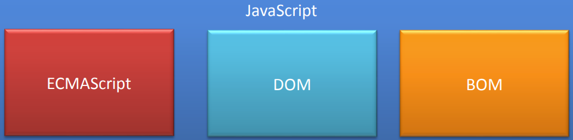
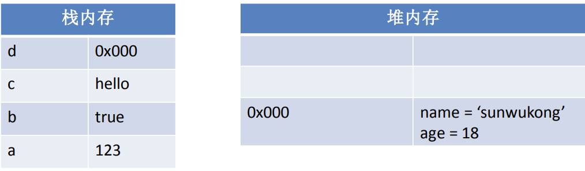
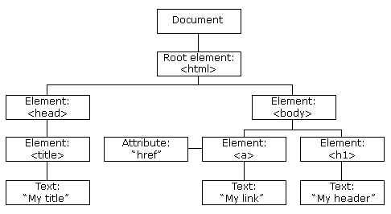
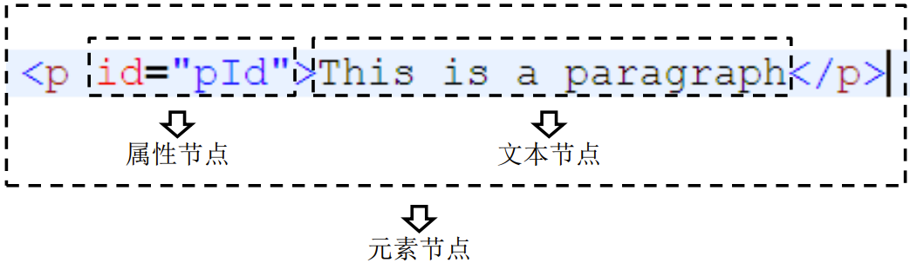
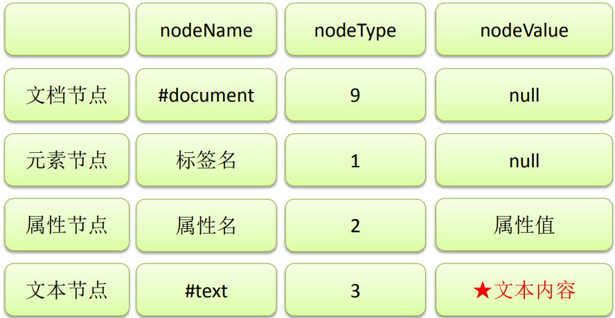
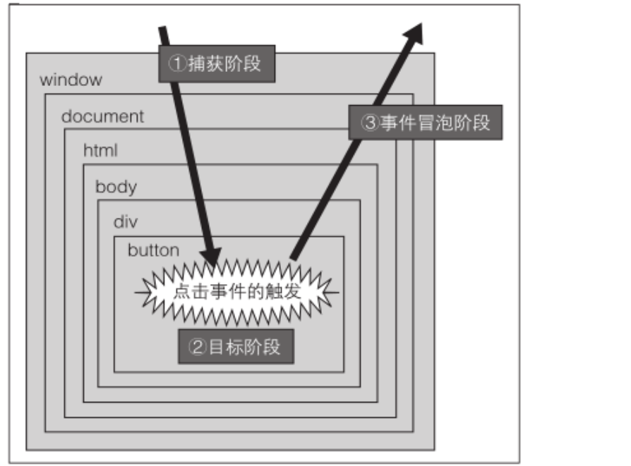

# 一、简介

## 什么是语言
- 计算机就是一个由人来控制的机器，人让它干嘛，它就得干嘛。
- 我们要学习的语言就是人和计算机交流的工具，人类通过语言来控制、操作计算机。
- 编程语言和我们说的中文、英文本质上没有区别，只是语法比较特殊。
- 语言的发展：
  - 纸带机：机器语言
  - 汇编语言：符号语言
  - 现代语言：高级语言


## 起源
- `JavaScript` 诞生于1995年，它的出现主要是用于处理网页中的前端验证。
- 所谓的前端验证，就是指检查用户输入的内容是否符合一定的规则。
- 比如：用户名的长度，密码的长度，邮箱的格式等。


## 简史
- `JavaScript` 是由**网景**公司发明，起初命名为 `LiveScript` ，后来由于**SUN**公司的介入更名为了 `JavaScript`。
- 1996年微软公司在其最新的IE3浏览器中引入了自己对 `JavaScript` 的实现**JScript**。
- 于是在市面上存在两个版本的 `JavaScript` ，一个网景公司的 `JavaScript` 和微软的 `JScript` 。
- 为了确保不同的浏览器上运行的 `JavaScript` 标准一致，所以几个公司共同定制了 `JS` 的标准名命名为**ECMAScript**。


## 时间表
| 年份   | 事件                                |
| ------ | ----------------------------------- |
| 1995年 | 网景公司开发了JavaScript            |
| 1996年 | 微软发布了和JavaScript兼容的JScript |
| 1997年 | ECMAScript第1版(ECMA-262)           |
| 1998年 | ECMAScript第2版                     |
| 1998年 | DOM Level1的制定                    |
| 1998年 | 新型语言DHTML登场                   |
| 1999年 | ECMAScript第3版                     |
| 2000年 | DOM Level2的制定                    |
| 2002年 | ISO/IEC 16262:2002的确立            |
| 2004年 | DOM Level3的制定                    |
| 2005年 | 新型语言AJAX登场                    |
| 2009年 | ECMAScript第5版                     |
| 2009年 | 新型语言HTML5登场                   |


## 实现
- `ECMAScript` 是一个标准，而这个标准需要由各个厂商去实现。
- 不同的浏览器厂商对该标准会有不同的实现。
  | 浏览器            | JavaScript实现方式 |
  | ----------------- | ------------------ |
  | FireFox           | SpiderMonkey       |
  | Internet Explorer | JScript/Chakra     |
  | Safari            | JavaScriptCore     |
  | **Chrome**        | **v8**             |
  | Carakan           | Carakan            |

- 我们已经知道 `ECMAScript` 是 `JavaScript` 标准，所以一般情况下这两个词我们认为是一个意思。
- 但是实际上 `JavaScript` 的含义却要更大一些。
- 一个完整的 `JavaScript` 实现应该由以下三个部分构成：
  


## 学习内容
- 我们已经知道了一个完整的`JavaScript`实现包含了三个部分：`ECMAScript`、`DOM`和`BOM`。
- 由此我们也知道了我们所要学习的内容就是这三部分。
  - ECMAScript（标准）
  - DOM（文档对象模型）
  - BOM（浏览器对象模型）


## 特点
- 解释型语言
- 类似于 `C` 和 `Java` 的语法结构
- 动态语言
- 基于原型的面向对象


## 解释型语言
- `JavaScript` 是一门解释型语言，所谓解释型值语言不需要被编译为机器码在执行，而是直接执行。
- 由于少了编译这一步骤，所以解释型语言开发起来尤为轻松，但是解释型语言运行较慢也是它的劣势。
- 不过解释型语言中使用了 `JIT` 技术，使得运行速度得以改善。


## 类似于 C 和 Java 的语法结构
- JavaScript的语法结构与C和Java很像，向for、if、while等语句和Java的基本上是一模一样的。
- 所以有过C和Java基础的同学学习起来会轻松很多。
- 不过JavaScript和与Java的关系也仅仅是看起来像而已。


## 动态语言
- JavaScript是一门动态语言，所谓的动态语言可以暂时理解为在语言中的一切内容都是不确定的。比如一个变量，这一时刻是个整型，下一时刻可能会变成字符串了。当然这个问题我们以后再谈。
- 不过在补充一句动态语言相比静态语言性能上要差一些，不过由于JavaScript中应用的JIT技术，所以JS可能是运行速度最快的动态语言了。


## 基于原型的面向对象
- JavaScript是一门面向对象的语言。啥是对象？下次聊。
- Java也是一门面向对象的语言，但是与Java不同JavaScript是基于原型的面向对象。啥是原型？下次聊。


# 二、基本语法

## 编写位置
- 我们目前学习的JS全都是客户端的JS，也就是说全都是需要在浏览器中运行的，所以我们我们的JS代码全都需要在网页中编写。
- 我们的JS代码需要编写到 `<script>` 标签中。
  - 另外可以写在元素的 onclick、href 等属性中。
- 我们一般将script标签写到head中。（和style标签有点像）
- 属性：
  - type：默认值 `text/javascript` 可以不写，不写也是这个值。
  - src：当需要引入一个外部的js文件时，使用该属性指向文件的地址。


> 1. 可以将js代码编写到外部js文件中，然后通过script标签引入写到外部文件中可以在不同的页面中同时引用，也可以利用到浏览器的缓存机制【推荐】。
> 2. script标签一旦用于引入外部文件了，就不能在编写代码了，即使编写了浏览器也会忽略如果需要则可以在创建一个新的script标签用于编写内部代码。


## Hello World
- 创建一个html文件。
- 在html文件的的head标签中创建一个script标签，并编写如下代码。
  ```html
  <script type="text/javascript">
    console.log("Hello World");
  </script>
  ```


## 严格区分大小写
- JavaScript是严格区分大小写的，也就是abc和Abc会被解析器认为是两个不同的东西。
- 所以在编写上边的HelloWorld时，一定要注意区分大小写。


## 注释
- 注释中的内容不会被解析器解析执行，但是会在源码中显示，我们一般会使用注释对程序中的内容进行解释。
- JS中的注释和Java的的一致，分为两种：
  - 单行注释：`//注释内容`
  - 多行注释：`/*注释内容*/`


## 标识符
- 所谓**标识符**，就是指**变量**、**函数**、**属性**的名字，或函数的**参数**。
- 标识符可以是按照下列格式规则组合起来的一或多个字符：
  - 第一个字符必须是一个**字母**、**下划线**（ `_` ）或一个**美元符号**（ `$` ）。
  - 其他字符可以是**字母**、**下划线**、**美元符号**或**数字**。
- 按照惯例，ECMAScript 标识符采用**驼峰命名法**。
- 但是要注意的是JavaScript中的标识符不能是**关键字**和**保留字符**。

> JS底层保存标识符时实际上是采用的Unicode编码，所以理论上讲，所有的utf-8中含有的内容都可以作为标识符。

### [保留关键字](https://www.runoob.com/js/js-reserved.html)
- 关键字
- 保留字符
- 其他不建议使用的标识符


## 变量
- **变量**的作用是给某一个值或对象标注名称。
- 比如我们的程序中有一个值123，这个值我们是需要反复使用的，这个时候我们最好将123这个值赋值给一个变量，然后通过变量去使用123这个值。
- 变量的声明：
  - 使用 **var** 关键字声明一个变量。
  - `var a;`
- 变量的赋值：
  - 使用=为变量赋值。
  - `a=123;`
- 声明和赋值同时进行：
  - `var a = 123;`

> 1. 字面量，都是一些不可改变的值。字面量都是可以直接使用，但是我们一般都不会直接使用字面量
> 2. 变量，变量可以用来保存字面量，而且变量的值是可以任意改变的。变量更加方便我们使用，所以在开发中都是通过变量去保存一个字面量，而很少直接使用字面量。可以通过变量对字面量进行描述。


## 数据类型
- 数据类型决定了一个数据的特征，比如：123和“123”，直观上看这两个数据都是123，但实际上前者是一个数字，而后者是一个字符串。
- 对于不同的数据类型我们在进行操作时会有很大的不同。
- JavaScript中一共有5种基本数据类型：
  - 字符串型（String）
  - 数值型（Number）
  - 布尔型（Boolean）
  - null型（Null）
  - undefined型（Undefined）
- 这5种之外的类型都称为Object，所以总的来看JavaScript中共有六种数据类型。

### typeof运算符
- 使用 typeof 操作符可以用来检查一个变量的数据类型，以字符串返回结果。
- 使用方式： typeof 数据，例如 typeof 123。
- 返回结果：
  - typeof 数值 ： `number`
  - typeof 字符串 ： `string`
  - typeof 布尔型 ： `boolean`
  - typeof undefined ： `undefined`
  - typeof null ： `object`

### String
- `String` 用于表示一个字符序列，即字符串。
- 字符串需要使用 `'` 或 `"` 括起来。
- 转义字符：
  | 转义字符 | 含义   |
  | -------- | ------ |
  | `\n`     | 换行   |
  | `\\`     | 斜杠   |
  | `\t`     | 制表   |
  | `\'`     | 单引号 |
  | `\b`     | 空格   |
  | `\"`     | 双引号 |
  | `\r`     | 回车   |
- 将其他数值转换为字符串有三种方式：`toString()`、`String()`、`拼串`。

### Number
- `Number` 类型用来表示整数和浮点数，最常用的功能就是用来表示10进制的整数和浮点数。
- Number表示的数字大小是有限的，范围是：
  - `1.7976931348623157e+308`
  - 如果超过了这个范围，则会返回 `Infinity`。
- `NaN`，即非数值（Not a Number）是一个特殊的数值，JS中当对数值进行计算时没有结果返回，则返回NaN。
- 使用typeof检查一个Number类型（包括NaN、Infinity）的数据时，会返回"number"

数值的转换
- 有三个函数可以把非数值转换为数值：`Number()`、`parseInt()`和`parseFloat()`。
- Number()可以用来转换任意类型的数据，而后两者只能用于转换字符串。
- parseInt()只会将字符串转换为整数，而parseFloat()可以转换为浮点数。

### Boolean(布尔型)
- `布尔型` 也被称为逻辑值类型或者真假值类型。
- 布尔型只能够取真（`true`）和假（`false`）两种数值。除此以外，其他的值都不被支持。
- 其他的数据类型也可以通过 `Boolean()` 函数转换为布尔类型。
- 转换规则：
  | 数据类型  | 转换为true     | 转换为false    |
  | --------- | -------------- | -------------- |
  | Boolean   | true           | false          |
  | String    | 任何非空字符串 | ""（空字符串） |
  | Number    | 任何非0数字    | 0和NaN         |
  | Object    | 任何对象       | null           |
  | Undefined | n/a            | undefined      |

### Undefined
- `Undefined` 类型只有一个值，即特殊的 undefined 。
- 在使用 var 声明变量但未对其加以初始化时，这个变量的值就是 undefined。例如：
  - `var message;`
  - message 的值就是 undefined。
- 需要注意的是typeof对没有初始化和没有声明的变量都会返回 undefined。

### Null
- `Null` 类型是第二个只有一个值的数据类型，这个特殊的值是 null 。
- 从语义上看null表示的是一个空的对象。所以使用typeof检查null会返回一个Object。
- undefined值实际上是由null值衍生出来的，所以如果比较undefined和null是否相等，会返回true；


## 类型转换
- 类型转换就是指将其他的数据类型，转换为String Number 或 Boolean

### 转换为String
- 方式一（强制类型转换）：
  - 调用被转换数据的toString()方法
  - 例子：
    - `var a = 123;`
    - `a = a.toString();`
  - 注意：这个方法不适用于null和undefined
    - 由于这两个类型的数据中没有方法，所以调用toString()时会报错

- 方式二（强制类型转换）：
  - 调用String()函数
  - 例子：
    - `var a = 123;`
    - `a = String(a);`
  - 原理：对于Number Boolean String都会调用他们的toString()方法来将其转换为字符串，
    - 对于null值，直接转换为字符串"null"。对于undefined直接转换为字符串"undefined"

- 方式三（隐式的类型转换）:
  - 为任意的数据类型 `+""`
  - 例子：
    - `var a = true;`
    - `a = a + "";`
  - 原理：和String()函数一样

### 转换为Number
- 方式一（强制类型转换）：
  - 调用Number()函数
  - 例子：
    `var s = "123";`
    `s = Number(s);`
  - 转换的情况：
    1. 字符串 => 数字
       - 如果字符串是一个合法的数字，则直接转换为对应的数字
       - 如果字符串是一个非法的数字，则转换为NaN
       - 如果是一个空串或纯空格的字符串，则转换为0
    2. 布尔值 => 数字
       - true转换为1
       - false转换为0
    3. 空值 => 数字
       - null转换为0
    4. 未定义 => 数字
       - undefined 转换为NaN

- 方式二（强制类型转换）：
  - 调用parseInt()或parseFloat()
  - 这两个函数专门用来将一个字符串转换为数字的
  - parseInt()
    - 可以将一个字符串中的有效的整数位提取出来，并转换为Number
    - 例子：
      - `var a = "123.456px";`
      - `a = parseInt(a); //123`
    - 如果需要可以在parseInt()中指定一个第二个参数，来指定进制

  - parseFloat()
    - 可以将一个字符串中的有效的小数位提取出来，并转换为Number
    - 例子：
      - `var a = "123.456px";`
      - `a = parseFloat(a); //123.456`

- 方式三（隐式的类型转换）：
  - 使用一元的+来进行隐式的类型转换
  - 例子：
    - `var a = "123";`
    - `a = +a;`

  - 原理：和Number()函数一样

### 转换为布尔值
- 方式一（强制类型转换）：
  - 使用Boolean()函数
  - 例子：
    - `var s = "false";`
    - `s = Boolean(s); //true`
  - 转换的情况
    字符串 => 布尔
      - 除了空串其余全是true

    数值 => 布尔
      - 除了0和NaN其余的全是true

    null、undefined => 布尔
      - 都是false

    对象 => 布尔
      - 都是true

- 方式二（隐式类型转换）：
  - 为任意的数据类型做两次非运算，即可将其转换为布尔值
  - 例子：
    - `var a = "hello";`
    - `a = !!a; //true`


## 运算符
- JS中为我们定义了一套对数据进行运算的运算符。
- 这其中包括：算数运算符、位运算符、关系运算符等。

### 算数运算符
- **算数运算符** 顾名思义就是进行算数操作的运算符。
- JS中为我们提供了多种算数运算符。
- 算数运算符：
  | 运算符       | 说明                         |
  | ------------ | ---------------------------- |
  | `+`          | 加法（字符串拼接）           |
  | `-`          | 减法                         |
  | `*`          | 乘法                         |
  | `/`          | 除法                         |
  | `%`          | 取模                         |
  | `++`（前置） | 自增                         |
  | `++`（后置） | 自增                         |
  | `--`（前置） | 自减                         |
  | `--`（后置） | 自减                         |
  | `+`          | 符号不变（将字符串转为数字） |
  | `-`          | 符号反转                     |

### 自增和自减
- 自增 `++` 自减 `--`
  - 自增和自减分为前置运算和后置元素。
  - 所谓的前置元素就是将元素符放到变量的前边，而后置将元素符放到变量的后边。
  - 例子：
- 前置自增：++a
- 后置自减：a--
  - 运算符在前置时，表达式值等于变量原值。
  - 运算符在后置是，表达式值等于变量变更以后的值。

### 逻辑操作符
- 一般情况下使用逻辑运算符会返回一个布尔值。
- 逻辑运算符主要有三个：非、与、或。
- 在进行逻辑操作时如果操作数不是布尔类型则会将其转换布尔类型在进行计算。
- 非使用符号 `!` 表示，与使用 `&&` 表示，或使用 `||` 表示。

| 运算符       | 说明          | 短路规则                 |
| ------------ | ------------- | ------------------------ |
| &#33;        | 逻辑非（NOT） | 无                       |
| &#38;&#38;   | 逻辑与（AND） | 若左值为假，则不运算右值 |
| &#124;&#124; | 逻辑或（OR）  | 若左值为真，则不运算右值 |

#### 非
- 非运算符使用 ! 表示。
- 非运算符可以应用于任意值，无论值是什么类型，这个运算符都会返回一个布尔值。
- 非运算符会对原值取反，比如原值是true使用非运算符会返回false，原值为false使用非运算符会返回true。

#### 与
- 与运算符使用 && 表示。
- 与运算符可以应用于任何数据类型，且不一定返回布尔值。
- 对于非布尔值运算，会先将非布尔值转换为布尔值。
- 对布尔值做运算时，如果两个值都为true则返回true，否则返回false。
- 非布尔值时：如果两个都为true，则返回第二个值，如果两个值中有false则返回靠前的false的值。

#### 或
- 或运算符使用 || 表示。
- 或运算符可以应用于任何数据类型，且不一定返回布尔值。
- 对于非布尔值运算，会先将非布尔值转换为布尔值。
- 对布尔值进行运算时，如果两个值都为false则返回false，否则返回true。
- 非布尔值时：如果两个都为false ，则返回第二个值，否则返回靠前true的值。

### 赋值运算符
- 简单的赋值操作符由等于号 （ `=` ） 表示，其作用就是把右侧的值赋给左侧的变量。
- 如果在等于号左边添加加减乘除等运算符，就可以完成复合赋值操作。
- +=、*=、-=、/=、%=
- 比如：`a+=10` 和 `a=a+10` 是一样的。

### 关系运算符
- 小于（`<`） 、大于（`>`） 、小于等于（`<=`）和大于等于（`>=`）这几个关系运算符用于对两个值进行比较，比较的规则与我们在数学课上所学的一样。
- 这几个运算符都返回一个布尔值。用来表示两个值之间的关系是否成立。
  - `5 > 10` : false
  - `5 < 10` : true
  - `5 <= 10` : true
  - `5 >= 10` : false

> 当我们使用关系运算符比较两个字符串时，实际上比较的是两个字符串的Unicode编码，比较规则是从第一个字符开始，逐个比较字符的Unicode编码，直到出现不同的字符，然后比较出现不同的字符的Unicode编码的大小。

#### 相等
- JS中使用 `==` 来判断两个值是否相等，如果相等则返回true。
- 使用 `!=` 来表示两个值是否不相等，如果不等则返回true。
- 注意：null和undefined使用 `==` 判断时是相等的。

| 表达式            | 值    |
| ----------------- | ----- |
| null == undefined | true  |
| "NaN" == NaN      | false |
| 5 == NaN          | false |
| NaN == NaN        | false |
| NaN != NaN        | true  |
| false == 0        | true  |
| true == 1         | true  |
| true == 2         | false |
| undefined == 0    | false |
| null == 0         | false |
| "5" == 5          | true  |

#### 全等
- 除了 `==` 以外，JS中还提供了`===`。
- `===` 表示全等，他和 `==` 基本一致，不过==在判断两个值时会进行自动的类型转换，而 `===` 不会。
- 也就是说 `"55" == 55` 会返回true，而 `"55" === 55` 会返回false；
- 同样我们还有 `!==` 表示不全等，同样比较时不会自动转型。
- 也就是说 `"55" != 55` 会返回false，而 `"55" !== 55` 会返回true；

### 逗号
- 使用逗号可以在一条语句中执行多次操作。
- 比如：var num1=1, num2=2, num3=3;
- 使用逗号运算符分隔的语句会从左到右顺序依次执行。

### 条件运算符
- 条件运算符也称为三元运算符。通常运算符写为 `?:` 。
- 这个运算符需要三个操作数，第一个操作数在 `?` 之前，第二个操作数在 `?` 和 `:` 之间，第三个操作数在 `:` 之后。
- 例如：`x > 0 ? x : -x // 求x的绝对值`
- 上边的例子，首先会执行 `x>0` ，如果返回true则执行冒号左边的代码，并将结果返回，这里就是返回x本身，如果返回false则执行冒号右边的代码，并将结果返回。

### 运算符的优先级
- `.` `[]` `new`
- `()`
- `++`  `--`
- `!` `~` `+(单目)` `-(单目)` `typeof` `void` `delete`
- `%` `*` `/`
- `+(双目)` `-(双目)`
- `<< `  `>>`  `>>>`
- `<` `<=` `>` `>=`
- `==` `!==` `===`
- `&`
- `^`
- `|`
- `&&`
- `||`
- `?:`
- `=` `+=` `-=` `*=` `/=` `%=` `<<=` `>>=` `>>>=` `&=` `^=` `|=`
- `,`


## 语句
- 前边我所说表达式和运算符等内容可以理解成是我们一门语言中的单词，短语。
- 而 **语句（statement）** 就是我们这个语言中一句一句完整的话了。
- 语句是一个程序的基本单位，JS的程序就是由一条一条语句构成的，每一条语句使用;结尾。
- JS中的语句默认是由上至下顺序执行的，但是我们也可以通过一些流程控制语句来控制语句的执行顺序。


## 代码块
- 代码块是在大括号 `{}` 中所写的语句，以此将多条语句的集合视为一条语句来使用。
- 例如：
  ```javascript
  {
    var a = 123;
    a++;
    alert(a);
  }
  ```
- 我们一般使用代码块将需要一起执行的语句进行分组，需要注意的是，代码块结尾不需要加分号。

> JS中的代码块，只具有分组的的作用，没有其他的用途。  
> 代码块内容的内容，在外部是完全可见的。


## 条件语句
- 条件语句是通过判断指定表达式的值来决定执行还是跳过某些语句。
- 最基本的条件语句：
  - `if...else`
  - `switch...case`

### if...else语句
- `if...else` 语句是一种最基本的控制语句，它让JavaScript可以有条件的执行语句。
- 第一种形式:
  ```javascript
  if(expression)
    statement
  ```
- 第二种形式:
  ```javascript
  if(expression)
    statement
  else
    statement
  ```
- 除了if和else还可以使用 `else if` 来创建多个条件分支。

### switch...case语句
- `switch...case` 是另一种流程控制语句。
- switch语句更适用于多条分支使用同一条语句的情况。
- 语法：
  ```javascript
  switch(语句){
    case 表达式1:
      语句...
    case 表达式2:
      语句...
    default:
      语句...
  }
  ```
- 需要注意的是case语句只是标识的程序运行的起点，并不是终点，所以一旦符合case的条件程序会一直运行到结束。所以我们一般会在case中添加break作为语句的结束。

> 在执行时会依次将case后的表达式的值和switch后的条件表达式的值进行**全等**比较，如果比较结果为true，则从当前case处开始执行代码。  
> 当前case后的所有的代码都会执行，我们可以在case的后边跟着一个break关键字，这样可以确保只会执行当前case后的语句，而不会执行其他的case。  
> 如果比较结果为false，则继续向下比较。如果所有的比较结果都为false，则只执行default后的语句。

> JavaScript的switch中的case后跟的可以是任意的表达式，而不仅仅是常量。


## 循环语句
- 和条件语句一样，循环语句也是基本的控制语句。
- 循环中的语句只要满足一定的条件将会一直执行。

### while
- while语句是一个最基本的循环语句。
- while语句也被称为while循环。
- 语法：
  ```javascript
  while(条件表达式){
    语句...
  }
  ```
- 和if一样while中的条件表达式将会被转换为布尔类型，只要该值为真，则代码块将会一直重复执行。
- 代码块每执行一次，条件表达式将会重新计算。

示例：
```javascript
//创建一个循环，往往需要三个步骤
//1.创初始化一个变量
var i = 11;
//2.在循环中设置一个条件表达式
while(i <= 10){
  //3.定义一个更新表达式，每次更新初始化变量
  document.write(i++ +"<br />")
}
```

### do...while
- do...while和while非常类似，只不过它会在循环的尾部而不是顶部检查表达式的值。
- do...while循环会**至少执行一次**。
- 语法：
  ```javascript
  do{
    语句...
  }while(条件表达式);
  ```
- 相比于while，do...while的使用情况并不是很多。

### for
- for语句也是循环控制语句，我们也称它为for循环。
- 大部分循环都会有一个计数器用以控制循环执行的次数，计数器的三个关键操作是初始化、检测和更新。for语句就将这三步操作明确为了语法的一部分。
- 语法：
  ```javascript
  for(①初始化表达式 ; ②条件表达式 ; ④更新表达式){
    ③语句...
  }
  ```

> for循环中的三个部分都可以省略，但是分号必须保留。  
> 如果省略②，则相当于永远为true。

小练习，质数判断：
```javascript
function isPrime(n) {
    if (n <= 3) return n > 1;
    if (n % 2 === 0 || n % 3 === 0) return false;
    for (let i = 5, max = Math.sqrt(n); i <= max; i += 6) {
        if (n % i === 0 || n % (i + 2) === 0) return false;
    }
    return true;
}
```

### break和continue
- break 和 continue 语句用于在循环中精确地控制代码的执行。
- 使用break语句会使程序立刻退出最近的循环，强制执行循环后边的语句。
- break和continue语句只在循环和switch语句中使用。
- 使用continue语句会使程序跳过当次循环，继续执行下一次循环，并不会结束整个循环。
- continue只能在循环中使用，不能出现在其他的结构中。

### label
- 使用 label 语句可以在代码中添加标签，以便将来使用。
- 语法：
  - `label: statement`
- 例子：
  ```javascript
  start: for (var i=0; i < count; i++) {
    alert(i);
  }
  ```
- 这个例子中定义的 start 标签可以在将来由 break 或 continue 语句引用。加标签的语句一般都要与 for 语句等循环语句配合使用。


# 三、对象

## Object对象
- Object类型，我们也称为一个对象。是JavaScript中的引用数据类型。
- 它是一种复合值，它将很多值聚合到一起，可以通过名字访问这些值。
- 对象也可以看做是属性的无序集合，每个属性都是一个名/值对。
- 对象除了可以创建自有属性，还可以通过从一个名为原型的对象那里继承属性。
- 除了字符串、数字、true、false、null和undefined之外，JS中的值都是对象。

> 如果使用基本数据类型的数据，我们所创建的变量都是独立，不能成为一个整体。  
> 对象属于一种复合的数据类型，在对象中可以保存多个不同数据类型的属性。  

对象的分类：
1. 内建对象
   - 由ES标准中定义的对象，在任何的ES的实现中都可以使用
   - 比如：Math String Number Boolean Function Object....
2. 宿主对象
   - 由JS的运行环境提供的对象，目前来讲主要指由浏览器提供的对象
   - 比如 BOM DOM
3. 自定义对象
   - 由开发人员自己创建的对象


## 创建对象的两种方式
- 第一种
  ```javascript
  var person = new Object();
  person.name = "孙悟空";
  person.age = 18;
  ```
- 第二种
  ```javascript
  var person = {
    name: "孙悟空",
    age: 18
  };
  ```


## 基本操作

### 对象属性的访问
- `.` 访问
  - `对象.属性名`
- `[]` 访问
  - `对象['属性名']`

> 如果要使用特殊（不符合标识符规范）的属性名，只能使用 `对象["属性名"]` 的方式来操作。  
> 使用 `[]` 这种形式去操作属性，更加的灵活，在 `[]` 中可以直接传递一个变量，这样变量值是多少就会读取那个属性。  

### 删除对象的属性
- `delete` 运算符
  - `delete 对象.属性名`
  - `delete 对象['属性名']`

### in 运算符
- 通过该运算符可以检查一个对象中是否含有指定的属性，如果有则返回true，没有则返回false。
- 语法：`"属性名" in 对象`


## 数据类型

### 基本数据类型
- JS中的变量可能包含两种不同数据类型的值：基本数据类型和引用数据类型。
- JS中一共有5种基本数据类型：String、Number、Boolean、Undefined、Null。
- 基本数据类型的值是无法修改的，是不可变的。
- 基本数据类型的比较是值的比较，也就是只要两个变量的值相等，我们就认为这两个变量相等。

### 引用数据类型
- 引用类型的值是保存在内存中的对象。
- 当一个变量是一个对象时，实际上变量中保存的并不是对象本身，而是对象的引用。
- 当从一个变量向另一个变量复制引用类型的值时，会将对象的引用复制到变量中，并不是创建一个新的对象。
- 这时，两个变量指向的是同一个对象。因此，改变其中一个变量会影响另一个。


## 栈和堆
- JavaScript在运行时数据是保存到栈内存和堆内存当中的。
- 简单来说栈内存用来保存变量和基本类型。堆内存用来保存对象。
- 我们在声明一个变量时实际上就是在栈内存中创建了一个空间用来保存变量。
- 如果是基本类型则在栈内存中直接保存，
- 如果是引用类型则会在堆内存中保存，变量中保存的实际上对象在堆内存中的地址。

```javascript
var a = 123;
var b = true;
var c = "hello";
var d = {name:'sunwukong',age:18};
```




## 函数
- 函数是由一连串的子程序（语句的集合）所组成的，可以被外部程序调用。向函数传递参数之后，函数可以返回一定的值。
- 通常情况下，JavaScript 代码是自上而下执行的，不过函数体内部的代码则不是这样。如果只是对函数进行了声明，其中的代码并不会执行。只有在调用函数时才会执行函数体内部的代码。
- 这里要注意的是JavaScript中的函数也是一个对象。

### 使用构造函数创建一个函数对象
可以将要封装的代码以字符串的形式传递给构造函数。
```javascript
var fun = new Function("console.log('Hello 这是我的第一个函数');");
```

> 封装到函数中的代码不会立即执行，函数中的代码会在函数调用的时按照顺序执行。  
> 调用函数 语法：`函数对象()`  

### 函数的声明（一）
- 首先明确一点函数也是一个对象，所以函数也是在堆内存中保存的。
- 函数声明比较特殊，需要使用function关键字声明。
  ```javascript
  var sum = function(a,b){return a+b};
  ```
- 上边的例子就是创建了一个函数对象，并将函数对象赋值给了sum这个变量。其中()中的内容表示执行函数时需要的参数，{}中的内容表示函数的主体。

### 函数的声明（二）
- 可以通过函数声明语句来定义一个函数。函数声明语句以关键字function 开始，其后跟有函数名、参数列表和函数体。其语法如下所示：
  ```javascript
  function 函数名(参数,参数,参数...){
    函数体
  }
  ```
- 例如:
  ```javascript
  function sum(a,b){
    return a+b;
  }
  ```

  - 上边我们定义了一个函数名为sum，两个参数a和b。函数声明时设置的参数称为形参（形式参数），这个函数对两个参数做了加法运算并将结果返回。

### 函数的调用
- 调用函数时，传递给函数的参数称为实参（实际参数）。
- 如果想调用我们上边定义的sum函数，可以这样写：
  ```javascript
  var result = sum(123,456);
  ```

  - 这样表示调用sum这个函数，并将123和456作为实参传递给函数，函数中会将两个参数求和并赋值给result。

立即执行函数：
- 函数定义完，立即被调用，这种函数叫做立即执行函数
- 立即执行函数往往只会执行一次
```javascript
(function(a,b){
    console.log("a = "+a);
    console.log("b = "+b);
})(123,456);
```

### 参数传递
- JS中的所有的参数传递都是按值传递的。也就是说把函数外部的值赋值给函数内部的参数，就和把值从一个变量赋值给另一个变量是一样的。

>JS调用函数时解析器不会检查实参的类型和数量，函数的实参可以是任意的数据类型。  
>多余实参不会被赋值。如果实参的数量少于形参的数量，则没有对应实参的形参将是undefined。  


## 作用域
- 作用域指一个变量的作用的范围
- 在JS中一共有两种作用域：
  1. 全局作用域
     - 直接编写在script标签中的JS代码，都在全局作用域
     - 全局作用域在页面打开时创建，在页面关闭时销毁
     - 在全局作用域中有一个全局对象window，它代表的是一个浏览器的窗口，它由浏览器创建我们可以直接使用
     - 在全局作用域中：
       - 创建的变量都会作为window对象的属性保存
       - 创建的函数都会作为window对象的方法保存
     - 全局作用域中的变量都是全局变量，在页面的任意的部分都可以访问的到
  2. 函数作用域
     - 调用函数时创建函数作用域，函数执行完毕以后，函数作用域销毁
     - 每调用一次函数就会创建一个新的函数作用域，他们之间是互相独立的
     - 在函数作用域中可以访问到全局作用域的变量，在全局作用域中无法访问到函数作用域的变量
     - 当在函数作用域操作一个变量时，它会先在自身作用域中寻找，如果有就直接使用，如果没有则向上一级作用域中寻找，直到找到全局作用域，如果全局作用域中依然没有找到，则会报错ReferenceError
     - 在函数中要访问全局变量可以使用window对象
     - 在函数中，不使用var声明的变量都会成为全局变量

### 变量的声明提前
使用var关键字声明的变量，会在作用域所有的代码执行之前被声明（但是不会赋值），但是如果声明变量时不适用var关键字，则变量不会被声明提前。

### 函数的声明提前
使用函数声明形式创建的函数 `function 函数(){}`，它会在作用域所有的代码执行之前就被创建，所以我们可以在函数声明前来调用函数。使用函数表达式创建的函数，不会被声明提前，所以不能在声明前调用。


## 执行环境
- 执行环境定义了变量或函数有权访问的其他数据，决定了它们各自的行为。
- 每个执行环境都有一个与之关联的变量对象，环境中定义的所有变量和函数都保存在这个对象中。
- 全局执行环境是最外围的一个执行环境。在 Web 浏览器中，全局执行环境被认为是 window 对象，因此所有全局变量和函数都是作为window 对象的属性和方法创建的。
- 某个执行环境中的所有代码执行完毕后，该环境被销毁，保存在其中的所有变量和函数定义也随之销毁。
- 在内部环境可以读取外部环境的变量，反之则不行。


## 函数内部属性
在函数内部，有两个特殊的对象：
- arguments
  - 该对象实际上是一个数组（类数组），用于保存函数的参数。
    - 它只有一个叫做length的属性，没有任何数组方法。
  - 同时该对象还有一个属性callee来表示当前函数。
- this
  - this 引用的是一个对象。对于最外层代码与函数内部的情况，其引用目标是不同的。
  - 此外，即使在函数内部，根据函数调用方式的不同，引用对象也会有所不同。需要注意的是，this 引用会根据代码的上下文语境自动改变其引用对象。

### arguments
arguments是一个类数组对象，它也可以通过索引来操作数据，也可以获取长度。
- 在调用函数时，我们所传递的实参都会在arguments中保存
- `arguments.length` 可以用来获取实参的长度
- 我们即使不定义形参，也可以通过arguments来使用实参，只不过比较麻烦
  - `arguments[0]` 表示第一个实参
  - `arguments[1]` 表示第二个实参...
- 它里边有一个属性叫做`callee`，这个属性对应一个函数对象，就是当前正在指向的函数的对象。

### this
- 在最外层代码中，this 引用的是全局对象。
- 在函数内，this 根据函数**调用方式**的不同而有所不同：

| 函数的调用方式  | this引用的对象     |
| --------------- | ------------------ |
| 构造函数        | 所生成的对象       |
| 调用对象的方法  | 当前对象           |
| apply或call调用 | 参数指定的对象     |
| 其他方式        | 全局对象（window） |


## 创建对象

### 工厂方法
使用工厂方法创建对象，通过该方法可以大批量的创建对象。
```javascript
function createPerson(name, age, gender) {
  //创建一个新的对象 
  var obj = new Object();
  //向对象中添加属性
  obj.name = name;
  obj.age = age;
  obj.gender = gender;
  obj.sayName = function () {
    alert(this.name);
  };
  //将新的对象返回
  return obj;
}
```

> 使用工厂方法创建的对象，使用的构造函数都是Object。所以创建的对象都是Object这个类型，就导致我们无法区分出多种不同类型的对象

### 构造函数
- 构造函数是用于生成对象的函数，像之前调用的Object()就是一个构造函数。
- 创建一个构造函数：
  ```javascript
  function MyClass(x, y) {
    this.x = x;
    this.y = y;
  }
  ```
- 调用构造函数：
  - 构造函数本身和普通的函数声明形式相同。
  - 构造函数通过 new 关键字来调用，new 关键字会新创建一个对象并返回。
  - 通过 new 关键字调用的构造函数内的 this 引用引用了（被新生成的）对象。
- 构造函数的执行流程：
  1. 立刻创建一个新的对象
  2. 将新建的对象设置为函数中this，在构造函数中可以使用this来引用新建的对象
  3. 逐行执行函数中的代码
  4. 将新建的对象作为返回值返回

> 构造函数就是一个普通的函数，创建方式和普通函数没有区别，不同的是构造函数习惯上首字母大写。  
> 构造函数和普通函数的区别就是调用方式的不同，普通函数是直接调用，而构造函数需要使用new关键字来调用。  
> 使用同一个构造函数创建的对象，我们称为一类对象，也将一个构造函数称为一个类。我们将通过一个构造函数创建的对象，称为是该类的实例。  

### new关键字
- 使用new关键字执行一个构造函数时：
  - 首先，会先创建一个空的对象。
  - 然后，会执行相应的构造函数。构造函数中的this将会引用这个新对象。
  - 最后，将对象作为执行结果返回。
- 构造函数总是由new关键字调用。
- 构造函数和普通函数的区别就在于调用方式的不同。
- 任何函数都可以通过new来调用，所以函数都可以是构造函数。
- 在开发中，通常会区分用于执行的函数和构造函数。
- 构造函数的首字母要大写。

### instanceof
- 之前学习基本数据类型时我们学习了typeof用来检查一个变量的类型。
- 但是typeof对于对象来说却不是那么好用，因为任何对象使用typeof都会返回Object。而我们想要获取的是对象的具体类型。
- 这时就需要使用instanceof运算符了，它主要用来检查一个对象的具体类型。
- 语法：
  - `var result = 变量 instanceof 类型`


## 属性的访问
- 在对象中保存的数据或者说是变量，我们称为是一个对象的属性。
- 读取对象的属性有两种方式：
  - `对象.属性名`
  - `对象['属性名']`
- 修改属性值也很简单：
  - `对象.属性名 = 属性值`
- 删除属性
  - `delete 对象.属性名`
- constructor
  - 每个对象中都有一个constructor属性，它引用了当前对象的构造函数。


## 原型对象

### 原型继承
- JS是一门面向对象的语言，而且它还是一个基于原型的面向对象的语言。
- 所谓的原型实际上指的是，在构造函数中存在着一个名为原型的(prototype)对象，这个对象中保存着一些属性，凡是通过该构造函数创建的对象都可以访问存在于原型中的属性。
- 最典型的原型中的属性就是toString()函数，实际上我们的对象中并没有定义这个函数，但是却可以调用，那是因为这个函数存在于Object对应的原型中。

### 设置原型
- 原型就是一个对象，和其他对象没有任何区别，可以通过构造函数来获取原型对象。
  - `构造函数. prototype`
- 和其他对象一样我们可以添加修改删除原型中的属性，也可以修改原型对象的引用。
- 需要注意的是prototype属性只存在于函数对象中，其他对象是没有prototype属性的。
- 每一个对象都有原型，包括原型对象也有原型。特殊的是Object的原型对象没有原型。

### 获取原型对象的方法
- 除了可以通过构造函数获取原型对象以外，还可以通过具体的对象来获取原型对象。
  - `Object.getPrototypeOf(对象)`
  - `对象.__proto__`
  - `对象.constructor.prototype`
- 需要注意的是，我们可以获取到Object的原型对象，也可以对它的属性进行操作，但是我们不能修改Object原型对象的引用。

### 原型链
- 基于我们上边所说的，每个对象都有原型对象，原型对象也有原型对象。
- 由此，我们的对象，和对象的原型，以及原型的原型，就构成了一个原型链。
- 比如这么一个对象：
  - `var mc = new MyClass(123,456);`
  - 这个对象本身，原型MyClass.proprototype原型对象的原型对象是Object，Object对象还有其原型。这组对象就构成了一个原型链。
  - 这个链的次序是：mc对象、mc对象原型、原型的原型（Object）、Object的原型(null)
- 当从一个对象中获取属性时，会首先从当前对象中查找，如果没有则顺着向上查找原型对象，直到找到Object对象的原型位置，找到则返回，找不到则返回undefined。


## 垃圾回收
- 不再使用的对象的内存将会自动回收，这种功能称作垃圾回收。
- 所谓不再使用的对象，指的是没有被任何一个属性（变量）引用的对象。
- 垃圾回收的目的是，使开发者不必为对象的生命周期管理花费太多精力。

> 在JS中拥有自动的垃圾回收机制，会自动将这些垃圾对象从内存中销毁，我们不需要也不能进行垃圾回收的操作。我们需要做的只是要将不再使用的对象设置null即可。


## 数组
数组也是对象的一种。
- 使用typeof检查一个数组时，会返回object。
- 它和我们普通对象功能类似，也是用来存储一些值的。
- 不同的是普通对象是使用字符串作为属性名的，而数组时使用数字来作为索引（从0开始的整数）操作元素。
- 数组是一种用于表达有顺序关系的值的集合的语言结构。存储性能比普通对象要好，在开发中我们经常使用数组来存储一些数据。

### 操作数组
- 创建数组：
  - `var array = [1,44,33];`
- 访问数组：
  - `array[index]`
  - 如果读取不存在的索引，他不会报错而是返回undefined。

### 获取数组的长度
可以使用length属性来获取数组的长度(元素的个数)
- 语法：`数组.length`

- 对于连续的数组，使用length可以获取到数组的长度（元素的个数）
- 对于非连续的数组，使用length会获取到数组的最大的索引+1
  > 尽量不要创建非连续的数组
- 向数组的最后一个位置添加元素
  - 语法：`数组[数组.length] = 值;`


## 引用类型
- 上边我们说到JS中除了5种基本数据类型以外其余的全都是对象，也就是引用数据类型。
- 但是虽然全都是对象，但是对象的种类却是非常繁多的。比如我们说过的Array（数组），Function
（函数）这些都是不同的类型对象。
- 实际上在JavaScript中还提供了多种不同类型的对象。

### Object
- 目前为止，我们看到的最多的类型就是Object，它也是我们在JS中使用的最多的对象。
- 虽然Object对象中并没有为我们提供太多的功能，但是我们会经常会用途来存储和传输数据。
- 创建Object对象有两种方式：
  - `var obj = new Object();`
  - `var obj = {}`
- 上边的两种方式都可以返回一个Object对象。
- 但是第一种我们使用了一个new关键字和一个Object()函数。
- 这个函数就是专门用来创建一个Object对象并返回的，像这种函数我们称为构造函数。

### [Array](https://www.runoob.com/jsref/jsref-obj-array.html)
- Array用于表示一个有序的数组。
- JS的数组中可以保存任意类型的数据。
- 创建一个数组的方式有两种：
  - 使用构造器：
    - `var arr = new Array(数组的长度);`
    - `var arr = new Array(123, 'hello', true);`
  - 使用 `[]`
    - `var arr = [];`
    - `var arr = [123, 'hello', false];`
- 读取数组中的值使用 `数组[索引]` 的方式，注意索引是从0开始的。

### [Date](https://www.runoob.com/jsref/jsref-obj-date.html)
- Date类型用来表示一个时间。
- Date采取的是时间戳的形式表示时间，所谓的时间戳指的是从1970年1月1日0时0秒0分开始经过的毫秒数来计算时间。
- 直接使用 `new Date()` 就可以创建一个Date对象。
- 创造对象时不传参数默认创建当前时间。可以传递一个毫秒数用来创建具体的时间。
- 也可以传递一个日期的字符串，来创建一个时间。
  - 格式为：`月份/日/年 时:分:秒`
  - 例如：`06/13/2004 12:12:12`

### Function
- Function类型代表一个函数，每一个函数都是一个Function类型的对象。而且都与其他引用类型一样具有属性和方法。
  - `var fn = new Function('参数1', '参数2', '函数体');`
- 由于函数是对象，因此函数名实际上也是一个指向函数对象的指针，不会与某个函数绑定。
- 函数的声明有两种方式：
  - `function sum(){}`
  - `var sum = function(){};`
- 由于存在**函数声明提升**的过程，第一种方式在函数声明之前就可以调用函数，而第二种不行。


## 函数对象

### 函数也可以作为参数
- 函数也是一个对象，所以函数和其他对象一样也可以作为一个参数传递给另外一个函数。
- 但是要注意的是使用函数作为参数时，变量后边千万不要加()，不加()表示将函数本身作为参数，加上以后表示将函数执行的结果作为参数。

### 函数对象的方法
- 每个函数都有两个方法call()和apply()。
- call()和apply()都可以指定一个函数的运行环境对象，换句话说就是设置函数执行时的this值。
- 使用方式：
  - `函数对象.call(this对象, 参数数组)`
  - `函数对象.apply(this对象, 参数1, 参数2, 参数N)`
- 区别：
  - call()方法可以将实参在对象之后依次传递
  - apply()方法需要将实参封装到一个数组中统一传递

### 闭包（closure）
- 闭包是JS一个非常重要的特性，这意味着当前作用域总是能够访问外部作用域中的变量。因为函数是JS中唯一拥有自身作用域的结构，因此闭包的创建依赖于函数。
- 也可以将闭包的特征理解为，其相关的局部变量在函数调用结束之后将会继续存在。


## 基本包装类型
- 基本数据类型是不能去调用方法的，所以JS中还提供了3个特殊的引用类型：
  - Boolean
  - Number
  - String
- 这三个类型分别包装了Boolean、Number、String并扩展了许多实用的方法。
- 他们的使用方式和普通的对象一样。
- 要注意的是使用typeof检查这些包装类型时返回的都是object。

### [Boolean](https://www.runoob.com/jsref/jsref-obj-boolean.html)
- Boolean 类型是与布尔值对应的引用类型。
- 可以采用这种方式创建：
  - `var booleanObject = new Boolean(true);`
- 我们最好永远不要使用Boolean包装类。
  - 包装类是一个对象，在判断对象时，对象永远为true。

### [Number](https://www.runoob.com/jsref/jsref-obj-number.html)
- Number是数值对应的引用数据类型。创建Number对象只需要在调用构造函数时传递一个数值：
  - `var num = new Numbaer(20);`
- 使用数值时我们建议使用基本数值，而不建议使用包装类。
  - 包装类是一个对象，在进行比较时，比较的是对象的地址，而不是对象的值。

### [String](https://www.runoob.com/jsref/jsref-obj-string.html)
- String 类型是字符串的对象包装类型，可以像下面这样使用 String 构造函数来创建。
  - `var str = new String("hello world");`
- 可以使用length属性来获取字符串的长度。

### [RegExp](https://www.runoob.com/jsref/jsref-obj-regexp.html)
- 正则表达式是描述字符模式的对象。
- 正则表达式用于对字符串模式匹配及检索替换，是对字符串执行模式匹配的强大工具。

创建正则表达式有两种方式：
- `new RegExp('正则表达式', '匹配模式')`
- `正则表达式/匹配模式`

常用正则：
- 邮箱：`/^[A-Za-z\d]+([-_.][A-Za-z\d]+)*@([A-Za-z\d]+[-.])+[A-Za-z\d]{2,4}$/`
- 手机号：`/^[1][3,4,5,7,8][0-9]{9}$/`
- 身份证：`/^\d{17}[\dXx]$/`


## [Math](https://www.runoob.com/jsref/jsref-obj-math.html)
- JS 还为保存数学公式和信息提供了一个公共位置，即 Math 对象。
- 与我们在 JavaScript 直接编写的计算功能相比， Math 对象提供的计算功能执行起来要快得多。 Math 对象中还提供了辅助完成这些计算的属性和方法。

### Math对象的属性
| 属性           | 说明                             |
| -------------- | -------------------------------- |
| `Math.E`       | 自然对数的底数，即常量 e 的值    |
| `Math.LN10`    | 10的自然对数                     |
| `Math.LN2`     | 2的自然对数                      |
| `Math.LOG2E`   | 以2为底 e 的对数                 |
| `Math.LOG10E`  | 以10为底 e 的对数                |
| `Math.PI`      | π的值                            |
| `Math.SQRT1_2` | 1/2的平方根（即2的平方根的倒数） |
| `Math.SQRT2`   | 2的平方根                        |

### Math的方法
- 最大最小值
  - `Math.max()` 获取最大值
  - `Math.min()` 获取最小值
- 舍入：
  - 向上舍 `Math.ceil()`
  - 向下舍 `Math.floor()`
  - 四舍五入 `Math.round()`
- 随机数： `Math.random()`
  - 选取某个范围内的随机值：
    - `值 = Math.floor(Math.random() * (b-a) + a)`


# 四、DOM

## 什么是DOM
- DOM，全称Document Object Model文档对象模型。
- JS中通过DOM来对HTML文档进行操作。只要理解了DOM就可以随心所欲的操作WEB页面。
- 文档：表示的就是整个的HTML网页文档
- 对象：表示将网页中的每一个部分都转换为了一个对象。
- 模型：表示对象之间的关系，这样方便我们获取对象。


## 模型
```html
<html>
  <head>
    <title>My title</title>
  </head>
  <body>
    <a href="1.html">My link</a>
    <h1>My header</h1>
  </body>
</html>
```



## 节点
节点Node，是构成我们网页的最基本的组成部分，网页中的每一个部分都可以称为是一个节点。
- 比如：html标签、属性、文本、注释、整个文档等都是一个节点。
- 虽然都是节点，但是实际上他们的具体类型是不同的。
- 比如：标签我们称为元素节点、属性称为属性节点、文本称为文本节点、文档称为文档节点。
- 节点的类型不同，属性和方法也都不尽相同。

节点：Node——构成HTML文档最基本的单元。
- 常用节点分为四类
  - **文档节点**：整个HTML文档
  - **元素节点**：HTML文档中的HTML标签
  - **属性节点**：元素的属性
  - **文本节点**：HTML标签中的文本内容



### 节点的属性


### 文档节点（document）
- 文档节点document，代表的是整个HTML文档，网页中的所有节点都是它的子节点。
- document对象作为window对象的属性存在的，我们不用获取可以直接使用。
- 通过该对象我们可以在整个文档访问内查找节点对象，并可以通过该对象创建各种节点对象。

### 元素节点（Element）
- HTML中的各种标签都是元素节点，这也是我们最常用的一个节点。
- 浏览器会将页面中所有的标签都转换为一个元素节点，我们可以通过document的方法来获取元素节点。
- 比如：
  - `document.getElementById()`
  - 根据id属性值获取一个元素节点对象。

### 文本节点（Text）
- 文本节点表示的是HTML标签以外的文本内容，任意非HTML的文本都是文本节点。
- 它包括可以字面解释的纯文本内容。
- 文本节点一般是作为元素节点的子节点存在的。
- 获取文本节点时，一般先要获取元素节点。在通过元素节点获取文本节点。
- 例如：
  - `元素节点.firstChild;`
  - 获取元素节点的第一个子节点，一般为文本节点

### 属性节点（Attr）
- 属性节点表示的是标签中的一个一个的属性，这里要注意的是属性节点并非是元素节点的子节点，而是元素节点的一部分。
- 可以通过元素节点来获取指定的属性节点。
- 例如：
  - `元素节点.getAttributeNode("属性名");`
- 注意：我们一般不使用属性节点。


## 事件
- 事件，就是文档或浏览器窗口中发生的一些特定的交互瞬间。
- JavaScript 与 HTML 之间的交互是通过事件实现的。
- 对于 Web 应用来说，有下面这些代表性的事件：点击某个元素、将鼠标移动至某个元素上方、按下键盘上某个键，等等。


## 获取节点

### 获取元素节点
通过document对象调用
1. `getElementById()`
   - 通过id属性获取一个元素节点对象
2. `getElementsByTagName()`
   - 通过标签名获取一组元素节点对象
3. `getElementsByName()`
   - 通过name属性获取一组元素节点对象

### 获取元素节点的子节点
通过具体的元素节点调用
1. `getElementsByTagName()`
  - 方法，返回当前节点的指定标签名后代节点
2. `childNodes`
  - 属性，表示当前节点的所有子节点
3. `children`
   - 属性，可以获取当前元素的所有子元素
4. `firstChild`
  - 属性，表示当前节点的第一个子节点
5. `lastChild`
  - 属性，表示当前节点的最后一个子节点

### 获取父节点和兄弟节点
通过具体的节点调用
1. `parentNode`
   - 属性，表示当前节点的父节点
2. `previousSibling`
   - 属性，表示当前节点的前一个兄弟节点
3. `nextSibling`
   - 属性，表示当前节点的后一个兄弟节点


## 节点的属性

### 元素节点的属性
- 获取: `元素对象.属性名`
- 设置: `元素对象.属性名=新的值`

> 注意：class属性不能采用这种方式，读取class属性时需要使用 `元素.className`。

### 其他属性
- `nodeValue`
  - **文本节点**可以通过nodeValue属性获取和设置文本节点的内容
- `innerHTML`
  - **元素节点**通过该属性获取和设置标签内部的html代码


## DOM的其他查询方法

### document中的dom
- 在document中有一个属性body，它保存的是body的引用
  ```javascript
  var body = document.body;
  ```
- document.documentElement保存的是html根标签
  ```javascript
  var html = document.documentElement;
  ```
- document.all代表页面中所有的元素
  ```javascript
  var all = document.all;
  ```

### 使用CSS选择器进行查询
下面两个方法都是用`document`对象来调用，两个方法使用相同，都是传递一个选择器字符串作为参数，方法会自动根据选择器字符串去网页中查找元素。
- `querySelector()` ：返回找到的第一个元素
- `querySelectorAll()`：返回所有符合条件的元素（即使只有一个也会返回一个数组）。


## 节点的修改
- 这里的修改我们主要指对元素节点的操作。
- 创建节点
  - `document.createElement(标签名)` ：创建一个元素节点
  - `document.createTextNode(文本内容)` ：创建一个文本节点
- 删除节点
  - `父节点.removeChild(子节点)` ：删除一个子节点
- 替换节点
  - `父节点.replaceChild(新节点, 旧节点)` ：用新节点替换旧节点
- 插入节点
  - `父节点.appendChild(子节点)` ：在父节点的最后一个子节点后面插入一个子节点
  - `父节点.insertBefore(新节点, 旧节点)` ：在父节点的某个子节点前面插入一个子节点

> 补充：
> 循环绑定事件函数的索引问题：
> ```javascript
> var allA = document.getElementsByTagName("a");
> for (var i = 0; i < allA.length; i++) {
> // for循环会在页面加载完成之后立即执行，而响应函数会在超链接被点击时才执行，当响应函数执行时，for循环早已执行完毕。
>   allA[i].onclick = function () {
>     // 这里获取到的i始终是allA.length
>   };
> }


## 使用DOM操作样式

### 获取和修改元素的内联样式
语法：`元素.style.样式名 = 样式值`
- 注意：如果CSS的样式名中含有`-`，这种名称在JS中是不合法的比如 `background-color`，需要将这种样式名修改为驼峰命名法，（去掉`-`，然后将`-`后的字母大写）

- 我们通过style属性设置的样式都是内联样式，而内联样式有较高的优先级，所以通过JS修改的样式往往会立即显示。

- 但是如果在样式中写了 `!important` ，则此时样式会有最高的优先级，即使通过JS也不能覆盖该样式，此时将会导致JS修改样式失效。所以尽量不要为样式添加 `!important`。

### 获取元素的当前显示的样式
语法：`元素.currentStyle.样式名`
- 通过style属性设置和读取的都是内联样式，无法读取样式表中的样式。
- currentStyle属性可以用来读取当前元素正在显示的样式，如果当前元素没有设置该样式，则获取它的默认值。

> 注意：
> - currentStyle只有IE浏览器支持，其他的浏览器都不支持

在其他浏览器中可以使用 `getComputedStyle()` 这个方法来获取元素当前的样式。
- 这个方法是window的方法，可以直接使用。
- 需要两个参数
  - 第一个：要获取样式的元素
  - 第二个：可以传递一个伪元素，一般都传null
- 该方法会返回一个对象，对象中封装了当前元素对应的样式。
  - 可以通过 `对象.样式名` 来读取样式
  - 如果获取的样式没有设置，则会获取到真实的值，而不是默认值。
    - 例：没有设置width，它不会获取到auto，而是一个长度。

> 注意：
> - 该方法不支持IE8及以下的浏览器
> - 通过currentStyle和getComputedStyle()读取到的样式都是只读的，不能修改，如果要修改必须通过style属性。

兼容写法： 定义一个函数，用来获取指定元素的当前的样式。
- `obj` ：要获取样式的元素
- `name` ：要获取的样式名

```javascript
function getStyle(obj, name){
  if(window.getComputedStyle){
    //正常浏览器的方式，具有getComputedStyle()方法
    return getComputedStyle(obj, null)[name];
  }else{
    //IE8的方式，没有getComputedStyle()方法
    return obj.currentStyle[name];
  }
  // return window.getComputedStyle ? getComputedStyle(obj, null)[name] : obj.currentStyle[name];
}
```

### 其他样式操作的属性
clientWidth 、 clientHeight
- 这两个属性可以获取元素的可见宽度和高度；
- 这些属性都是不带px的，返回都是一个数字，可以直接进行计算；
- 会获取元素宽度和高度，包括**内容区和内边距**；
- 这些属性都是只读的，不能修改。

offsetWidth 、 offsetHeight
- 获取元素的整个的宽度和高度，包括**内容区、内边距和边框**。

offsetParent
- 可以用来获取当前元素的定位父元素
- 会获取到离当前元素最近的开启了定位的祖先元素，如果所有的祖先元素都没有开启定位，则返回body。
- offsetLeft
  - 当前元素相对于其定位父元素的水平偏移量
- offsetTop
  - 当前元素相对于其定位父元素的垂直偏移量

scrollWidth 、 scrollHeight
- 可以获取元素整个滚动区域的宽度和高度
- scrollLeft
  - 可以获取水平滚动条滚动的距离
- scrollTop
  - 可以获取垂直滚动条滚动的距离

示例：
```html
<p id="info">lorem*10000</p>
<!-- 如果为表单项添加disabled="disabled" 则表单项将变成不可用的状态 -->
<input id="read" type="checkbox" disabled="disabled" />我已仔细阅读协议
```

```javascript
var info = document.getElementById("info");
var read = document.getElementById("read");
info.onscroll = function(){
  if (read.disabled && Math.abs(info.scrollHeight - info.scrollTop - info.clientHeight) < 0.5) {
    read.disabled = false;
  }
};
```


# 五、事件

## 事件
- 关于事件实际上我们已经初步接触过了，指的就是用户与浏览器交互的一瞬间。
- 我们通过为指定事件绑定回调函数的形式来处理事件，当指定事件触发以后我们的回调函数就会被调用，这样我们的页面就可以完成和用户的交互了。
- 这里我们还要更加深入的聊一聊事件的其他内容。


## 事件处理程序
- 我们可以通过两种方式为一个元素绑定事件处理程序：
  - 通过HTML元素指定事件属性来绑定
  - 通过DOM对象指定的属性来绑定★
- 这两种方式都是我们日常用的比较多的，但是更推荐使用第二种方式。
- 还有一种方式比较特殊我们称为设置事件监听器。使用如下方式：
  - `元素对象.addEventListener()`

### 通过HTML标签的属性设置
- 通过HTML属性来绑定事件处理程序是最简单的方式。
  ```html
  <button onclick="alert('hello');alert('world')">按钮</button>
  ```
- 这种方式当我们点击按钮以后，onclick属性中对应的JS代码将会执行，也就是点击按钮以后，页面中会弹出两个提示框。
- 这种方式我们直接将代码编写到了onclick属性中，可以编写多行js代码，当然也可以事先在外部定义好函数。
- 这种方式的优点在于，设定步骤非常简单，并且能够确保事件处理程序会在载入时被设定。
- 如果在函数的最后return false则会取消元素的默认行为。

### 通过DOM对象的属性绑定
- 但是其实上面的写法虽然简单，但却将JS和HTML的代码编写到了一起，并不推荐使用，我们更推荐如下的写法：
  ```javascript
  var btn = document.getElementById('btn');
  btn.onclick = function(){alert("hello");};
  ```
- 这种写法将HTML代码和JS写在不同的位置，维护起来更加容易。

### 设置事件监听器
- 前边两种方式都可以绑定事件处理程序，但是它们都有一个缺点就是都只能绑定一个程序，而不能为一个事件绑定多个程序。如果绑定了多个，则后边会覆盖掉前边的。
- 这是我们就可以使用 `addEventListener()` 来处理，当事件被触发时，响应函数将会按照函数的绑定顺序执行。
  ```javascript
  btn.addEventListener('click', function(){alert("hello");});
  ```
  参数：
  1. 事件的字符串，不要on
  2. 回调函数，当事件触发时该函数会被调用
  3. 是否在捕获阶段触发事件，需要一个布尔值，一般都传false
- 但是要注意的是IE8以下的浏览器是不支持上边的方法的，需要使用 `attachEvent()` 代替。后绑定先执行，执行顺序和 `addEventListener()` 相反。
  ```javascript
  btn.attachEvent('onclick', function(){alert("hello");});
  ```
  参数：
  1. 事件的字符串，要on
  2. 回调函数，当事件触发时该函数会被调用
- 也可以使用 `removeEventListener()` 和 `detachEvent()` 移除事件。


## 事件处理中的this
- 在事件处理程序内的 `this` 所引用的对象即是设定了该事件处理程序的元素。
- 也就是事件是给那个对象绑定的 `this` 就是哪个对象。

处理兼容性问题：定义一个函数，用来为指定元素绑定响应函数
- `addEventListener()` 中的 `this` ，是绑定事件的对象
- `attachEvent()` 中的 `this` ，是 `window`

```javascript
function bind(obj, eventStr, callback) {
    // obj 要绑定事件的对象
    // eventStr 事件的字符串(不要on)
    // callback 回调函数
    if (obj.addEventListener) {// 大部分浏览器兼容的方式
        obj.addEventListener(eventStr, callback, false);
    } else {// IE8及以下
        obj.attachEvent("on" + eventStr, function () {
            // 在匿名函数中调用回调函数
            // - this是谁由调用方式决定
            callback.call(obj);
        });
    }
}
```


## 事件对象
- 在DOM对象上的某个事件被触发时，会产生一个事件对象Event，这个对象中包含着所有事件有关的信息。包括导致事件的元素、事件的类型以及其他与特定事件相关的信息。
- 例如，鼠标操作导致的事件对象中，会包含鼠标位置的信息，而键盘操作导致的事件对象中，会包含与按下的键有关的信息。所有浏览器都支持 event 对象，但支持方式不同。

- DOM标准的浏览器会将一个event对象传入到事件的处理程序当中。无论事件处理程序是什么都会传入一个event对象。
- 可以通过这种方式获取：
  ```javascript
  btn.onclick = function(event){
    alert(event.type);
  };
  ```
- Event对象包含与创建它的特定事件有关的属性和方法。触发的事件类型不一样，可用的属性和方法也不一样。

> 可以在响应函数中定义一个形参，来使用事件对象，但是在IE8以下浏览器中事件对象没有做完实参传递，而是作为window对象的属性保存。
> ```javascript
> 元素.事件 = function(event){
>   event = event || window.event;
> };
> 元素.事件 = function(e){
>   e = e || event;
> };
> ```

### Event对象的通用属性/方法
| 属性/方法                  | 类型     | 读/写 | 说明                        |
| -------------------------- | -------- | ----- | --------------------------- |
| bubbles                    | Boolean  | 只读  | 事件是否冒泡                |
| cancelable                 | Boolean  | 只读  | 是否可以取消事件的默认行为  |
| currentTarget              | Element  | 只读  | 当前正在处理的事件元素      |
| defaultPrevented           | Boolean  | 只读  | 是否调用了preventDefault()  |
| detail                     | Number   | 只读  | 与事件相关的细节信息        |
| eventPhase                 | Number   | 只读  | 阶段 1:捕获  2:目标  3:冒泡 |
| preventDefault()           | Function | 只读  | 取消事件的默认行为          |
| stopImmediatePropagation() | Function | 只读  | 取消事件的进一步捕获或冒泡  |
| stopPropagation()          | Function | 只读  | 取消事件的进一步捕获或冒泡  |
| target                     | Element  | 只读  | 事件的目标                  |
| trusted                    | Boolean  | 只读  | 是否是浏览器内置事件        |
| type                       | String   | 只读  | 被触发的事件的类型          |

### IE中的事件对象
- 与访问 DOM 中的 event 对象不同，要访问 IE 中的 event 对象有几种不同的方式，取决于指定事件处理程序的方法。
- 在IE中event对象作为window对象的属性存在的，可以使用window.event来获取event对象。
- 在使用attachEvent()的情况下，也会在处理程序中传递一个event对象，也可以按照前边的方式使用。

Event对象的通用属性/方法（IE）
| 属性/方法    | 类型    | 读/写 | 说明               |
| ------------ | ------- | ----- | ------------------ |
| cancelBubble | Boolean | 读/写 | 是否取消冒泡       |
| returnValue  | Boolean | 读/写 | 是否执行默认行为   |
| srcElement   | Element | 只读  | 事件的目标         |
| type         | String  | 只读  | 被触发的事件的类型 |


## 事件的触发
- 事件的发生主要是由用户操作引起的。
- 比如mousemove这个事件就是由于用户移动鼠标引起的，在鼠标指针移动的过程中该事件会持续发生。
- 当指定事件被触发时，浏览器就会调用对应的函数去响应事件，一般情况下事件没触发一次，函数就会执行一次。
- 因此设置鼠标移动的事件可能会影响到鼠标的移动速度。所以设置该类事件时一定要谨慎


## 事件的传播
- 在网页中标签与标签之间是有嵌套关系的，比如这样一个页面：
  ```html
  <html>
    <body>
      <div id="foo">
        <button id="bar">sample</button>
      </div>
    </body>
  </html>
  ```
- 如果这时用户点击了sample按钮，则会以该按钮作为事件目标触发一次点击事件。
- 这时，事件的处理将会分为捕获阶段、目标阶段、事件冒泡这三个阶段。
  

### 事件的传播的三个阶段
关于事件的传播网景公司和微软公司有不同的理解
- 微软公司认为事件应该是由内向外传播，也就是当事件触发时，应该先触发当前元素上的事件，然后再向当前元素的祖先元素上传播，也就说事件应该在冒泡阶段执行。
- 网景公司认为事件应该是由外向内传播的，也就是当前事件触发时，应该先触发当前元素的最外层的祖先元素的事件，然后在向内传播给后代元素。

W3C综合了两个公司的方案，将事件传播分成了三个阶段
1. 捕获阶段
   - 在捕获阶段时从最外层的祖先元素，向目标元素进行事件的捕获，但是默认此时不会触发事件
2. 目标阶段
   - 事件捕获到目标元素，捕获结束开始在目标元素上触发事件
3. 冒泡阶段
   - 事件从目标元素向他的祖先元素传递，依次触发祖先元素上的事件
   - 如果希望在捕获阶段就触发事件，可以将addEventListener()的第三个参数设置为true
     - 一般情况下我们不会希望在捕获阶段触发事件，所以这个参数一般都是false

> IE8及以下的浏览器中没有捕获阶段

### 取消事件传播
- 我们可以使用event对象的两个方法完成：
  - `stopPropagation()`
  - `stopImmediatePropagation()`
- 取消默认行为：
  - `preventDefault()`


## 事件冒泡
- 事件的冒泡（Bubble）：事件的冒泡指的是事件向上传导，当后代元素上的事件被触发时，将会导致其祖先元素上的同类事件也会触发。
- 事件的冒泡大部分情况下都是有益的，如果需要取消冒泡，则需要使用事件对象来取消：可以将事件对象的cancelBubble设置为true，即可取消冒泡。
  - `e.cancelBubble = true;`

### 事件的委派
- 指将事件统一绑定给元素的共同的祖先元素，这样当后代元素上的事件触发时，会一直冒泡到祖先元素，从而通过祖先元素的响应函数来处理事件。
- 事件委派是利用了冒泡，通过委派可以减少事件绑定的次数，提高程序的性能。
- event中的target表示的触发事件的对象，如果触发事件的对象是我们期望的元素，则执行否则不执行。


## 示例

### 获取鼠标的位置
```html
<div style="width: 300px;height: 300px;border: 1px solid ;" id="areaDiv"></div>
<div id="showMsg"></div>
```

```javascript
function $(id) {
  return document.getElementById(id);
}
$("areaDiv").onmousemove = function (event) {
  // 在IE8中，响应函数被处罚时，浏览器不会传递事件对象，在IE8及以下的浏览器中，是将事件对象作为window对象的属性保存的
  event = event || window.event;
  $("showMsg").innerHTML = "x = " + event.clientX + " , y = " + event.clientY;
};
```

### 鼠标跟随
```html
<body style="height: 1000px;width: 2000px;">
    <div style="width: 100px;height: 100px;background-color: red;position: absolute;" id="div1"></div>
</body>
```

```javascript
document.onmousemove = function (event) {
    event = event || window.event;

    // 获取滚动条滚动的距离
    // - chrome认为浏览器的滚动条是body的，可以通过body.scrollTop来获取
    // - 火狐等浏览器认为浏览器的滚动条是html的，可以通过documentElement.scrollTop来获取
    var st = document.body.scrollTop || document.documentElement.scrollTop;
    var sl = document.body.scrollLeft || document.documentElement.scrollLeft;

    // 获取到鼠标的坐标
    // - clientX和clientY用于获取鼠标在当前的可见窗口的坐标
    // - pageX和pageY可以获取鼠标相对于当前页面的坐标，但是这个两个属性在IE8中不支持，所以如果需要兼容IE8，则不要使用。
    var left = event.clientX;
    var top = event.clientY;

    //设置div的偏移量
    $("div1").style.left = left + sl + "px";
    $("div1").style.top = top + st + "px";

};
```

### 拖拽
```javascript
function drag(obj) {
  // 1. 当鼠标在被拖拽元素上按下时，开始拖拽 onmousedown
  obj.onmousedown = function (event) {
    event = event || window.event;
    var ol = event.clientX - obj.offsetLeft; // 鼠标在被拖拽元素上的位置
    var ot = event.clientY - obj.offsetTop; // 鼠标在被拖拽元素上的位置

    obj.setCapture && obj.setCapture(); // 设置全局捕获

    // 2. 当鼠标移动时被拖拽元素跟随鼠标移动 onmousemove
    document.onmousemove = function (event) {
      event = event || window.event;
      var left = event.clientX - ol;
      var top = event.clientY - ot;

      obj.style.left = left + "px";
      obj.style.top = top + "px";
    };

    // 3.当鼠标松开时，被拖拽元素固定在当前位置 onmouseup
    document.onmouseup = function () {
      document.onmousemove = null;
      document.onmouseup = null;

      obj.releaseCapture && obj.releaseCapture(); // 释放全局捕获
    };
    
    // 当我们拖拽一个网页中的内容时，浏览器会默认去搜索引擎中搜索内容。
    // 此时会导致拖拽功能的异常，这个是浏览器提供的默认行为。
    //如果不希望发生这个行为，则可以通过return false来取消默认行为。但是这招对IE8不起作用，所以还需要使用releaseCapture来处理IE8。
    return false;
  };
}
```

### 鼠标滚轮事件
```html
<div id="box1"></div>
```

```javascript
//获取id为box1的div
var box1 = document.getElementById("box1");
// 为box1绑定一个鼠标滚轮滚动的事件：onmousewheel鼠标滚轮滚动的事件，会在滚轮滚动时触发，但是火狐不支持该属性。
box1.onmousewheel = function (event) {
    event = event || window.event;
    //event.wheelDelta 可以获取鼠标滚轮滚动的方向（变化像素）
    //向上滚>0 向下滚<0

    //在火狐中使用event.detail来获取滚动的方向（变化行）
    //向上滚<0 向下滚>0

    //判断鼠标滚轮滚动的方向
    if (event.wheelDelta > 0 || event.detail < 0) {
        //向上滚，box1变短
        box1.style.height = box1.clientHeight - 10 + "px";
    } else {
        //向下滚，box1变长
        box1.style.height = box1.clientHeight + 10 + "px";
    }

    // 使用addEventListener()方法绑定响应函数，取消默认行为时不能使用return false
    // 需要使用event来取消默认行为event.preventDefault();
    // 但是IE8不支持event.preventDefault();这个玩意，如果直接调用会报错。
    event.preventDefault && event.preventDefault();
    
    // 当滚轮滚动时，如果浏览器有滚动条，滚动条会随之滚动，这是浏览器的默认行为，如果不希望发生，则可以取消默认行为。
    return false;
};

// 在火狐中需要使用 DOMMouseScroll 来绑定滚动事件，注意该事件需要通过addEventListener()函数来绑定。
box1.addEventListener && box1.addEventListener("DOMMouseScroll", box1.onmousewheel);
```

### 键盘事件
- onkeydown
  - 按键被按下
  - 对于onkeydown来说如果一直按着某个按键不松手，则事件会一直触发。
  - 当onkeydown连续触发时，第一次和第二次之间会间隔稍微长一点，其他的会非常的快。这种设计是为了防止误操作的发生。
- onkeyup
  - 按键被松开

> 键盘事件一般都会绑定给一些可以获取到焦点的对象或者是document

可以通过keyCode来获取按键的编码，通过它可以判断哪个按键被按下。除了keyCode，事件对象中还提供了几个属性：
- altKey
- ctrlKey
- shiftKey
- 这个三个用来判断alt ctrl 和 shift是否被按下，如果按下则返回true，否则返回false


# 六、BOM

## 什么是BOM
- ECMAScript无疑是JavaScript的核心，但是要想在浏览器中使用JavaScript，那么BOM（浏览器对象模型）才是真正的核心。
- BOM 提供了很多对象，用于访问浏览器的功能，这些功能与任何网页内容无关。
- BOM将浏览器中的各个部分转换成了一个一个的对象，我们通过修改这些对象的属性，调用他们的方法，从而控制浏览器的各种行为。

### BOM对象
- Window
  - 代表的是整个浏览器的窗口，同时window也是网页中的全局对象
- Navigator
  - 代表的当前浏览器的信息，通过该对象可以来识别不同的浏览器
- Location
  - 代表当前浏览器的地址栏信息，通过Location可以获取地址栏信息，或者操作浏览器跳转页面
- History
  - 代表浏览器的历史记录，可以通过该对象来操作浏览器的历史记录
  - 由于隐私原因，该对象不能获取到具体的历史记录，只能操作浏览器向前或向后翻页
  - 而且该操作只在当次访问时有效
- Screen
  - 代表用户的屏幕的信息，通过该对象可以获取到用户的显示器的相关的信息

> 这些BOM对象在浏览器中都是作为window对象的属性保存的，可以通过window对象来使用，也可以直接使用。


## window对象
- window对象是BOM的核心，它表示一个浏览器的实例。
- 在浏览器中我们可以通过window对象来访问操作浏览器，同时window也是作为全局对象存在的。
- 全局作用域：
  - window对象是浏览器中的全局对象，因此所有在全局作用域中声明的变量、对象、函数都会变成window对象的属性和方法。

### 窗口大小
- 浏览器中提供了四个属性用来确定窗口的大小：
  - 网页窗口的大小
    - `innerWidth`
    - `innerHeight`
  - 浏览器本身的尺寸
    - `outerWidth`
    - `outerHeight`

### 打开窗口
- 使用 `window.open()` 方法既可以导航到一个特定的 URL，也可以打开一个新的浏览器窗口。
- 这个方法需要四个参数：
  - 需要加载的url地址
  - 窗口的目标
  - 一个特性的字符串
  - 是否创建新的历史记录

### 超时调用
- 超时调用：
  - `setTimeout()`
  - 超过一定时间以后执行指定函数
  - 需要连个参数：
    - 要执行的内容
    - 超过的时间
- 取消超时调用
  - `clearTimeout()`
- 超时调用都是在全局作用域中执行的。

### 间歇调用
- 间歇调用：
  - `setInterval()`
  - 每隔一段时间执行指定代码
  - 需要两个参数：
    - 要执行的代码
    - 间隔的时间
- 取消间隔调用：
  - `clearInterval()`

### 系统对话框
- 浏览器通过 `alert()` 、 `confirm()` 和 `prompt()` 方法可以调用系统对话框向用户显示消息。
- 它们的外观由操作系统及（或）浏览器设置决定，而不是由 CSS 决定。
- 显示系统对话框时会导致程序终止，当关闭对话框程序会恢复执行。

#### alert
- alert()接收一个字符串并显示给用户。调用alert()方法会向用户显示一个包含一个确认按钮的对话框。

#### confirm
- confirm和alert类似，只不过confirm弹出的对话框有一个确认和取消按钮。用户可以通过按钮来确认是否执行操作。
- 这个函数的执行会返回一个布尔值，如果选择确定则返回true，如果点击取消则返回false。

#### prompt
- prompt会弹出一个带输入框的提示框，并可以将用户输入的内容返回。
- 它需要两个值作为参数：
  - 显示的提示文字
  - 文本框中的默认值


## navigator对象
- 对象包含了浏览器的版本、浏览器所支持的插件、浏览器所使用的语言等各种与浏览器相关的信息。
- 我们有时会使用navigator的userAgent属性来检查用户浏览器的版本。
- 由于历史原因，Navigator对象中的大部分属性都已经不能帮助我们识别浏览器了。
- 一般我们只会使用userAgent来判断浏览器的信息，userAgent是一个字符串，这个字符串中包含有用来描述浏览器信息的内容，不同的浏览器会有不同的userAgent。

常用的浏览器的userAgent信息：
- 火狐: `Mozilla/5.0 (Windows NT 6.1; WOW64; rv:50.0) Gecko/20100101 Firefox/50.0`
- Chrome: `Mozilla/5.0 (Windows NT 6.1; Win64; x64) AppleWebKit/537.36 (KHTML, like Gecko) Chrome/52.0.2743.82 Safari/537.36`
- IE8: `Mozilla/4.0 (compatible; MSIE 8.0; Windows NT 6.1; WOW64; Trident/7.0; SLCC2; .NET CLR 2.0.50727; .NET CLR 3.5.30729; .NET CLR 3.0.30729; Media Center PC 6.0; .NET4.0C; .NET4.0E)`
- IE9: `Mozilla/5.0 (compatible; MSIE 9.0; Windows NT 6.1; WOW64; Trident/7.0; SLCC2; .NET CLR 2.0.50727; .NET CLR 3.5.30729; .NET CLR 3.0.30729; Media Center PC 6.0; .NET4.0C; .NET4.0E)`
- IE10: `Mozilla/5.0 (compatible; MSIE 10.0; Windows NT 6.1; WOW64; Trident/7.0; SLCC2; .NET CLR 2.0.50727; .NET CLR 3.5.30729; .NET CLR 3.0.30729; Media Center PC 6.0; .NET4.0C; .NET4.0E)`
- IE11: `Mozilla/5.0 (Windows NT 6.1; WOW64; Trident/7.0; SLCC2; .NET CLR 2.0.50727; .NET CLR 3.5.30729; .NET CLR 3.0.30729; Media Center PC 6.0; .NET4.0C; .NET4.0E; rv:11.0) like Gecko`
  - 在IE11中已经将微软和IE相关的标识都已经去除了，所以我们基本已经不能通过UserAgent来识别一个浏览器是否是IE了

如果通过UserAgent不能判断，还可以通过一些浏览器中特有的对象，来判断浏览器的信息。比如：ActiveXObject
```javascript
if("ActiveXObject" in window){
  // IE
}
```


## history对象
history 对象保存着用户上网的历史记录，从窗口被打开的那一刻算起。
- `length`
  - 属性，可以获取到当成访问的链接数量
- `back()`
  - 向后跳转：可以用来回退到上一个页面，作用和浏览器的回退按钮一样
- `forward()`
  - 向前跳转：可以跳转下一个页面，作用和浏览器的前进按钮一样
- `go()`
  - 使用 `go()` 方法可以在用户的历史记录中任意跳转，可以向后也可以向前。
  - 接收一个参数，表示向前或向后跳转的页面数。（正数向前跳转，负数向后跳转）


## location对象
location 对象提供了与当前窗口中加载的文档有关的信息，还提供了一些导航功能。如果直接打印location，则可以获取到地址栏的信息（当前页面的完整路径）
- `href` 属性：
  - href属性可以获取或修改当前页面的完整的URL地址，使浏览器跳转到指定页面。
  - 如果直接将location属性修改为一个完整的路径，或相对路径，则我们页面会自动跳转到该路径，并且会生成相应的历史记录
- `assign()` 方法
  - 所用和href一样，使浏览器跳转页面，新地址作为参数传递到assign()方法中
- `replace()` 方法
  - 可以使用一个新的页面替换当前页面，调用完毕也会跳转页面，不会生成历史记录，不能使用回退按钮回退。
- `reload()` 方法
  - 用于重新加载当前页面，作用和刷新按钮一样
  - 如果在方法中传递一个true，作为参数，则会强制清空缓存刷新页面


## screen对象
screen 对象基本上只用来表明客户端的能力，其中包括浏览器窗口外部的显示器的信息，如像素宽度和高度等。
- 该对象作用不大，我们一般不太使用。


## document对象
document 对象也是window的一个属性，这个对象代表的是整个网页的文档对象。
- 我们对网页的大部分操作都需要以document对象作为起点。
- 关于document对象的内容，我们后边还要具体讲解。


## 定时调用
JS的程序的执行速度是非常非常快的，如果希望一段程序，可以每间隔一段时间执行一次，可以使用定时器。

### setInterval()
- 定时调用：将一个函数，每隔一段时间执行一次
- 参数：
  1. 回调函数，该函数会每隔一段时间被调用一次
  2. 每次调用间隔的时间，单位是毫秒
- 返回值：
  - 返回一个Number类型的数据
  - 这个数字用来作为定时器的唯一标识

### clearInterval()
- 可以用来关闭一个定时器
- 方法中需要一个定时器的标识作为参数，这样将关闭标识对应的定时器
- 如果参数是一个有效的定时器的标识，则停止对应的定时器；如果参数不是一个有效的标识，则什么也不做。

### 练习1：切换图片
```html

<br /><br />
<button id="btn01">开始</button>
<button id="btn02">停止</button>
```

```javascript
var img1 = document.getElementById("img1");
var imgArr = ["img/1.jpg", "img/2.jpg", "img/3.jpg", "img/4.jpg", "img/5.jpg"];
var index = 0;// 当前图片的索引

var timer;// 定时器的标识

$("btn01").onclick = function () {
    //在开启定时器之前，需要将当前元素上的其他定时器关闭
    clearInterval(timer);
    timer = setInterval(function () {
        index++;
        index %= imgArr.length;
        img1.src = imgArr[index];
    }, 100);
};

$("btn02").onclick = function () {
    clearInterval(timer);
};
```

### 练习2：移动div
```html
<div id="box1" style="width: 100px; height: 100px; background-color: red; position: absolute; left: 0px; top: 0px;"></div>
```

```javascript
var speed = 10;
var dir = 0;
var box1 = document.getElementById("box1");
setInterval(function () {
    switch (dir) {
        case 37: //左
            box1.style.left = box1.offsetLeft - speed + "px";
            break;
        case 39: //右
            box1.style.left = box1.offsetLeft + speed + "px";
            break;
        case 38: //上
            box1.style.top = box1.offsetTop - speed + "px";
            break;
        case 40: //下
            box1.style.top = box1.offsetTop + speed + "px";
            break;
    }
}, 30);

document.onkeydown = function (event) {
    event = event || window.event;
    // 当用户按了ctrl以后，速度加快
    speed = event.ctrlKey ? 500 : 10;
    dir = event.keyCode;
};

document.onkeyup = function () {
    dir = 0;
};
```


## 延时调用
延时调用，延时调用一个函数不马上执行，而是隔一段时间以后在执行，而且只会执行一次。
- 延时调用和定时调用的区别，定时调用会执行多次，而延时调用只会执行一次；
- 延时调用和定时调用实际上是可以互相代替的，在开发中可以根据自己需要去选择。

### setTimeout()
- 延时调用：将一个函数，延时一段时间以后执行
- 参数：
  1. 回调函数，该函数会延时一段时间以后被调用一次
  2. 延时的时间，单位是毫秒
- 返回值：
  - 返回一个Number类型的数据
  - 这个数字用来作为定时器的唯一标识

### clearTimeout()
- 可以用来关闭一个延时调用
- 方法中需要一个延时调用的标识作为参数，这样将关闭标识对应的延时调用
- 如果参数是一个有效的延时调用的标识，则停止对应的延时调用；如果参数不是一个有效的标识，则什么也不做。


# 七、两个案例

## 自定义工具 tools.js
```javascript
function $(id) {
    return document.getElementById(id);
}

// 绑定事件
function bind(obj, eventStr, callback) {
    // obj 要绑定事件的对象
    // eventStr 事件的字符串(不要on)
    // callback 回调函数
    if (obj.addEventListener) {// 大部分浏览器兼容的方式
        obj.addEventListener(eventStr, callback, false);
    } else {// IE8及以下
        obj.attachEvent("on" + eventStr, function () {
            callback.call(obj);
        });
    }
}

// 拖动
function drag(obj) {
    obj.onmousedown = function (event) {
        event = event || window.event;
        document.onmousemove = function (event) {
            event = event || window.event;
            var left = event.clientX - ol;
            var top = event.clientY - ot;

            obj.style.left = left + "px";
            obj.style.top = top + "px";
        };
        document.onmouseup = function () {
            document.onmousemove = null;
            document.onmouseup = null;

        };
        return false;
    };
}

// 获取元素的样式
function getStyle(obj, name) {
    if (window.getComputedStyle) {
        //正常浏览器的方式，具有getComputedStyle()方法
        return getComputedStyle(obj, null)[name];
    } else {
        //IE8的方式，没有getComputedStyle()方法
        return obj.currentStyle[name];
    }
    // return window.getComputedStyle ? getComputedStyle(obj, null)[name] : obj.currentStyle[name];
}

// 执行简单动画
// - obj:要执行动画的对象
// - attr:要执行动画的样式，比如：left top width height
// - target:执行动画的目标位置
// - speed:移动的速度(正数向右移动，负数向左移动)
// - callback:回调函数，这个函数将会在动画执行完毕以后执行
function move(obj, attr, target, speed, callback) {
    clearInterval(obj.timer);//关闭上一个定时器
    var current = parseInt(getStyle(obj, attr));
    if (current > target) {
        speed = -speed;
    }
    obj.timer = setInterval(function () {
        var oldValue = parseInt(getStyle(obj, attr));
        var newValue = oldValue + speed;
        if ((speed < 0 && newValue < target) || (speed > 0 && newValue > target)) {
            newValue = target;
        }
        obj.style[attr] = newValue + "px";
        if (newValue == target) {
            clearInterval(obj.timer);
            callback && callback();
        }
    }, 30);
}

// 向一个元素中添加指定的class属性值
function addClass(obj, cn) {
    //检查obj中是否含有cn
    if (!hasClass(obj, cn)) {
        obj.className += " " + cn;
    }
}

// 判断一个元素中是否含有指定的class属性值
function hasClass(obj, cn) {
    //判断obj中有没有cn class
    //创建一个正则表达式
    // var reg = /\bb2\b/;
    var reg = new RegExp("\\b" + cn + "\\b");
    return reg.test(obj.className);
}

// 删除一个元素中的指定的class属性
function removeClass(obj, cn) {
    //创建一个正则表达式
    var reg = new RegExp("\\b" + cn + "\\b");
    //删除class
    obj.className = obj.className.replace(reg, "");
}

// toggleClass可以用来切换一个类
function toggleClass(obj, cn) {
    //判断obj中是否含有cn
    if (hasClass(obj, cn)) {
        //有，则删除
        removeClass(obj, cn);
    } else {
        //没有，则添加
        addClass(obj, cn);
    }
}
```


## 案例1：轮播图
```html
<!DOCTYPE html>
<html>

<head>
    <meta charset="UTF-8">
    <title></title>

    <style type="text/css">
        * {
            margin: 0;
            padding: 0;
        }

        /* 设置outer的样式 */
        #outer {
            /*设置宽和高*/
            width: 520px;
            height: 333px;
            /*居中*/
            margin: 50px auto;
            /*设置背景颜色*/
            background-color: greenyellow;
            /*设置padding*/
            padding: 10px 0;
            /*开启相对定位*/
            position: relative;
            /*裁剪溢出的内容*/
            overflow: hidden;
        }

        /*设置imgList*/
        #imgList {
            /*去除项目符号*/
            list-style: none;
            /*开启绝对定位*/
            position: absolute;
            /*设置偏移量*/
            /* 每向左移动520px，就会显示到下一张图片 */
            left: 0px;
        }

        /*设置图片中的li*/
        #imgList li {
            /*设置浮动*/
            float: left;
            /*设置左右外边距*/
            margin: 0 10px;
        }

        /*设置导航按钮*/
        #navDiv {
            /*开启绝对定位*/
            position: absolute;
            /*设置位置*/
            bottom: 15px;
        }

        #navDiv a {
            /*设置超链接浮动*/
            float: left;
            /*设置超链接的宽和高*/
            width: 15px;
            height: 15px;
            /*设置背景颜色*/
            background-color: red;
            /*设置左右外边距*/
            margin: 0 5px;
            /*设置透明*/
            opacity: 0.5;
            /*兼容IE8透明*/
            filter: alpha(opacity=50);
        }

        /*设置鼠标移入的效果*/
        #navDiv a:hover {
            background-color: black;
        }
    </style>

    <!--引用工具-->
    <script type="text/javascript" src="js/tools.js"></script>
    <script type="text/javascript">
        window.onload = function () {
            //获取imgList
            var imgList = $("imgList");
            //获取页面中所有的img标签
            var imgArr = document.getElementsByTagName("img");
            //设置imgList的宽度
            imgList.style.width = 520 * imgArr.length + "px";
            /*设置导航按钮居中*/
            //获取navDiv
            var navDiv = $("navDiv");
            //获取outer
            var outer = $("outer");
            //设置navDiv的left值
            navDiv.style.left = (outer.offsetWidth - navDiv.offsetWidth) / 2 + "px";

            //默认显示图片的索引
            var index = 0;
            //获取所有的a
            var allA = document.getElementsByTagName("a");
            //设置默认选中的效果
            allA[index].style.backgroundColor = "black";

            /*
             * 点击超链接切换到指定的图片
             *   点击第一个超链接，显示第一个图片
             *   点击第二个超链接，显示第二个图片
             */
            //为所有的超链接都绑定单击响应函数
            for (var i = 0; i < allA.length; i++) {

                //为每一个超链接都添加一个num属性
                allA[i].num = i;

                //为超链接绑定单击响应函数
                allA[i].onclick = function () {

                    //关闭自动切换的定时器
                    clearInterval(timer);
                    //获取点击超链接的索引,并将其设置为index
                    index = this.num;

                    //切换图片
                    /*
                     * 第一张  0 0
                     * 第二张  1 -520
                     * 第三张  2 -1040
                     */
                    //imgList.style.left = -520*index + "px";
                    //设置选中的a
                    setA();

                    //使用move函数来切换图片
                    move(imgList, "left", -520 * index, 20, function () {
                        //动画执行完毕，开启自动切换
                        autoChange();
                    });

                };
            }
            //开启自动切换图片
            autoChange();
            //创建一个方法用来设置选中的a
            function setA() {

                //判断当前索引是否是最后一张图片
                if (index >= imgArr.length - 1) {
                    //则将index设置为0
                    index = 0;

                    //此时显示的最后一张图片，而最后一张图片和第一张是一摸一样
                    //通过CSS将最后一张切换成第一张
                    imgList.style.left = 0;
                }

                //遍历所有a，并将它们的背景颜色设置为红色
                for (var i = 0; i < allA.length; i++) {
                    allA[i].style.backgroundColor = "";
                }

                //将选中的a设置为黑色
                allA[index].style.backgroundColor = "black";
            };

            //定义一个自动切换的定时器的标识
            var timer;
            //创建一个函数，用来开启自动切换图片
            function autoChange() {

                //开启一个定时器，用来定时去切换图片
                timer = setInterval(function () {

                    //使索引自增
                    index++;

                    //判断index的值
                    index %= imgArr.length;

                    //执行动画，切换图片
                    move(imgList, "left", -520 * index, 20, function () {
                        //修改导航按钮
                        setA();
                    });

                }, 3000);

            }
        };

    </script>
</head>

<body>
    <!-- 创建一个外部的div，来作为大的容器 -->
    <div id="outer">
        <!-- 创建一个ul，用于放置图片 -->
        <ul id="imgList">
            <li></li>
            <li></li>
            <li></li>
            <li></li>
            <li></li>
        </ul>
        <!--创建导航按钮-->
        <div id="navDiv">
            <a href="javascript:;"></a>
            <a href="javascript:;"></a>
            <a href="javascript:;"></a>
            <a href="javascript:;"></a>
            <a href="javascript:;"></a>
        </div>
    </div>
</body>

</html>
```


## 案例2：二级菜单
```html
<!DOCTYPE html>
<html>

<head>
    <meta charset="UTF-8">
    <title>二级菜单</title>
    <style type="text/css">
        * {
            margin: 0;
            padding: 0;
            list-style-type: none;
        }

        a,
        img {
            border: 0;
            text-decoration: none;
        }

        body {
            font: 12px/180% Arial, Helvetica, sans-serif, "新宋体";
        }
    </style>

    <link rel="stylesheet" type="text/css" href="css/sdmenu.css" />

    <script type="text/javascript" src="js/tools.js"></script>
    <script type="text/javascript">
        window.onload = function () {

            /*
             * 我们的每一个菜单都是一个div
             *   当div具有collapsed这个类时，div就是折叠的状态
             *   当div没有这个类是，div就是展开的状态
             */

            /*
             * 点击菜单，切换菜单的显示状态
             */
            //获取所有的class为menuSpan的元素
            var menuSpan = document.querySelectorAll(".menuSpan");

            //定义一个变量，来保存当前打开的菜单
            var openDiv = menuSpan[0].parentNode;

            //为span绑定单击响应函数
            for (var i = 0; i < menuSpan.length; i++) {
                menuSpan[i].onclick = function () {

                    //this代表我当前点击的span
                    //获取当前span的父元素
                    var parentDiv = this.parentNode;

                    //切换菜单的显示状态
                    toggleMenu(parentDiv);
                    //判断openDiv和parentDiv是否相同
                    if (openDiv != parentDiv && !hasClass(openDiv, "collapsed")) {
                        //打开菜单以后，应该关闭之前打开的菜单
                        //为了可以统一处理动画过渡效果，我们希望在这将addClass改为toggleClass
                        //addClass(openDiv , "collapsed");
                        //此处toggleClass()不需要有移除的功能
                        //toggleClass(openDiv , "collapsed");
                        //切换菜单的显示状态
                        toggleMenu(openDiv);
                    }

                    //修改openDiv为当前打开的菜单
                    openDiv = parentDiv;

                };
            }

            /*
             * 用来切换菜单折叠和显示状态
             */
            function toggleMenu(obj) {
                //在切换类之前，获取元素的高度
                var begin = obj.offsetHeight;

                //切换parentDiv的显示
                toggleClass(obj, "collapsed");

                //在切换类之后获取一个高度
                var end = obj.offsetHeight;

                //console.log("begin = "+begin +" , end = "+end);
                //动画效果就是将高度从begin向end过渡
                //将元素的高度重置为begin
                obj.style.height = begin + "px";

                //执行动画，从bengin向end过渡
                move(obj, "height", end, 10, function () {
                    //动画执行完毕，内联样式已经没有存在的意义了，删除之
                    obj.style.height = "";
                });

            }
        };
    </script>

</head>

<body>

    <div id="my_menu" class="sdmenu">
        <div>
            <span class="menuSpan">在线工具</span>
            <a href="#">图像优化</a>
            <a href="#">收藏夹图标生成器</a>
            <a href="#">邮件</a>
            <a href="#">htaccess密码</a>
            <a href="#">梯度图像</a>
            <a href="#">按钮生成器</a>
        </div>
        <div class="collapsed">
            <span class="menuSpan">支持我们</span>
            <a href="#">推荐我们</a>
            <a href="#">链接我们</a>
            <a href="#">网络资源</a>
        </div>
        <div class="collapsed">
            <span class="menuSpan">合作伙伴</span>
            <a href="#">JavaScript工具包</a>
            <a href="#">CSS驱动</a>
            <a href="#">CodingForums</a>
            <a href="#">CSS例子</a>
        </div>
        <div class="collapsed">
            <span class="menuSpan">测试电流</span>
            <a href="#">Current or not</a>
            <a href="#">Current or not</a>
            <a href="#">Current or not</a>
            <a href="#">Current or not</a>
        </div>
    </div>
</body>

</html>
```
