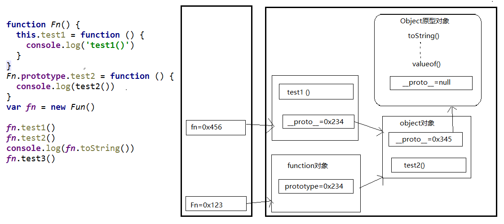

# 一、基础总结深入

## 数据类型的分类和判断

### 1. 分类
基本(值)类型
- String: 任意字符串
- Number: 任意的数字
- Boolean: true/false
- undefined: undefined
- null: null

对象(引用)类型
- Object: 任意对象
- Function: 一种特别的对象(可以执行)
- Array: 一种特别的对象(数值下标, 内部数据是有序的)

### 2. 判断
- typeof
  - 可以判断: undefined / 数值 / 字符串 / 布尔值 / function
  - 不能判断: null与object  object与array
- instanceof
  - 判断对象的具体类型
- ===
  - 可以判断: undefined, null

### 相关问题

#### 1. undefined与null的区别?
- undefined: 定义但未赋值
- null: 定义并赋值为null

#### 2. 什么时候将变量赋值为null?
- 初始赋值, 表明将要赋值为对象
- 结束前, 让对象成为垃圾对象(被垃圾回收器回收)

#### 3. 严格区别变量类型与数据类型?
- 数据的类型
  - 基本类型
  - 对象类型
- 变量的类型(变量内存值的类型)
  - 基本类型: 保存就是基本类型的数据
  - 引用类型: 保存的是地址值


## 数据、变量与内存

### 1. 什么是数据?
- 在内存中可读的, 可传递的保存了特定信息的东西, 本质上是0101...
- 数据的特点: 可传递、可运算
- 一切皆数据, 函数也是数据
- 在内存中的所有操作的目标: 数据
  - 算术运算
  - 逻辑运算
  - 赋值
  - 运行函数

### 2. 什么是内存?
- 内存条通电后产生的可储存数据的空间(临时的)
- 内存产生和死亡: 内存条(电路版)=>通电=>产生内存空间=>存储数据=>处理数据=>断电=>内存空间和数据都消失
- 一块内存包含2个方面的数据
  - 内部存储的数据
  - 地址值数据
- 内存空间的分类
  - 栈空间: 全局变量 / 局部变量
  - 堆空间: 对象 

### 3. 什么是变量?
- 在程序运行过程中它的值是允许改变的量, 由变量名和变量值组成
- 每个变量都对应的一块小内存, 变量名用来查找对应的内存, 变量值就是内存中保存的数据

### 4. 内存、数据、变量三者之间的关系
- 内存是容器, 是用来存储数据的空间
- 变量是内存的标识, 通过变量我们可以操作(读/写)内存中的数据

### 相关问题

#### 关于赋值与内存的问题?
问题: `var a = xxx` ,a内存中到底保存的是什么?
- xxx 是基本数据, 保存的就是这个数据
- xxx 是对象, 保存的是对象的地址值
- xxx 是一个变量, 保存的xxx的内存内容(可能是基本数据, 也可能是地址值)

#### 关于引用变量赋值问题?
- 2个引用变量指向同一个对象, 通过一个变量修改对象内部数据, 另一个变量看到的是修改之后的数据
- 2个引用变量指向同一个对象, 让其中一个引用变量指向另一个对象, 另一引用变量依然指向前一个对象

#### 关于数据传递问题?
问题: 在js调用函数时传递变量参数时, 是值传递还是引用传递
- 理解1: 都是值(基本/地址值)传递
- 理解2: 可能是值传递, 也可能是引用传递(地址值)

#### JS引擎如何管理内存?
1. 内存生命周期
   - 分配小内存空间, 得到它的使用权
   - 存储数据, 可以反复进行操作
   - 释放小内存空间
2. 释放内存
   - 局部变量: 函数执行完自动释放
   - 对象: 成为垃圾对象=>垃圾回收器回收


## 对象

### 1. 什么是对象?
- 多个数据(属性)的集合
- 用来保存多个数据(属性)的容器
- 一个对象代表现实中的一个事物

### 2. 为什么要用对象?
- 统一管理多个数据

### 3. 对象的组成
- 属性: 属性名(字符串, 标识符)和属性值(任意类型)组成
- 方法: 一种特别的属性(属性值是函数)

### 4. 属性的分类
- 一般: 属性值不为function的属性: 描述对象的状态
- 方法: 属性值为function的属性: 描述对象的行为

### 5. 如何访问对象内部数据?
- `.属性名`: 编码简单, 有时不能用
- `['属性名']`: 编码麻烦, 能通用

### 6. 特殊的对象
- 数组: 属性名是 `0,1,2,3` 之类的索引, 有序
- 函数: 可执行

### 相关问题

#### 什么时候必须使用['属性名']的方式?
1. 属性名包含特殊字符: `-`, `空格`, ...
2. 属性名不确定


## 函数

### 1. 什么是函数?
- 用来实现特定功能的, n条语句的封装体
- 只有函数类型的数据是可以执行的, 其它的类型的数据都不可以

函数也是对象
- `instanceof Object === true`
- 函数有属性: `prototype`
- 函数有方法: `call()` / `apply()`
- 可以添加新的属性/方法

### 2. 为什么要用函数?
- 提高代码复用, 降低代码的冗余度
- 便于阅读交流

函数的3种不同角色
- 一般函数: 直接调用
- 构造函数: 通过 `new` 调用
- 对象: 通过 `.` 调用内部的属性/方法

### 3. 如何定义函数?
- 函数声明
  ```javascript
  function fn1 (x, y) {  return x+y  }
  ```
- 表达式
  ```javascript
  var fn2 = function (x, y) {  return x+y  }
  ```
- Function构造函数
  ```javascript
  var fn3 = new Function('x', 'y', 'return x+y')
  ```
- 箭头函数(ES6)
  ```javascript
  var fn4 = (x, y) => x+y
  ```

### 4. 如何调用(执行)函数?
- `test()`: 直接调用
- `obj.test()`: 通过对象调用
- `new test()`: new调用
- `test.call/apply(obj)`: 临时让test成为obj的方法进行调用

### 5. 回调函数

#### 1. 什么函数才是回调函数?
- 你定义的
- 你没有调用
- 但它最终执行了(在一定条件下或某个时刻)

#### 2. 常见的回调函数?
- dom事件回调函数 : 当dom事件发生时调用的函数, 事件处理函数
- 定时器回调函数 : 当定时器到达指定的时间后调用的函数
- ajax请求回调函数(后面讲解) : 当ajax异步获取数据返回时调用的函数
- 生命周期回调函数(后面讲解) : 当生命周期函数发生时调用的函数

### 6. IIEF

#### 1. 理解
专业术语为: IIFE (Immediately Invoked Function Expression) 立即调用函数表达式
```javascript
(function(w, obj){
  //实现代码
})(window, obj)
```

#### 2. 作用
- 隐藏实现
- 不会污染外部(全局)命名空间
- 用它来编码js模块

### 7. 函数中的this
- 任何函数本质上都是通过某个对象来调用的, 如果没有直接指定就是window
- 所有函数内部都有一个变量this
- 它的值是调用函数的当前对象

#### 判断this的指向
- 显式指定谁: `obj.xxx()`
- 通过 call/apply 指定谁调用: `xxx.call(obj)`
- 不指定谁调用: `xxx()` : window
- 回调函数: 看背后是通过谁来调用的: window/其它

#### 练习
```javascript
function Person(color) {
  console.log(this)
  this.color = color;
  this.getColor = function () {
    console.log(this)
    return this.color;
  };
  this.setColor = function (color) {
    console.log(this)
    this.color = color;
  };
}

Person("red"); //window

var p = new Person("yello"); //p
p.getColor(); //p

var obj = {};
p.setColor.call(obj, "black"); //obj

var test = p.setColor;
test(); //window

function fun1() {
  function fun2() {
    console.log(this);
  }
  fun2(); //window
}
fun1();
```


## 关于语句分号问题
1. js一条语句的后面可以不加分号
2. 是否加分号是编码风格问题, 没有应该不应该, 只有你自己喜欢不喜欢
3. 在下面2种情况下不加分号会有问题
   - 小括号开头的前一条语句
   - 中方括号开头的前一条语句
4. 解决办法: 在行首加分号
5. 强有力的例子: vue.js库
6. 知乎热议: https://www.zhihu.com/question/20298345


# 二、函数高级

## 原型与原型链

### 原型(prototype)

#### 1. 函数的protype属性
- 每个函数都有一个prototype属性, 它默认指向一个Object空对象(即称为: 原型对象)
- 原型对象中有一个属性constructor, 它指向函数对象
  ```javascript
  Date.prototype.constructor === Date
  ```

#### 2. 给原型对象添加属性(一般都是方法)
- 作用: 函数的所有实例对象自动拥有原型中的属性(方法)
- 实例对象可以访问原型中的属性(方法)

```javascript
function Fun() {  }
Fun.prototype.test = function () {  console.log('test()')  }
var fun = new Fun()
fun.test()
```

### 显式原型与隐式原型
1. 每个函数function都有一个特别的属性 `prototype`: 显式原型(属性)
2. 每个实例对象都有一个特别的属性 `__proto__` : 隐式原型(属性)
3. 对象的隐式原型的值为其对应构造函数的显式原型的值
4. 总结:
   - 函数的prototype属性: 在定义函数时自动添加的, 默认值是一个空Object对象
   - 对象的__proto__属性: 创建对象时自动添加的, 默认值为构造函数的prototype属性值
   - 程序员能直接操作显式原型, 但不能直接操作隐式原型(ES6之前)

显式原型与隐式原型的关系
- 函数的prototype: 定义函数时被自动赋值, 值默认为{}, 即用为原型对象
- 实例对象的__proto__: 在创建实例对象时被自动添加, 并赋值为构造函数的prototype值
- 原型对象即为当前实例对象的父对象

```javascript
// 定义构造函数
function Fn() {  } // 内部语句: this.prototype = {}
// 1. 每个函数function都有一个prototype，即显式原型属性, 默认指向一个空的Object对象
console.log(Fn.prototype)

// 创建实例对象
var fn = new Fn() // 内部语句: this.__proto__ = Fn.prototype
// 2. 每个实例对象都有一个__proto__，可称为隐式原型
console.log(fn.__proto__)

// 3. 对象的隐式原型的值为其对应构造函数的显式原型的值
console.log(Fn.prototype === fn.__proto__) // true

// 给原型添加方法
Fn.prototype.test = function () {  console.log('test()')  }
// 通过实例调用原型的方法
fn.test()
```

### 原型链

#### 1. (隐式)原型链
- 所有的实例对象都有__proto__属性, 它指向的就是原型对象
- 这样通过__proto__属性就形成了一个链的结构 :原型链
- 作用: 查找对象的属性(方法), 当查找对象内部的属性/方法时, js引擎自动沿着这个原型链查找
  - 访问一个对象的属性时，
    - 先在自身属性中查找，找到返回
    - 如果没有, 再沿着__proto__这条链向上查找, 找到返回
    - 如果最终没找到, 返回undefined
- 当给对象属性赋值时不会使用原型链, 而只是在当前对象中进行操作

#### 2. 构造函数/原型/实例对象的关系(图解)



> 1. 函数的显式原型指向的对象默认是空Object实例对象(但Object不满足)
> 2. 所有函数都是Function的实例(包含Function) `Function.__proto__ === Function.prototype`
> 3. Object的原型对象是原型链尽头 `Object.prototype.__proto__ === null`

#### 3. 原型继承
- 构造函数的实例对象自动拥有构造函数原型对象的属性(方法)
- 利用的就是原型链

#### 4. 原型属性问题
1. 读取对象的属性值时: 会自动到原型链中查找
2. 设置对象的属性值时: 不会查找原型链, 如果当前对象中没有此属性, 直接添加此属性并设置其值
3. 方法一般定义在原型中, 属性一般通过构造函数定义在对象本身上

### 探索instanceof
1. instanceof是如何判断的?
   - 表达式: `A instanceof B`
   - 如果B函数的显式原型对象在A对象的原型链上, 返回true, 否则返回false
2. Function是通过new自己产生的实例

#### 案例1
```javascript
function Foo() {  }
var f1 = new Foo();
console.log(f1 instanceof Foo);
console.log(f1 instanceof Object);
```

#### 案例2
```javascript
console.log(Object instanceof Function);
console.log(Object instanceof Object);
console.log(Function instanceof Function);
console.log(Function instanceof Object);

function Foo() {  }
console.log(Object instanceof Foo); // false
```


### 面试题
```javascript
// 测试题1
function A() { }
A.prototype.n = 1

var b = new A()
A.prototype = { n: 2, m: 3 }

var c = new A()
console.log(b.n, b.m, c.n, c.m) // 1 undefined 2 3

// 测试题2
function F() { }
Object.prototype.a = function () { console.log('a()') }
Function.prototype.b = function () { console.log('b()') }

var f = new F()
f.a()
// f.b()
F.a()
F.b()
```


## 执行上下文与执行上下文栈

### 变量提升与函数提升
- 变量提升: 在变量定义语句之前, 就可以访问到这个变量(undefined)
- 函数提升: 在函数定义语句之前, 就执行该函数
- 先有变量提升, 再有函数提升

1. 变量声明提升
   - 通过var定义(声明)的变量, 在定义语句之前就可以访问到
   - 值: undefined
2. 函数声明提升
   - 通过function声明的函数, 在之前就可以直接调用
   - 值: 函数定义(对象)

```javascript
var a = 3
function fn() {
  console.log(a)
  var a = 4
}
fn() // undefined

console.log(b) // undefined  变量提升
fn2() // 可调用   函数提升
// fn3() // 不能  变量提升

var b = 3
function fn2() {
  console.log('fn2()')
}

var fn3 = function () {
  console.log('fn3()')
}
```

### 执行上下文

#### 1. 代码分类(位置)
- 全局代码: window
- 函数(局部)代码: 对程序员来说是透明的

#### 2. 全局执行上下文
生命周期: 准备执行全局代码前产生, 当页面刷新/关闭页面时死亡
- 在全局代码执行前最先创建一个全局执行上下文(window)
- 对全局数据进行预处理(收集一些全局变量, 将这些变量设置为window的属性)
  - var定义的全局变量 => undefined, 添加为window的属性
  - function声明的全局函数 => 赋值(fun), 添加为window的方法
  - this => 赋值(window)
- 开始执行全局代码

#### 3. 函数执行上下文
生命周期: 调用函数时产生, 函数执行完时死亡
- 在调用函数时, 在执行函数体之前先创建一个函数执行上下文(虚拟的, 存在于栈中)
- 对局部数据进行预处理(收集一些局部变量, 将这些变量设置为执行上下文的属性)
  - 形参变量 => 赋值(实参), 添加为执行上下文的属性
  - arguments => 赋值(实参列表), 添加为执行上下文的属性
  - var定义的局部变量 => undefined, 添加为执行上下文的属性
  - function声明的函数 => 赋值(fun), 添加为执行上下文的方法
  - this => 赋值(调用函数的对象)
- 开始执行函数体代码

### 执行上下文栈

#### 理解
- 执行上下文: 由js引擎自动创建的对象, 包含对应作用域中的所有变量属性
- 执行上下文栈: 用来管理产生的多个执行上下文, 栈底永远是全局上下文, 栈顶就是当前函数的执行上下文


#### 流程分析
1. 在全局代码执行前, JS引擎就会创建一个栈来存储管理所有的执行上下文对象
2. 在全局执行上下文(window)确定后, 将其添加到栈中(压栈)
3. 在函数执行上下文创建后, 将其添加到栈中(压栈)
4. 在当前函数执行完后,将栈顶的对象移除(出栈)
5. 当所有的代码执行完后, 栈中只剩下window

#### 案例
```javascript
// 上下文1
var a = 10
var bar = function (x) {
  var b = 5
  foo(x + b) // 上下文3
}
var foo = function (y) {
  var c = 5
  console.log(a + c + y)
}
bar(10) // 上下文2
```
执行上下文数量 = 函数调用次数 + 1(全局)

```javascript
console.log('global begin: '+ i)
var i = 1
foo(1)
function foo(i) {
  if (i == 4) {
    return
  }
  console.log('foo begin:' + i)
  foo(i + 1) // 递归调用: 在函数内部调用自己
  console.log('foo end:' + i)
}
console.log('global end: ' + i)
```
1. 依次输出什么?
   - global begin: undefined
   - foo begin: 1
   - foo begin: 2
   - foo begin: 3
   - foo end: 3
   - foo end: 2
   - foo end: 1
   - global end: 1
2. 整个过程中产生了几个执行上下文?  5: global, foo(1), foo(2), foo(3), foo(4)

### 面试题
```javascript
// 测试题1:  先执行变量提升, 再执行函数提升
function a() {}
var a
console.log(typeof a) // 'function'

// 测试题2:
if (!(b in window)) {
  var b = 1 // 变量提升
}
console.log(b) // undefined

// 测试题3:
var c = 1
function c(c) {
  console.log(c)
  var c = 3
}
c(2) // 报错, 变量、函数提升结束后c被赋值为1
```


## 作用域与作用域链

### 作用域
- 理解:
  - 作用域: 就是一块"地盘", 一个代码段所在的区域, 它是静态的(相对于上下文对象), 在编写代码时就确定了
  - 作用域链: 多个嵌套的作用域形成的由内向外的结构, 用于查找变量
- 分类:
  - 全局作用域
  - 函数作用域
  - js没有块作用域(在ES6之前)
- 作用:
  - 作用域: 隔离变量, 可以在不同作用域定义同名的变量不冲突
  - 作用域链: 查找变量

### 作用域与执行上下文
- 作用域: 静态的, 编码时就确定了(不是在运行时), 一旦确定就不会变化了
- 执行上下文: 动态的, 执行代码时动态创建, 当执行结束消失

区别与联系:
1. 区别1
   - 全局作用域之外，每个函数都会创建自己的作用域，作用域在函数定义时就已经确定了。而不是在函数调用时
   - 全局执行上下文环境是在全局作用域确定之后, js代码马上执行之前创建
   - 函数执行上下文是在调用函数时, 函数体代码执行之前创建
2. 区别2
   - 作用域是静态的, 只要函数定义好了就一直存在, 且不会再变化
   - 执行上下文是动态的, 调用函数时创建, 函数调用结束时就会自动释放
3. 联系
   - 执行上下文(对象)从属于所在的作用域
     - 全局上下文环境 => 全局作用域
     - 函数上下文环境 => 对应的函数使用域

### 作用域链
1. 理解
   - 多个上下级关系的作用域形成的链, 它的方向是从下向上的(从内到外)
   - 查找变量时就是沿着作用域链来查找的
2. 查找一个变量的查找规则
   1. 在当前作用域下的执行上下文中查找对应的属性, 如果有直接返回, 否则进入2
   2. 在上一级作用域的执行上下文中查找对应的属性, 如果有直接返回, 否则进入3
   3. 再次执行2的相同操作, 直到全局作用域, 如果还找不到就抛出找不到的异常

### 面试题

#### 面试题1
```javascript
var x = 10;
function fn() {
  console.log(x);
}
function show(f) {
  var x = 20;
  f();
}
show(fn); // 10
```

#### 面试题2
```javascript
var fn = function () {
  console.log(fn)
}
fn()

var obj = {
  fn2: function () {
    console.log(fn2)
    // 函数作用域内没有fn2, 会沿着作用域链查找全局作用域, 但是全局作用域中也没有fn2, 所以报错
    // 理解: var obj = {}; obj.fn2 = function () { console.log(fn2) }
    // 要想使用obj.fn2, 可以使用this.fn2
  }
}
obj.fn2()
```


## 闭包(Closure)

### 引子实例
需求: 点击某个按钮, 提示"点击的是第n个按钮"
```javascript
var btns = document.getElementsByTagName('button')
// 遍历加监听: 存在问题
for (var i = 0, length = btns.length; i < length; i++) {
  var btn = btns[i]
  btn.onclick = function () {
    alert('第' + (i + 1) + '个')
  }
}

// 解决方案1: 将btn所对应的下标保存在btn上
for (var i = 0, length = btns.length; i < length; i++) {
  var btn = btns[i]
  btn.index = i
  btn.onclick = function () {
    alert('第' + (this.index + 1) + '个')
  }
}

// 解决方案2: 使用闭包
for (var i = 0, length = btns.length; i < length; i++) {
  (function (j) {
    var btn = btns[j]
    btn.onclick = function () {
      alert('第' + (j + 1) + '个')
    }
  })(i)
}
```

### 理解闭包
1. 如何产生闭包?
   - 当一个嵌套的内部(子)函数引用了嵌套的外部(父)函数的变量(函数)时, 就产生了闭包
2. 闭包到底是什么?
   - 通过chrome工具得知: 闭包本质是内部函数中的一个对象, 这个对象中包含引用的变量属性
   - 理解一: 闭包是嵌套的内部函数(绝大部分人)
   - 理解二: 包含被引用变量(函数)的对象(极少数人)
   - 注意: 闭包存在于嵌套的内部函数中
3. 产生闭包的条件?
   - 函数嵌套
   - 内部函数引用了外部函数的数据(变量/函数)
   - 执行内部函数定义就会产生闭包(不用调用内部函数)

### 常见的闭包
1. 将函数作为另一个函数的返回值
   ```javascript
   function fn1() {
     var a = 2
     function fn2() {
       a++
       console.log(a)
     }
     return fn2
   }
   var f = fn1()
   f() // 3
   f() // 4
   ```
2. 将函数作为实参传递给另一个函数调用
   ```javascript
   function showDelay(msg, time) {
     setTimeout(function () {
       alert(msg)
     }, time)
   }
   showDelay('atguigu', 2000)
   ```

### 闭包的作用
1. 使用函数内部的变量在函数执行完后, 仍然存活在内存中(延长了局部变量的生命周期)
2. 让函数外部可以操作(读写)到函数内部的数据(变量/函数)

问题:
1. 函数执行完后, 函数内部声明的局部变量是否还存在? 一般是不存在, 存在于闭中的变量才可能存在
2. 在函数外部能直接访问函数内部的局部变量吗? 不能, 但我们可以通过闭包让外部操作它

应用:
- 模块化: 封装一些数据以及操作数据的函数, 向外暴露一些行为
- 循环遍历加监听
- JS框架(jQuery)大量使用了闭包

### 闭包的生命周期
1. 产生: 在嵌套内部函数定义执行完时就产生了(不是在调用)
2. 死亡: 在嵌套的内部函数成为垃圾对象时

```javascript
function fn1() {
  // 此时闭包就已经产生了(函数提升, 内部函数对象已经创建了)
  var a = 2
  function fn2() {
    a++
    console.log(a)
  }
  return fn2
}
var f = fn1()
f() // 3
f() // 4
f = null // 闭包死亡(包含闭包的函数对象成为垃圾对象)
```

### 闭包的应用: 自定义JS模块
- 具有特定功能的js文件
- 将所有的数据和功能都封装在一个函数内部(私有的)
- 只向外暴露一个包信n个方法的对象或函数
- 模块的使用者, 只需要通过模块暴露的对象调用方法来实现对应的功能

#### 使用方式一: 返回对象
```javascript
function myModule() {
  // 私有数据
  var msg = 'My atguigu'
  // 操作数据的函数
  function doSomething() {
    console.log('doSomething() ' + msg.toUpperCase())
  }
  function doOtherthing() {
    console.log('doOtherthing() ' + msg.toLowerCase())
  }

  // 向外暴露对象(给外部使用的方法)
  return {
    doSomething: doSomething,
    doOtherthing: doOtherthing
  }
}
```

使用方式:
```javascript
var module = myModule()
module.doSomething()
module.doOtherthing()
```

#### 使用方式二: 匿名函数自调用
```javascript
(function (window) {
  // 私有数据
  var msg = 'My atguigu'
  // 操作数据的函数
  function doSomething() {
    console.log('doSomething() ' + msg.toUpperCase())
  }
  function doOtherthing() {
    console.log('doOtherthing() ' + msg.toLowerCase())
  }

  // 向外暴露对象(给外部使用的方法)
  window.myModule = {
    doSomething: doSomething,
    doOtherthing: doOtherthing
  }
})(window)
```

使用方式:
```javascript
myModule.doSomething()
myModule.doOtherthing()
```

### 闭包的缺点及解决
1. 缺点
   - 函数执行完后, 函数内的局部变量没有释放, 占用内存时间会变长
   - 容易造成内存泄露
2. 解决
   - 能不用闭包就不用
   - 及时释放 `f = null`

### 内存溢出与内存泄露
1. 内存溢出
   - 一种程序运行出现的错误
   - 当程序运行需要的内存超过了剩余的内存时, 就出抛出内存溢出的错误
2. 内存泄露
   - 占用的内存没有及时释放
   - 内存泄露积累多了就容易导致内存溢出
   - 常见的内存泄露:
     - 意外的全局变量
       ```javascript
       // 意外的全局变量
       function fn() {
         a = new Array(10000000) // a是全局变量
         console.log(a)
       }
       fn() // 调用函数后, a不会被释放 => 使用var a = new Array(10000000)来避免
       ```
     - 没有及时清理的计时器或回调函数
        ```javascript
        var timer = setInterval(function () {
          console.log('xxx')
        }, 1000)
        // clearInterval(timer) 当不需要timer时, 及时清理
        ```
     - 闭包

### 面试题

#### 面试题一
代码片段一
```javascript
var name = "The Window";
var object = {
  name: "My Object",
  getNameFunc: function () {
    return function () {
      return this.name;
    };
  }
};
alert(object.getNameFunc()());  // The Window
```

代码片段二
```javascript
var name = "The Window";
var object = {
  name: "My Object",
  getNameFunc: function () {
    var that = this;
    return function () {
      return that.name;
    };
  }
};
alert(object2.getNameFunc()());  // My Object
```

#### 面试题二(闭包终极面试题)
```javascript
function fun(n, o) {
  console.log(o)
  return {
    fun: function (m) {
      return fun(m, n) // n是闭包中的属性值
    }
  }
}
var a = fun(0); a.fun(1); a.fun(2); a.fun(3); // undefined,0,0,0
var b = fun(0).fun(1).fun(2).fun(3); // undefined,0,1,2
var c = fun(0).fun(1); c.fun(2); c.fun(3); // undefined,0,1,1
```


# 三、面向对象高级

## 对象创建模式

### Object构造函数模式
- 套路: 先创建空Object对象, 再动态添加属性/方法
- 适用场景: 起始时不确定对象内部数据
- 问题: 语句太多

```javascript
var obj = new Object() // 创建空对象, 也可以写成: var obj = {}
obj.name = 'Tom'; obj.age = 12
obj.setName = function(name){this.name=name}
```

### 对象字面量模式
- 套路: 使用{}创建对象, 同时指定属性/方法
- 适用场景: 起始时对象内部数据是确定的
- 问题: 如果创建多个对象, 有重复代码

```javascript
var obj = {
  name: 'Tom', age: 12,
  setName: function(name){this.name=name}
}
```

### 工厂模式
- 套路: 通过工厂函数动态创建对象并返回
- 适用场景: 需要创建多个对象
- 问题: 对象没有一个具体的类型, 都是Object类型

```javascript
function createPerson(name, age) { // 返回一个对象的函数 => 工厂函数
  var obj = {
    name: name, age: age,
    setName: function (name) {this.name = name}
  }
  return obj
}
```

### 自定义构造函数模式
- 套路: 自定义构造函数, 通过new创建对象
- 适用场景: 需要创建多个类型确定的对象
- 问题: 每个对象都有相同的数据(方法), 浪费内存

```javascript
function Person(name, age) {
  this.name = name
  this.age = age
  this.setName = function (name) {
    this.name = name
  }
}
```

### 构造函数+原型的组合模式
- 套路: 自定义构造函数, 属性在函数中初始化, 方法添加到原型上
- 适用场景: 需要创建多个类型确定的对象

```javascript
function Person(name, age) { //在构造函数中只初始化一般函数
  this.name = name
  this.age = age
}
Person.prototype.setName = function (name) {
  this.name = name
}
```


## 继承模式

### 原型链继承: 得到方法
1. 套路
   1. 定义父类型构造函数
   2. 给父类型的原型添加方法
   3. 定义子类型的构造函数
   4. 创建父类型的对象赋值给子类型的原型
   5. 将子类型原型的构造属性设置为子类型
   6. 给子类型原型添加方法
   7. 创建子类型的对象: 可以调用父类型的方法
2. 关键
   1. 子类型的原型为父类型的一个实例对象


```javascript
// 父类型
function Supper() {
  this.supProp = 'Supper property'
}
Supper.prototype.showSupperProp = function () {
  console.log(this.supProp)
}

// 子类型
function Sub() {
  this.subProp = 'Sub property'
}

// 子类型的原型为父类型的一个实例对象
Sub.prototype = new Supper()
// 让子类型的原型的constructor指向子类型
Sub.prototype.constructor = Sub
Sub.prototype.showSubProp = function () {
  console.log(this.subProp)
}

var sub = new Sub()
sub.showSupperProp()
sub.showSubProp()
```

### 借用构造函数继承: 得到属性
1. 套路:
   1. 定义父类型构造函数
   2. 定义子类型构造函数
   3. 在子类型构造函数中调用父类型构造
2. 关键:
   1. 在子类型构造函数中通用call()调用父类型构造函数

```javascript
function Person(name, age) {
  this.name = name
  this.age = age
}
function Student(name, age, price) {
  Person.call(this, name, age)  // 相当于: this.Person(name, age)
  this.price = price
}

var s = new Student('Tom', 20, 14000)
console.log(s.name, s.age, s.price)
```

> 只是简化了代码, 但是父类型的原型对象的方法子类型是不能继承的

### 组合继承
原型链+借用构造函数的组合继承
1. 利用原型链实现对父类型对象的方法继承
2. 利用super()借用父类型构建函数初始化相同属性

```javascript
function Person(name, age) {
  this.name = name
  this.age = age
}
Person.prototype.setName = function (name) {
  this.name = name
}

function Student(name, age, price) {
  Person.call(this, name, age)  // 为了得到属性
  this.price = price
}
Student.prototype = new Person() // 为了能看到父类型的方法
Student.prototype.constructor = Student // 修正constructor属性
Student.prototype.setPrice = function (price) {
  this.price = price
}

var s = new Student('Tom', 24, 15000)
s.setName('Bob')
s.setPrice(16000)
console.log(s.name, s.age, s.price)
```

### new一个对象背后做了些什么?
- 创建一个空对象
- 给对象设置 `__proto__`, 值为构造函数对象的prototype属性值 `this.__proto__ = Fn.prototype`
- 执行构造函数体(给对象添加属性/方法)


# 四、线程机制与事件机制

## 进程与线程
- 进程(process)
  - 程序的一次执行, 它占有一片独有的内存空间
  - 可以通过windows任务管理器查看进程
- 线程(thread)
  - 是进程内的一个独立执行单元
  - 是程序执行的一个完整流程
  - 是CPU的最小的调度单元
- 图解
  
  一个进程至少有一个线程(主); 程序是在某个进程中的某个线程执行的

### 相关知识
- 应用程序必须运行在某个进程的某个线程上
- 一个进程中至少有一个运行的线程: 主线程,  进程启动后自动创建
- 一个进程中也可以同时运行多个线程, 我们会说程序是多线程运行的
- 一个进程内的数据可以供其中的多个线程直接共享
- 多个进程之间的数据是不能直接共享的
- 线程池(thread pool): 保存多个线程对象的容器, 实现线程对象的反复利用

### 相关问题
1. 何为多进程与多线程?
   - 多进程运行: 一应用程序可以同时启动多个实例运行
   - 多线程: 在一个进程内, 同时有多个线程运行
2. 比较单线程与多线程?
   - 多线程
     - 优点: 能有效提升CPU的利用率
     - 缺点: 创建多线程开销, 线程间切换开销, 死锁与状态同步问题
   - 单线程
     - 优点: 顺序编程简单易懂
     - 缺点: 效率低
3. JS是单线程还是多线程?
   - js是单线程运行的
   - 但使用H5中的 Web Workers可以多线程运行
4. 浏览器运行是单线程还是多线程?
   - 都是多线程运行的
5. 浏览器运行是单进程还是多进程?
   - 有的是单进程
     - firefox
     - 老版IE
   - 有的是多进程
     - chrome
     - 新版IE

> 如何查看浏览器是否是多进程运行的呢? 任务管理器 -> 进程


## 浏览器内核
1. 什么是浏览器内核?
   - 支撑浏览器运行的最核心的程序
2. 不同的浏览器可能不太一样
   - Chrome, Safari: webkit
   - firefox: Gecko
   - IE: Trident
   - 360,搜狗等国内浏览器: Trident + webkit
3. 内核由很多模块组成
   - 主线程
     - js引擎模块 : 负责js程序的编译与运行
     - html,css文档解析模块 : 负责页面文本的解析
     - dom/css模块 : 负责dom/css在内存中的相关处理
     - 布局和渲染模块 : 负责页面的布局和效果的绘制
   - 分线程
     - 定时器模块 : 负责定时器的管理
     - 网络请求模块 : 负责服务器请求(常规/Ajax)
     - 事件响应模块 : 负责事件的管理


## 定时器引发的思考
1. 定时器真是定时执行的吗?
   - 定时器并不能保证真正定时执行
   - 一般会延迟一丁点(可以接受), 也有可能延迟很长时间(不能接受)
2. 定时器回调函数是在哪个线程执行的?
   - 在主线程执行的, js是单线程的
3. 定时器是如何实现的?
   - 事件循环模型(后面讲)


## JS是单线程执行的

### 1. 如何证明js执行是单线程的?
- setTimeout()的回调函数是在主线程执行的
- 定时器回调函数只有在运行栈中的代码全部执行完后才有可能执行

```javascript
setTimeout(function () {
  console.log('timeout 2222')
}, 2000)
setTimeout(function () {
  console.log('timeout 1111')
}, 1000)

console.log('alert()之前')
alert('------') // 暂停当前主线程的执行, 同时暂停计时, 点击确定后, 恢复程序执行和计时
console.log('alert()之后')
```

### 2. 为什么js要用单线程模式, 而不用多线程模式?
- JavaScript的单线程，与它的用途有关。
- 作为浏览器脚本语言，JavaScript的主要用途是与用户互动，以及操作DOM。
- 这决定了它只能是单线程，否则会带来很复杂的同步问题

> - js是单线程执行的(回调函数也是在主线程)
> - H5提出了实现多线程的方案: Web Workers
> - 只能是主线程更新界面

### 3. 代码的分类
- 初始化代码
- 回调代码

```javascript
setTimeout(function () {
  console.log('timeout 0000')
}, 0)
function fn() {
  console.log('fn()')
}
fn()

console.log('alert()之前') // 执行完后输出: fu() alert()之前
alert('------') // 点击确定后输出: alert()之后 timeout 0000
console.log('alert()之后')
```

### 4. js引擎执行代码的基本流程
- 先执行初始化代码: 包含一些特别的代码 回调函数(异步执行)
  - 设置定时器
  - 绑定事件监听
  - 发送ajax请求
- 后面在某个时刻才会执行回调代码


## 浏览器的事件循环(轮询)模型

### 模型原理图


### 相关重要概念
1. 执行栈(execution stack)
   - 所有的代码都是在此空间中执行的
2. 浏览器内核(browser core)
   - js引擎模块(在主线程处理)
   - 其它模块(在主/分线程处理)
3. 任务队列(task queue)
4. 消息队列(message queue)
5. 事件队列(event queue)
6. 事件轮询(event loop)
   - 从任务队列中循环取出回调函数放入执行栈中处理(一个接一个)
7. 事件驱动模型(event-driven interaction model)
8. 请求响应模型(request-response model)

### 执行流程
1. 所有代码分类
   - 初始化执行代码(同步代码): 包含绑定dom事件监听, 设置定时器, 发送ajax请求的代码
   - 回调执行代码(异步代码): 处理回调逻辑
2. js引擎执行代码的基本流程:
   - 初始化代码 => 回调代码
3. 模型的2个重要组成部分:
   - 事件(定时器/DOM事件/Ajax)管理模块
   - 回调队列
4. 模型的运转流程
   - 执行初始化代码, 将事件回调函数交给对应模块管理
   - 当事件发生时, 管理模块会将回调函数及其数据添加到回调列队中
   - 只有当初始化代码执行完后(可能要一定时间), 才会遍历读取回调队列中的回调函数执行


## H5 Web Workers(多线程)

### 介绍
- Web Workers 是 HTML5 提供的一个javascript多线程解决方案
- 我们可以将一些大计算量的代码交由web Worker运行而不冻结用户界面
- 但是子线程完全受主线程控制, 且不得操作DOM。
  - 所以, 这个新标准并没有改变JavaScript单线程的本质
- 图解
  

### 使用
- 创建在分线程执行的js文件
- 在主线程中的js中发消息并设置回调

相关API
- Worker: 构造函数, 加载分线程执行的js文件
- Worker.prototype.onmessage: 用于接收另一个线程的回调函数
- Worker.prototype.postMessage: 向另一个线程发送消息

### 应用练习
```html
<input type="text" placeholder="数值" id="number">
<button id="btn">计算</button>
```

#### 直接在主线程
```javascript
function fibonacci(n) {
  return n <= 2 ? 1 : fibonacci(n - 1) + fibonacci(n - 2)
}

var input = document.getElementById('number')
document.getElementById('btn').onclick = function () {
  var number = input.value
  var result = fibonacci(number)
  alert(result)
}
```

#### 使用Worker在分线程

##### 主线程
```javascript
var input = document.getElementById('number')
document.getElementById('btn').onclick = function () {
  var number = input.value
  var worker = new Worker('worker.js') // 创建一个Worker对象
  // 绑定接收消息的监听
  worker.onmessage = function (event) {
    alert(event.data)
  }
  // 向分线程发送消息
  worker.postMessage(number)
}
```

##### 分线程
- alert是window的方法, 在分线程不能调用
- 分线程中的全局对象不再是window, 所以在分线程中不可能更新界面

worker.js
```javascript
function fibonacci(n) {
  return n <= 2 ? 1 : fibonacci(n - 1) + fibonacci(n - 2)
}

this.onmessage = function (event) {
  var number = event.data // 分线程接收到主线程发送的数据
    var result = fibonacci(number) // 计算
  postMessage(result) // 分线程向主线程返回数据
}
```

### 不足
- worker内代码不能操作DOM(更新UI)
- 不能跨域加载JS
- 不是每个浏览器都支持这个新特性

